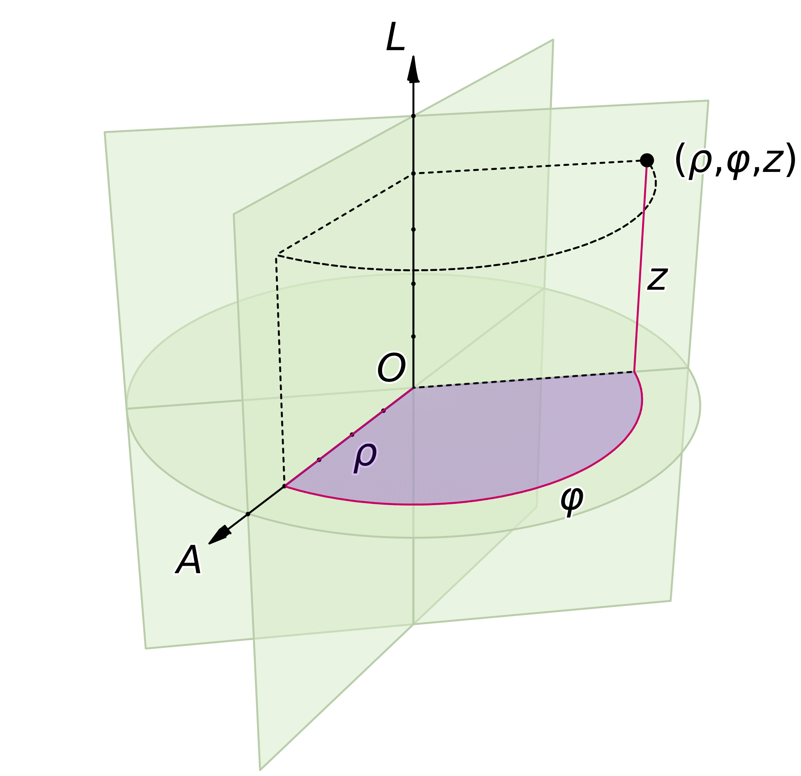
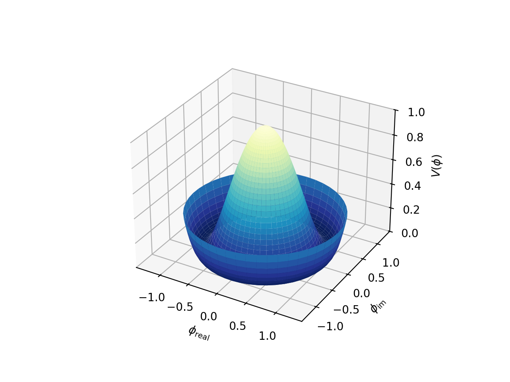
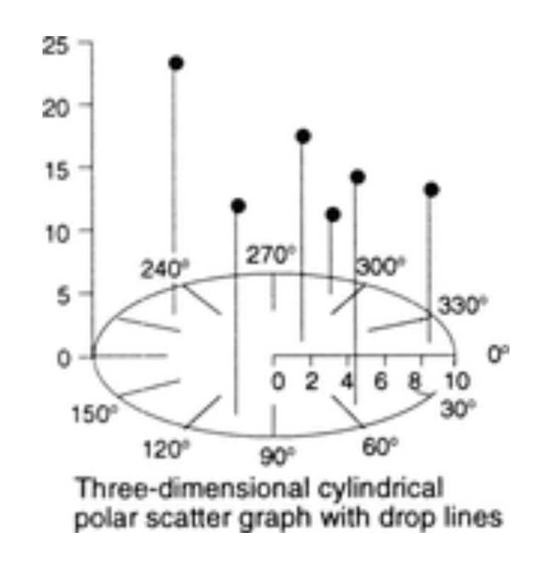

+++
author = "Yuichi Yazaki"
title = "Three-Dimensional Cylindrical Polar Scatter Graph"
slug = "3d-cylindrical-polar-scatter-graph"
date = "2025-10-12"
categories = [
    "chart"
]
tags = [
    "",
]
image = "images/thumb_ph_vizjp.png"
+++

A three-dimensional cylindrical polar scatter graph uses cylindrical coordinates: angle, radius, and height. It visualizes three variables in a form related to a 3D extension of a polar plot. It is useful for multivariate data with directionality, periodicity, or radial structure.

<!--more-->

## How to Read It

The angle represents direction or phase, the radius represents distance or magnitude from the center, and height represents a third variable. Together they create a spatial distribution that can reveal directional and periodic patterns.

## Use Cases

- Meteorological direction and intensity data
- Engineering measurements with angular components
- Earth science and oceanographic data
- Cyclical patterns with magnitude and height

## Design Notes

- Label angular units clearly.
- Provide interaction or multiple views.
- Avoid visual clutter from too many points.
- Use color or transparency carefully.

## Summary

This chart is specialized but useful when the data naturally fits cylindrical coordinates. It should be used when angle and radius are meaningful, not merely to make a chart look three-dimensional.
