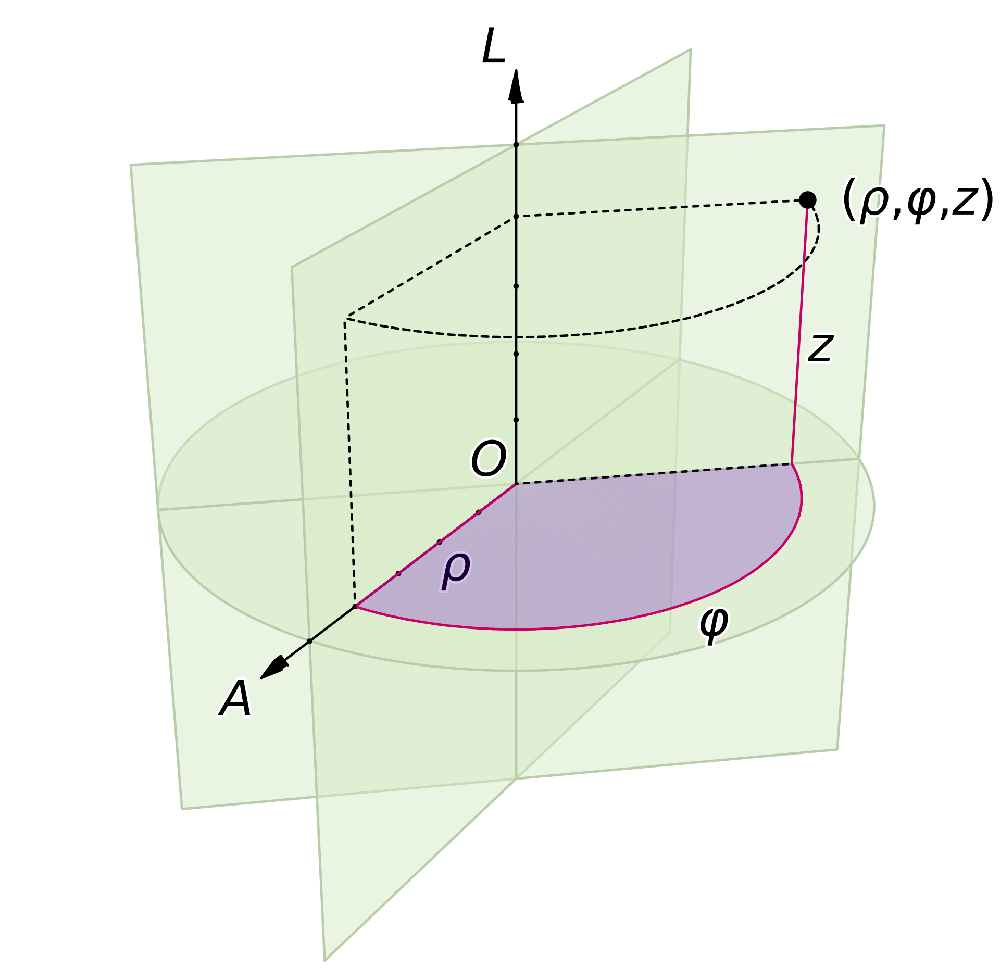
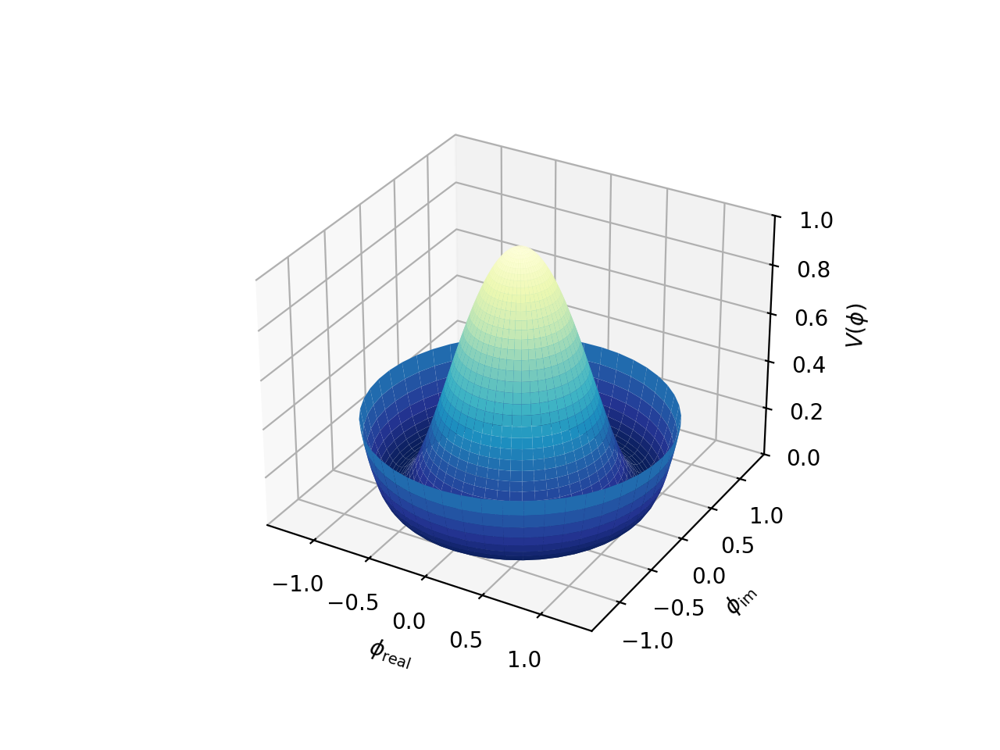
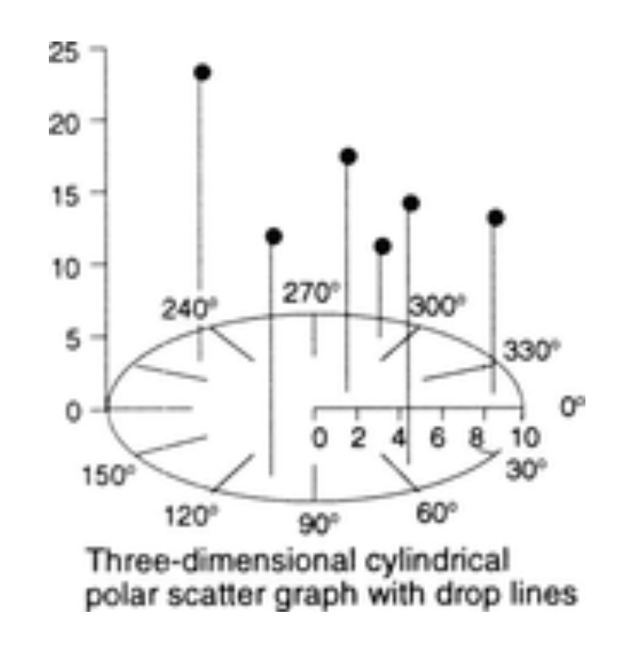

+++
author = "Yuichi Yazaki"
title = "三次元 円筒座標 散布図"
slug = "3d-cylindrical-polar-scatter-graph"
date = "2025-10-12"
categories = [
    "chart"
]
tags = [
    "",
]
image = "images/thumb_ph_vizjp.png"
+++

この図は「三次元 円筒座標 散布図（Three-dimensional Cylindrical Polar Scatter Graph）」と呼ばれるグラフの一例です。円筒座標系を用いて、極角・半径・高さという三つの値の関係を可視化しています。

一般的な散布図が二次元平面上に点をプロットするのに対し、この図では「角度（θ）」「半径（r）」「高さ（z）」の三要素を組み合わせることで、三次元的な分布を表現します。

これは極座標プロット（Polar Plot）の三次元拡張とみなすことができます。二次元の極座標散布図では平面上の角度と距離で表現しますが、さらに高さ軸を加えることで、データの変化をより立体的に理解できます。

<!--more-->

 

## チャートの見方

- **底面（水平の円）**：角度方向（0°〜360°）と半径方向（0〜10）の二軸を表します。0°、30°、60°、…といった目盛りは、円周上の角度（極角θ）を示しています。
- **垂直軸（高さ方向）**：数値（ここでは0〜25）を表し、縦方向の値（z軸）として機能します。
- **黒い点（データポイント）**：各データの位置を示します。点の位置は、
  - **角度（θ）** … 円周上の方向  
  - **半径（r）** … 中心からの距離  
  - **高さ（z）** … 垂直方向の値  
  によって決定されます。
- **縦線（ドロップライン）**：データ点と底面を結ぶ線で、点の高さを明確にする補助線です。

このように、データを「方向」「距離」「高さ」という三つの変数で表すため、気象学・地球科学・工学など、周期性や角度を含む多変量データの分析によく用いられます。

## 目的と利用分野

三次元円筒座標散布図は、「角度」「距離」「高さ」という三つの変数を同時に可視化できるグラフです。主に次のような目的で利用されます。

### 1. 方向性をもつデータの分析

角度（0°〜360°）を用いることで **方位や方向をもつデータ** を扱えます。たとえば次のような分野です。

| 分野 | 具体例 | 解釈のポイント |
|------|---------|----------------|
| 気象学 | 風向・風速・高度 | 風がどの方向からどのくらいの強さで吹いているか |
| 海洋学 | 潮流の方向・深さ | 各深度での潮流方向の変化 |
| 通信工学 | アンテナの方向特性 | 角度ごとの信号強度（ゲイン）を立体的に表示 |

### 2. 周期的な現象の可視化

360°の角度を時間や周期に見立て **周期的な変化** を表すことができます。

- 例：1日を360°に見立てて、時刻ごとの温度や電力消費量をプロット  
- 例：1年を円周に割り当て、月ごとの降水量や日照時間を高さで表現

このように「円周上の繰り返し」と「高さ方向の変化」を同時に見ることで、周期的パターンを一目で把握できます。

### 3. 三変数の同時比較

一般的な散布図では2軸（x, y）でしか関係を示せませんが、  
円筒座標では次のように3軸を対応づけることができます。

| 軸 | 意味 | 例 |
|----|------|----|
| 角度（θ） | カテゴリ・方向・時間 | 方位・時間・角度 |
| 半径（r） | 距離・大きさ | 測定点までの距離、周波数など |
| 高さ（z） | 量的変数 | 強度、頻度、値の大きさなど |

これにより **3つの連続変数の関係性やパターン** を立体的に把握できます。

### 4. 視覚的なプレゼンテーション

立体的な形状が特徴的なため **研究発表・学会ポスター・技術報告書** などでも利用されます。

特に、通常の平面グラフでは伝わりにくい「方向＋強度＋高さ」の関係を視覚的に表現できるため、観察的データの探索（exploratory data analysis）にも適しています。

## 背景と数理的基盤

円筒座標系（Cylindrical Coordinates）は、三次元空間を角度・半径・高さで表す数学的座標系です。これを視覚化に応用したのが本チャートです。

特に **風向・風速・高度** 、**信号強度の方向特性** 、**極座標上の周期データの振幅変化** などを分析する際に有用です。

3D円筒散布図は、極座標プロット（Polar Plot）の三次元拡張とみなすことができます。二次元の極座標散布図では平面上の角度と距離で表現しますが、さらに高さ軸を加えることで、データの変化をより立体的に理解できます。

## まとめ

三次元円筒座標散布図は、角度・距離・高さという3変数の関係を一度に把握できる強力な可視化手法です。

ドロップラインによって高さ情報が明確に示され、角度的な周期性と縦方向の変化を同時に読むことができます。

ただし、視点によっては奥行き方向の重なりが発生するため、適切な視角の設定やインタラクティブ表示が推奨されます。

## 参考・出典

- *3D surface with polar coordinates* — Matplotlib ドキュメント：極座標／円筒座標を用いた 3D 表面描画例  [oai_citation:0‡matplotlib.org](https://matplotlib.org/stable/gallery/mplot3d/surface3d_radial.html)  
- *Cylindrical Coordinates* — Wolfram MathWorld：円筒座標系の定義および性質  [oai_citation:1‡ウルフラム数学ワールド](https://mathworld.wolfram.com/CylindricalCoordinates.html)  
- *Cylindrical coordinate system* — Wikipedia：座標系としての概要と応用例  [oai_citation:3‡ウィキペディア](https://en.wikipedia.org/wiki/Cylindrical_coordinate_system)  
- *Three-dimensional plotting in Matplotlib* — Jake VanderPlas によるチュートリアル：「極座標グリッド」を 3D プロットに使う例  [oai_citation:4‡jakevdp.github.io](https://jakevdp.github.io/PythonDataScienceHandbook/04.12-three-dimensional-plotting.html)  