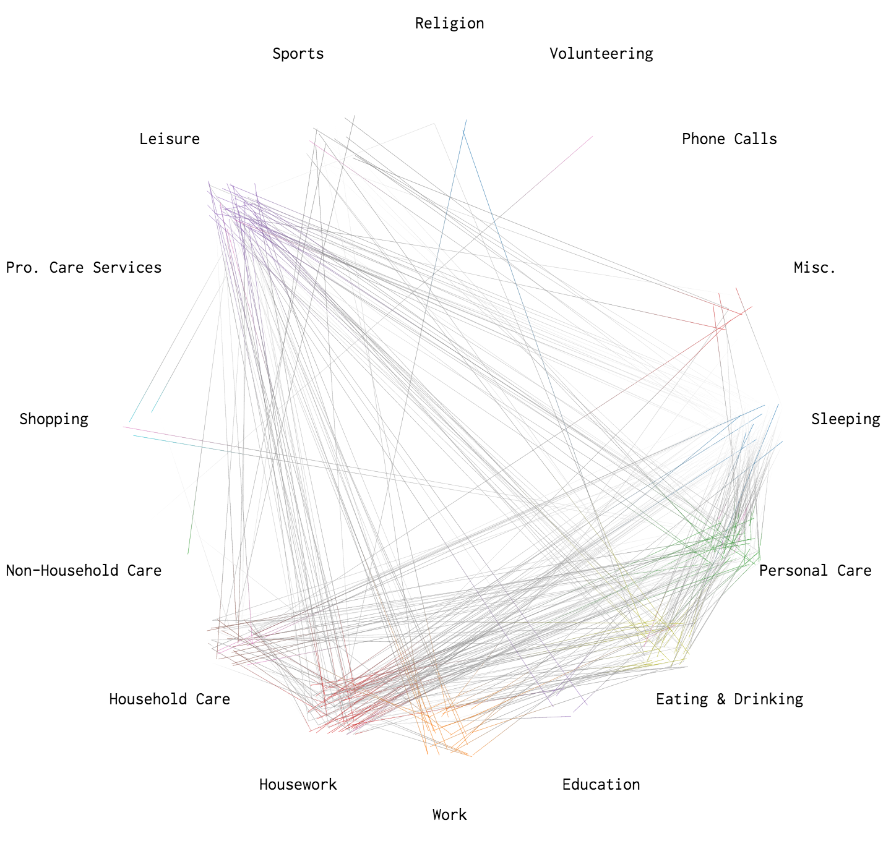
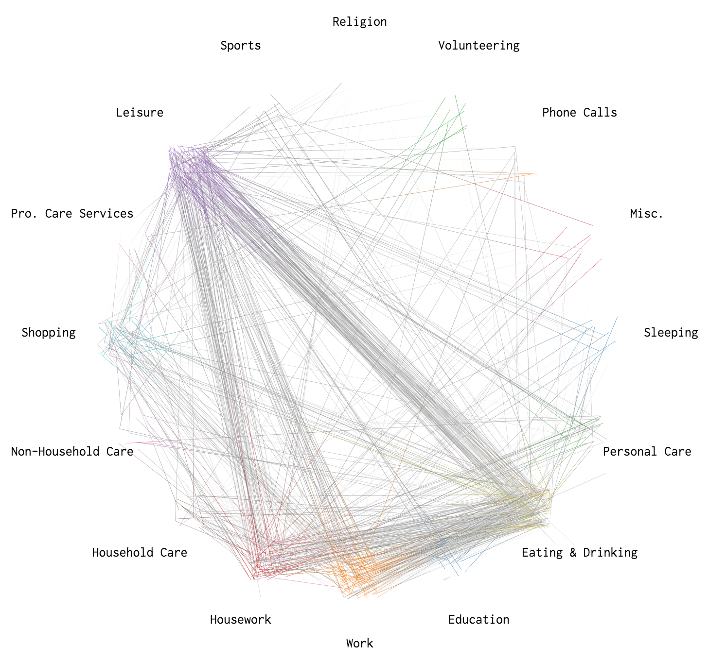
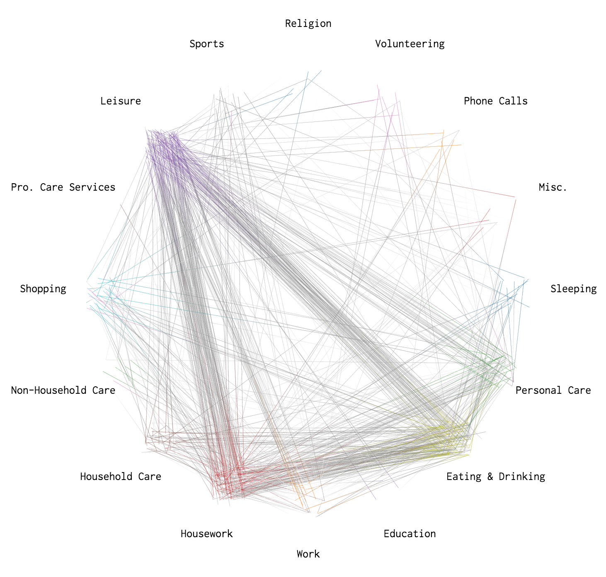
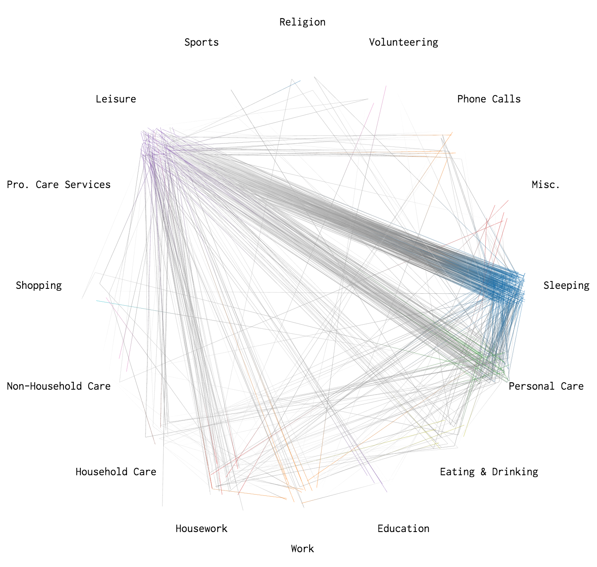
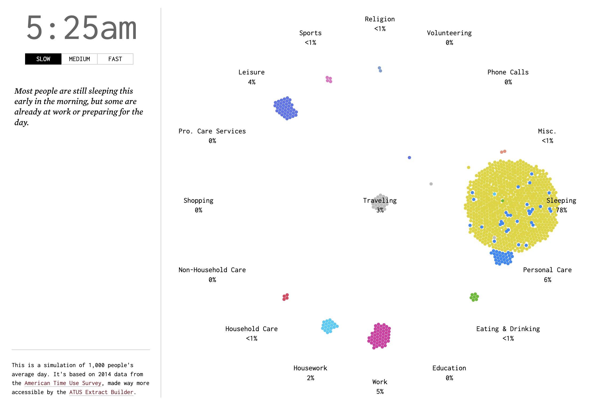

+++
author = "Yuichi Yazaki"
title = "アメリカ人の典型的な1日"
slug = "a-day-in-the-life-of-americans"
date = "2026-01-04"
categories = [
    "consume"
]
tags = [
    "",
]
image = "images/a-day-of-life.png"
+++

世の中の人々がどのように1日を過ごしているのか──これは統計的な数字で示されることはあっても、私たちは“生きた日常”として感じることは多くありません。FlowingData の Nathan Yau（ネイサン・ヤウ） は、米国の時間利用調査（American Time Use Survey: ATUS）のミクロデータをもとに、1,000人の典型的な1日をシミュレーションし、時間の流れと活動の変化を視覚化しました。 

このビジュアライゼーションは単なる統計グラフではなく、同じ時間の中で多様な行動をする人々の「リズム」を見せてくれます。データの背後にある生活の物語が、視覚的に体験できるのです。 

<!--more-->



## データと方法：ATUSとシミュレーション

このプロジェクトの基となっているのは、アメリカ労働統計局が実施する American Time Use Survey（ATUS） の 2014年版データです。ATUSは、15歳以上のアメリカ人が1日の行動を細かく記録した調査で、起きている間の行動をカテゴリ別に集計しています。 

ヤウはこのデータを以下のように処理しました：
- 各人がどの活動から次の活動へ移るかの**「遷移確率」**を1分単位で集計
- それをもとに、24時間（4:00AM〜翌4:00AM）を1,440ステップのマルコフ連鎖モデルとして再現
- 1,000人分の活動の流れをシミュレーションし、ドット（点）として表示
- 色は活動カテゴリ、時間は画面左上に表示（再生速度は選択可能） 

つまり「1,000人の典型的な1日」はランダムではなく、実際の調査に基づく確率モデルから描かれているのです。 

## 活動の流れ：一日の24時間

## 早朝（4:00〜7:00）

シミュレーションは 午前4時 から始まります。最初はほとんどの点が動かず、多くの人がまだ眠っています。人々が徐々に目を覚まし、身支度を始める動きが見られるのは 6:30〜7:30頃 です。 
- Sleep（睡眠） → Personal Care（身支度）
- 起床後の移動や朝食、通勤への準備が始まる時間帯です。 

## 午前中

午前7時を過ぎると、多くが 仕事（Work）へ向かいます。通勤や移動の点が活発になります。オフィス街が“青や赤の塊”に変わり、活動の中心が寝室から社会生活へ移っていくのがわかります。 

## 昼休み（12:00〜13:00）

正午前後は Lunch（昼食）や休憩活動 への移行が生じます。昼食時には仕事から一時的に離れる点が増えるほか、家事・余暇への一時的なシフトも見られます。 

## 夕方（17:00〜19:00）

仕事終了と帰宅 が顕著になる時間帯です。夕方5時頃になると、オフィスの点が解散して移動や食事の活動に変化します。また、家庭での家事や家族との時間が増えることも視覚化で分かります。 

## 夜（22:00〜翌0:00）

夜遅くになると、Leisure（余暇） や Personal Care を経て、再び Sleep（睡眠） に戻る人が増えます。日中の活動のラッシュが終わり、点たちはゆっくりと就寝前の活動へ移行します。 

## 視覚表現の価値

このビジュアライゼーションの魅力は、統計をただ語るのではなく「動き」として見せる点です。
点の動きによって、次のような洞察が得られます：
- 多くの人が似た時間帯に同じ行動へ移行する傾向
- 昼休みや帰宅時間帯における活動の集団的な変化
- ある活動の最盛時間や分散の程度

単純な棒グラフや円グラフでは見えにくい時間的な連続性とリズムが、視覚的に理解できます。 

## 結論：日常というリズムの可視化

Nathan Yau の A Day in the Life of Americans は、統計データをストーリーとして感じられる形で提示する秀逸なビジュアライゼーションです。

「人々はただデータとして存在するのではなく、時間とともに生き動いている」
— このプロジェクトは、日常生活の“見えないリズム”を鮮やかに可視化しています。 

## 参考・出典（Markdownコードブロック）

- [A Day in the Life of Americans – FlowingData](https://flowingdata.com/2015/12/15/a-day-in-the-life-of-americans/)
- [American Time Use Survey (ATUS) – U.S. Bureau of Labor Statistics](https://www.bls.gov/tus/)
- [ATUS Extract Builder – IPUMS](https://atus.ipums.org/atus/)