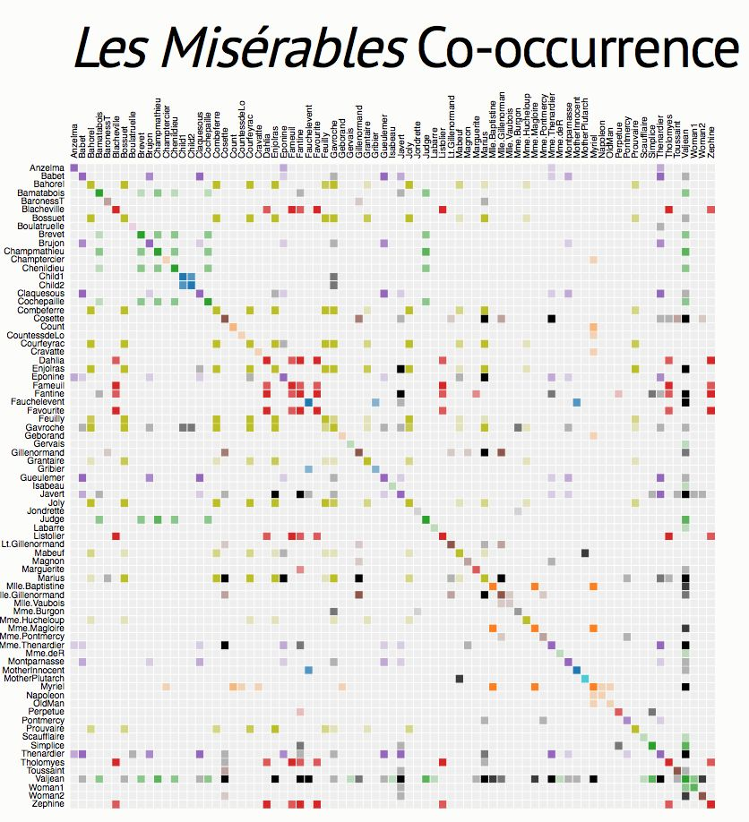

+++
author = "Yuichi Yazaki"
title = "Adjacency Matrix"
slug = "adiacency-matrix"
date = "2025-10-11"
categories = [
    "chart"
]
tags = [
    "",
]
image = "images/cover.png"
+++

An adjacency matrix represents a network as a table. Nodes appear as both rows and columns, and each cell indicates whether a connection exists between the corresponding pair of nodes.

<!--more-->

## Purpose

The purpose is to show network structure without edge crossings. Matrices are especially useful for dense networks where node-link diagrams become unreadable.

## Design Notes

- Node ordering is crucial.
- Use color intensity for edge weight.
- Cluster related nodes to reveal block structure.
- Provide labels or interaction for large matrices.

## Summary

Adjacency matrices are precise and scalable network representations. They are less intuitive than node-link diagrams at first, but much clearer for dense graphs.
