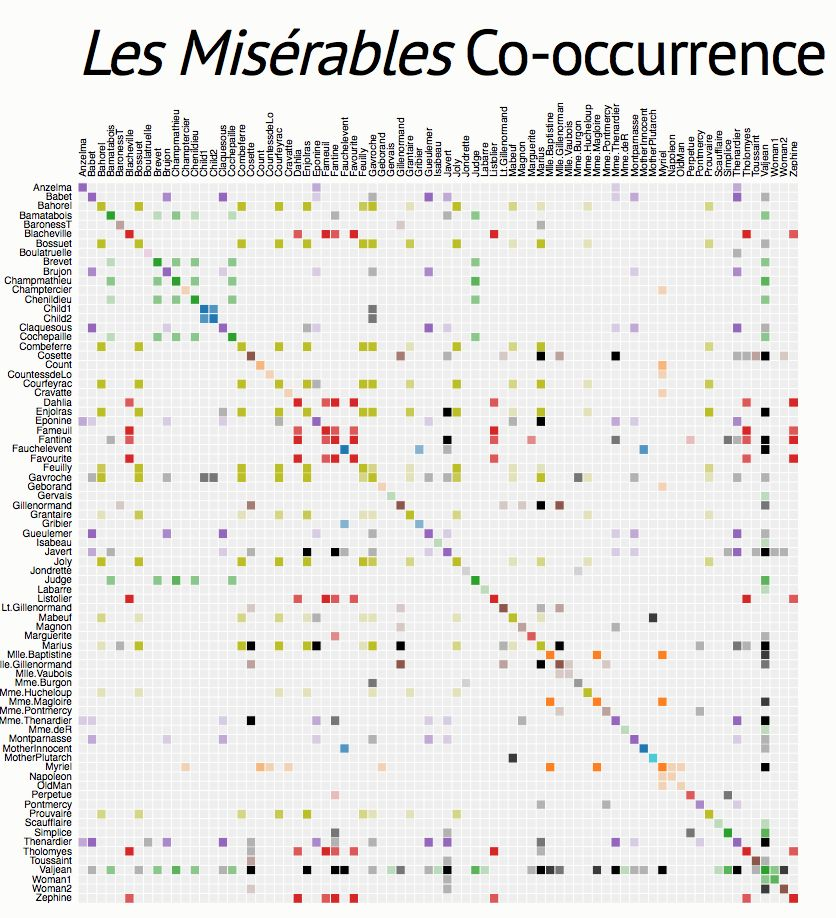

+++
author = "Yuichi Yazaki"
title = "隣接行列"
slug = "adiacency-matrix"
date = "2025-10-11"
categories = [
    "chart"
]
tags = [
    "",
]
image = "images/cover.png"
+++

隣接行列（adjacency matrix）は、**ネットワーク（グラフ）構造を行列の表形式で表現する方法**です。つまり頂点（ノード）同士の接続関係を、行と列で示します。ネットワーク理論・社会ネットワーク分析・グラフアルゴリズムなどの分野で広く用いられています。

<!--more-->

## 歴史的経緯
  
隣接行列は、グラフ理論の基礎的な表現方法として、コンピュータサイエンスや社会ネットワーク分析で早くから採用されてきました。特に、ノード数が少ない場合や、行列演算を通して連結性を計算する場合に適しています。

## データ構造

(To be delivered.)

## 目的

隣接行列は **ネットワーク可視化の「行列型レイアウト」** として利用されます。

**縦軸と横軸にすべてのノード（頂点）を並べ**、交差点のセル（マス目）に「接続があるかどうか」を記します。

| 行・列 | 意味 | セルの値の意味 | 備考 |
|---------|------|----------------|------|
| 行（縦） | 出発ノード（From） | 1（または◯）：接続あり 0（または空白）：接続なし | 有向グラフでは「出発点」を示す |
| 列（横） | 到達ノード（To） | 1（または◯）：接続あり 0（または空白）：接続なし | 無向グラフでは行列が対称になる |
| 対角成分 | 自己ループ | 1の場合：ノードが自分自身へ接続 | 多くのネットワークでは0 |

例えば、3つのノード A, B, C のネットワークで  
A→B、B→C、C→A という接続がある場合の隣接行列は次の通りです。

|   | A | B | C |
|---|---|---|---|
| **A** | 0 | 1 | 0 |
| **B** | 0 | 0 | 1 |
| **C** | 1 | 0 | 0 |

このように、**行列の1つ1つのセルがエッジ（辺）を表す**ため、リンクの有無を簡潔に比較できます。

## 特徴

ノードを円や線で描く「ノードリンク図」に比べ、リンクの重なりがなく **構造的な規則性（クラスター、対称性、自己ループなど）** を視覚的に発見しやすい特徴があります。

| 可視化形式 | 特徴 | 適用例 |
|-------------|------|--------|
| ノードリンク図 | 直感的・空間的関係を表現 | 小規模ネットワーク |
| 隣接行列 | 構造・関係パターンを強調 | 大規模・密集ネットワーク、社会ネットワーク |

- **長所**  
  - 行列演算が使えるため、ネットワークの **連結成分・経路探索・中心性計算** に有効。  
  - 形式が単純で **プログラム実装や保存** に適する。

- **短所**  
  - ノード数が増えると、要素数が急増（O(n²)）し、疎なネットワークでは **非効率** 。  
  - 視覚的な理解が難しく、大規模ネットワークでは **密集したパターン（hairball）** になりやすい。

## デザイン上の注意点

(To be delivered.)

## 応用例

- **ソート済み隣接行列（Sorted Adjacency Matrix）**：ノードを特定の属性（例：コミュニティ、次数、モジュール）で並べ替え、構造的パターンを強調。

## 代替例

- **相関行列との比較**：隣接行列が「接続の有無（binary）」を表すのに対し、相関行列は「関係の強さ（continuous）」を示す。
- **BioFabric・Hive Plotなど**：隣接行列の欠点を克服し、構造を線形・規則的に描く手法として発展している。

## まとめ

隣接行列は **ネットワークを数値的・構造的に理解するための基本フォーマット** であり、可視化においても「構造の秩序を読む」ことを重視する設計思想に通じています。ノード間の関係を抽象的に捉える練習として、インフォグラフィックス教育でも有効な素材となります。

## 参考・出典

- [Wikipedia: Adjacency matrix](https://en.wikipedia.org/wiki/Adjacency_matrix)
- [Network Science by Albert-László Barabási](https://networksciencebook.com/chapter/3)
- [Les Misérables Co-occurrence](https://bost.ocks.org/mike/miserables/)

