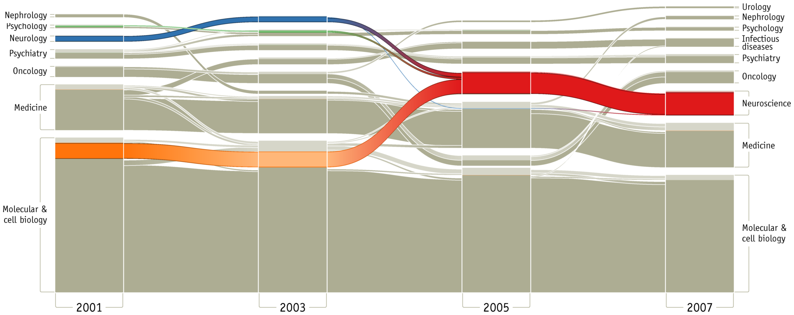

+++
author = "Yuichi Yazaki"
title = "沖積図（Alluvial Diagrams）の事例"
slug = "alluvial-diagrams-example"
date = "2020-08-03"
description = ""
categories = [
    "chart"
]
tags = [
    "ネットワーク",
]
image = "images/image-24.png"
+++

沖積図（Alluvial Diagrams）の事例を紹介します。

<!--more-->

## 科学に起こった大きな構造的変化
過去10年間に科学に起こった大きな構造的変化を示しています。

[Mapping Change in Large Networks](https://journals.plos.org/plosone/article?id=10.1371/journal.pone.0008694)

## ゲーム・オブ・スローンズ(シーズン1-7)における所属の変化

[A Game of Data Visualizations: Making Alluvial Diagrams Without Code | by Matthew Lunkes | Medium](https://medium.com/@matthewlunkes/a-game-of-data-visualizations-243c3d8ceb1e)

## アフリカ都市の人口（1960年～2025年）

[AFRICA – Big Change / Big Chance](https://www.behance.net/gallery/20553607/AFRICA-Big-Change-Big-Chance-Triennale-di-Milano)

