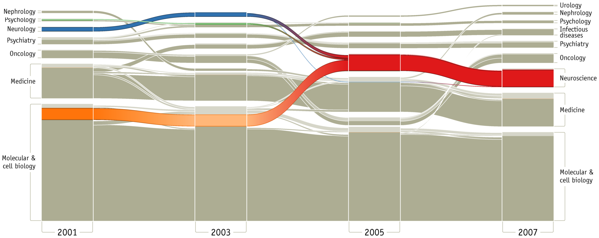
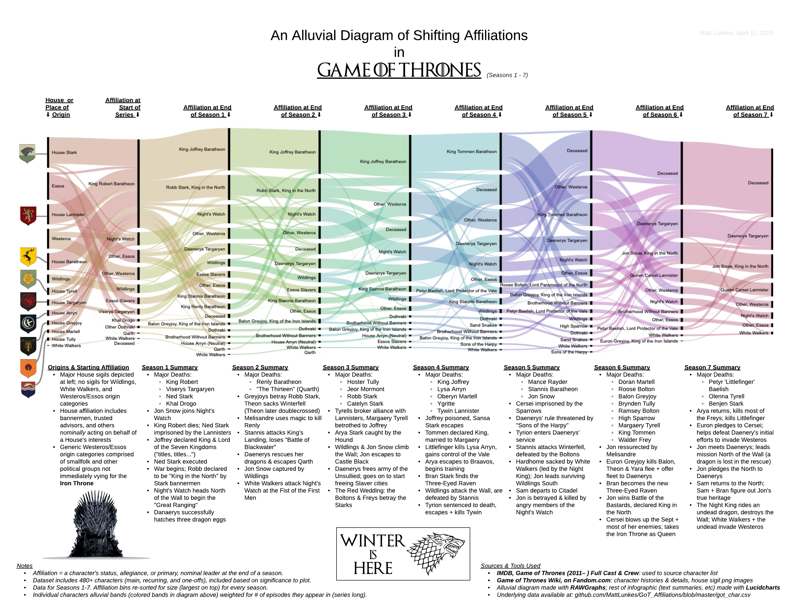
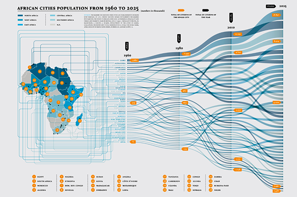

+++
author = "Yuichi Yazaki"
title = "沖積図（Alluvial Diagrams）"
slug = "alluvial-diagrams"
date = "2020-08-03"
description = ""
categories = [
    "chart"
]
tags = [
    "ネットワーク",
]
image = "images/image-24.png"
+++

沖積図（沖積グラフとも呼ばれます）は、時間の経過とともに、対象が合併したり分裂したりする様子を示すのに使用することができるチャートです。

<!--more-->

ある時点における定量的な値（ノード）と、それらをつなぐ線（リンク）は、ノードの値を線の太さや色に反映させます。

たいてい、横軸に時間の流れを示します。縦軸に対象の大きい順に並べられていることが多いでしょう。

サンキー・ダイアグラムは時間の流れを表さないため、 沖積図とは明確に異なるチャートになります。

## 作例

### 科学に起こった大きな構造的変化
過去10年間に科学に起こった大きな構造的変化を示しています。

[Mapping Change in Large Networks](https://journals.plos.org/plosone/article?id=10.1371/journal.pone.0008694)

### ゲーム・オブ・スローンズ(シーズン1-7)における所属の変化

[A Game of Data Visualizations: Making Alluvial Diagrams Without Code | by Matthew Lunkes | Medium](https://medium.com/@matthewlunkes/a-game-of-data-visualizations-243c3d8ceb1e)

### アフリカ都市の人口（1960年～2025年）

[AFRICA – Big Change / Big Chance](https://www.behance.net/gallery/20553607/AFRICA-Big-Change-Big-Chance-Triennale-di-Milano)

