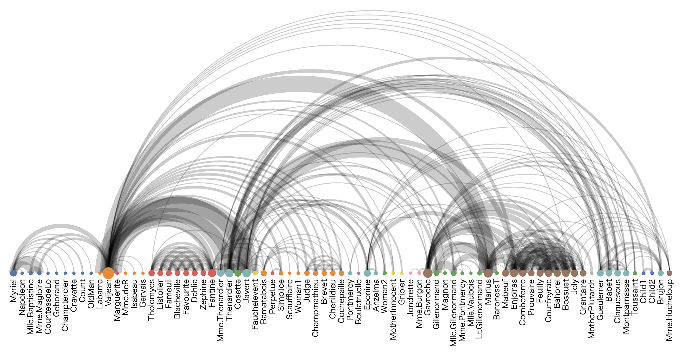

+++
author = "Yuichi Yazaki"
title = "Arc Diagram"
slug = "arc-diagram"
date = "2025-10-11"
categories = [
    "chart"
]
tags = [
    "",
]
image = "images/cover.png"
+++

An arc diagram places nodes along a straight line and draws relationships as arcs above or below that line. It is a network visualization technique that can reveal patterns, symmetry, repetition, and long-range connections.

<!--more-->

## Design Notes

- Node ordering strongly affects readability.
- Use for moderate-sized networks.
- Separate directions or categories with color or arc side when helpful.
- Avoid dense networks with too many overlapping arcs.

## Summary

Arc diagrams are simple network views where ordering is central. They work well when the sequence of nodes has meaning or when connection patterns are the main story.
