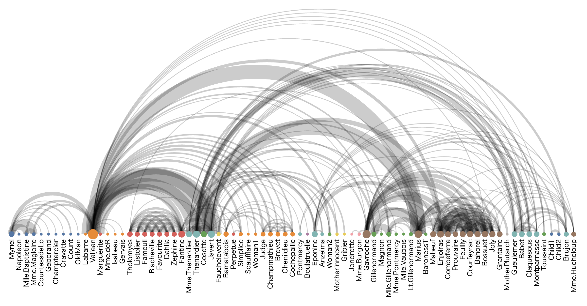

+++
author = "Yuichi Yazaki"
title = "アーク・ダイアグラム (Arc Diagram)"
slug = "arc-diagram"
date = "2025-10-11"
categories = [
    "chart"
]
tags = [
    "",
]
image = "images/cover.png"
+++

アーク・ダイアグラム（Arc Diagram）は、ネットワーク構造を直線上に配置したノード（点）と、それらを結ぶ円弧（アーク）によって関係性を可視化する図法です。2000年代初頭にマサチューセッツ工科大学のMartin Wattenbergが提案した手法で、複雑なネットワーク構造を「時間的順序」や「系列関係」とともに視覚的に理解できるように設計されています。

<!--more-->

## 図解の見方

| 要素 | 説明 |
|------|------|
| **ノード（点）** | 対象となる要素（人物、単語、音符、登場キャラクターなど）を表す。直線上に等間隔または意味のある順序で並ぶ。 |
| **アーク（円弧）** | ノード間の関係性や接続を表す。線の高さや太さ、色などで関係の種類や強さを表現できる。 |
| **配置の順序** | 左から右へ、または上から下へと進む直線的な並びは、時間の流れや文脈の順序を意味することが多い。 |
| **重なりのパターン** | アークが交差したり密集したりする部分は、関係が集中している、または複雑な相互関係を持つことを示す。 |
| **対称性** | 対称的なアーク配置は、構造的なパターンや循環性（再帰的な関係）を暗示する。 |

## 背景と応用例

アーク・ダイアグラムは、ネットワーク可視化の中でも「直線的な時間軸」や「系列的なテキスト構造」との親和性が高い手法です。たとえば以下のような領域で活用されています。

- **テキスト分析** ：同じ語句の出現関係や文中の参照構造を表す（例：シェイクスピア作品における人物同士の登場関係）。  
- **音楽解析** ：曲中で繰り返されるモチーフや和音進行の関係を示す。  
- **生物情報学** ：遺伝子間相互作用や配列の類似性を時間軸上で視覚化。  
- **ソフトウェア解析** ：コード内の関数呼び出し関係を直線的に表す。  

この手法は、ネットワーク構造を「空間的に展開する」のではなく、「時間的・文脈的な線上に射影する」ことで、観察者が系列構造と関係構造を同時に理解できる点が特徴です。

## 歴史的背景

Martin Wattenberg（現・Google Research, 以前はIBM Visual Communication Lab）は2002年に、音楽の構造を可視化する「The Shape of Song」プロジェクトにおいてアーク・ダイアグラムを初めて一般に紹介しました。
この作品では、音楽の繰り返し構造が左右対称のアークとして描かれ、聴覚的な構造が視覚的パターンに変換されています。

その後、アーク・ダイアグラムはネットワーク可視化ライブラリ（Gephi, D3.js, Vega-Liteなど）に取り込まれ、現在では「ネットワーク構造を簡潔に表現する代表的手法」として定着しています。

## まとめ

アーク・ダイアグラムは、複雑な関係性を直線的な配置で単純化し、パターン認識を助ける強力な可視化手法です。「時間・順序・関係」の三要素を同時に理解できる点が特徴であり、特に情報デザイン・音楽分析・テキスト構造解析など **系列的構造を持つデータ** において有効です。

## 参考・出典

- [“Arc Diagrams: Visualizing Structure in Strings” — Martin Wattenberg, IEEE InfoVis 2002](https://research.ibm.com/publications/arc-diagrams-visualizing-structure-in-strings)
- [Arc diagram — Wikipedia （頂点を直線上に配置し、半円弧などで辺を描く手法について解説](https://en.wikipedia.org/wiki/Arc_diagram)
- [Arc diagram Example | Vega （“arc diagrams were originally invented to depict repeated musical structures in Martin Wattenberg’s The Shape of Song.” と記述）](https://vega.github.io/vega/examples/arc-diagram/)
- [The Shape of Song — “I created a visualization method called an arc diagram that highlighted repeated sections …”](https://www.bewitched.com/song.html)
- [Martin M. Wattenberg — 可視化分野・Arc Diagram との関連を記述](https://en.wikipedia.org/wiki/Martin_M._Wattenberg)
- [Arc Diagrams: Visualizing Structure in Strings (IBM 公開版) — IBM サイト上での発表概要](https://research.ibm.com/publications/arc-diagrams-visualizing-structure-in-strings)