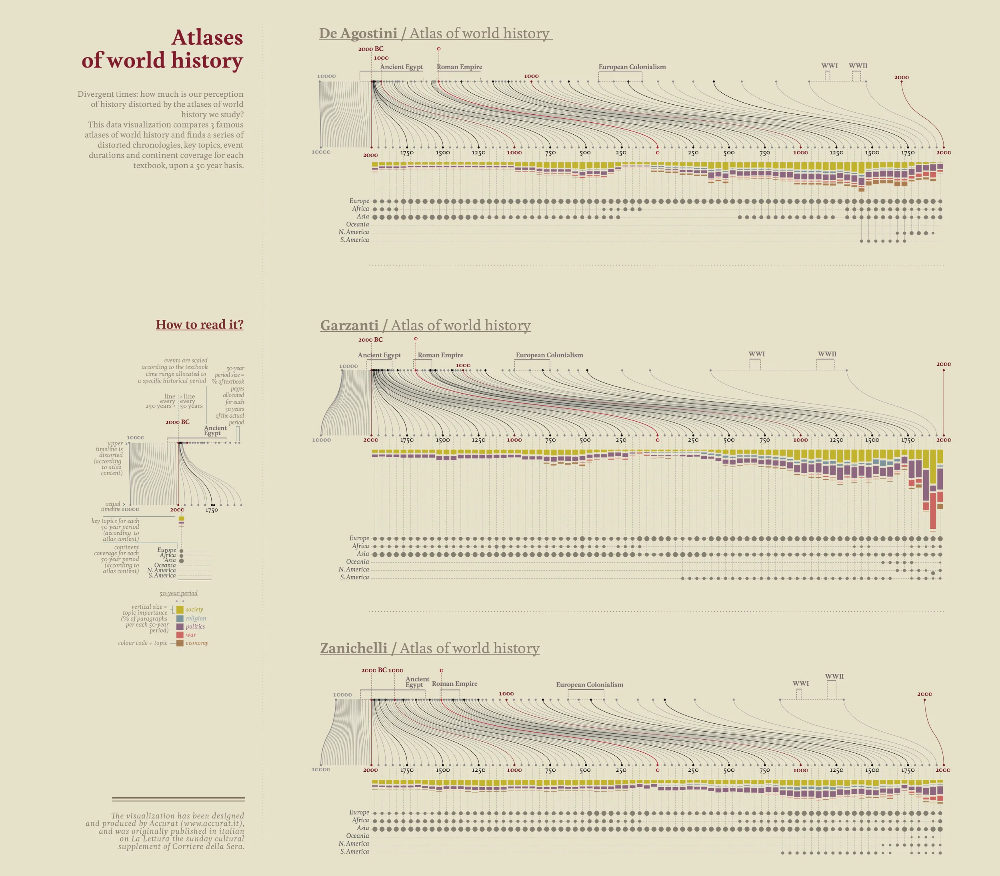
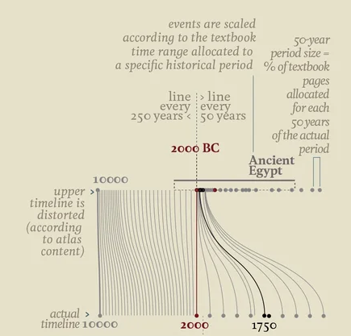
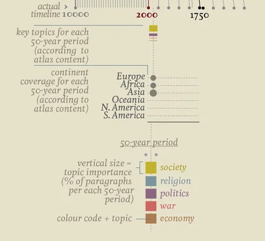

+++
author = "Yuichi Yazaki"
title = "Atlases of World History: How Historical Atlases Distort Historical Memory"
slug = "atlases-of-world-history"
date = "2025-10-10"
categories = [
    "consume"
]
tags = [
    "オリジナルのビジュアル変換",
]
image = "images/cover.png"
+++

**Atlases of world history** is a data visualization about how historical atlases shape, and sometimes distort, our sense of history. It was created by **Accurat**, the Italian data design studio, for the *Visual Data* series in *La Lettura*.

The work compares three Italian world-history atlases from De Agostini, Garzanti, and Zanichelli. It asks a simple but powerful question: how much space does each atlas give to each period of history?

<!--more-->

## How to Read It

The "How to read it?" panel defines the visual grammar of the piece.

### Distorted Timeline

The upper timeline is distorted according to the amount of page space each atlas devotes to each period. Periods that receive more pages are stretched; periods that receive little attention are compressed.

| Element | Meaning |
|---|---|
| Actual timeline | The real passage of time from 10000 BC to AD 2000 |
| Upper timeline | The atlas timeline, rescaled by page allocation |
| Vertical lines | Correspondences between actual time and the distorted timeline |
| Red 2000 BC mark | A reference point highlighting displacement |
| 50-year period size | Percentage of textbook pages assigned to that period |

The core idea is that "textbook pages" become a proxy for perceived historical length. Ancient Egypt, for example, may occupy a much larger cognitive space than its actual duration would suggest, while prehistory or early medieval periods may be compressed into near invisibility.

### Topics and Continents

The lower portion shows what each period is about and where it is geographically focused.

- Bar **height** indicates how much a topic is discussed.
- **Color** identifies the topic, such as society, religion, politics, war, or economy.
- Dots indicate continental coverage.

This layered structure shows history not as a neutral timeline, but as an editorial construction: what a book chooses to emphasize becomes what readers remember as important.

## Comparing the Atlases

| Atlas | Publisher | Main tendency |
|---|---|---|
| De Agostini / Atlas of world history | De Agostini | Relatively balanced, but still strongly Eurocentric |
| Garzanti / Atlas of world history | Garzanti | Greater emphasis on the modern period, politics, and war |
| Zanichelli / Atlas of world history | Zanichelli | Broad scholarly coverage, again with Europe and warfare prominent |

Across all three, modern Europe receives disproportionate attention.

## Why It Matters

The work is not merely a comparison of books. It is a critique of how educational media constructs collective memory. If the scale of a timeline is governed by page allocation, then the act of learning history also reshapes our intuitive sense of historical time.

Accurat's method turns editorial bias into a visible structure. It shows how data visualization can act not only as an explanatory tool, but also as a cultural critique.

## Summary

"Atlases of world history" reveals the hidden geometry of historical education. By stretching and compressing time according to the space it receives in atlases, the piece shows how world history is remembered through emphasis, omission, and repetition.

## References

- [Visual Data — Atlases of world history](https://giorgialupi.com/lalettura)
- [Comparing historical atlases — Flickr](https://www.flickr.com/photos/accurat/8417324861/in/album-72157632185046466)
