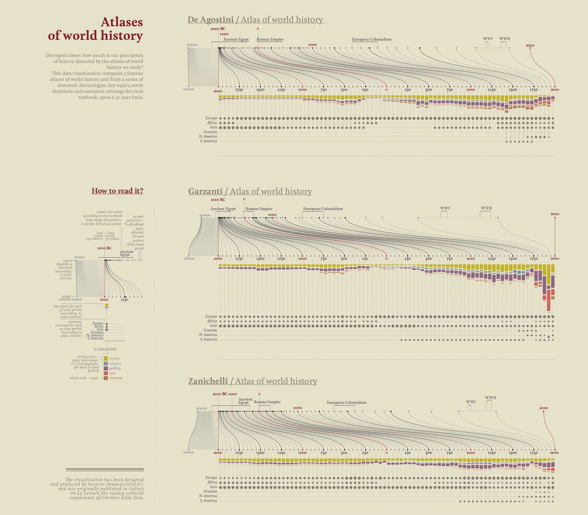
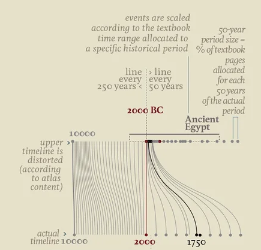
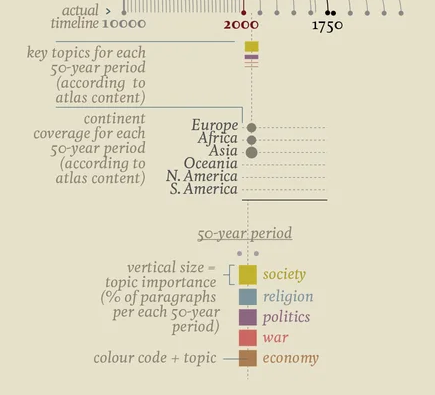

+++
author = "Yuichi Yazaki"
title = "歴史地図帳によって歪められた歴史認識 -Atlases of world history-"
slug = "atlases-of-world-history"
date = "2025-10-10"
categories = [
    "consume"
]
tags = [
    "オリジナルのビジュアル変換",
]
image = "images/cover.png"
+++

この作品「 **Atlases of world history** 」は、歴史地図帳によってどのように私たちの「歴史認識」が歪められているのかを可視化したデータ・ヴィジュアライゼーションです。
制作者は **Accurat**（イタリアのデータ・デザインスタジオ）で、イタリア紙 *Corriere della Sera* の文化付録「La Lettura」に掲載されたシリーズ作品のひとつです。
De Agostini、Garzanti、Zanichelli という3種類の代表的な世界史アトラス（いずれもイタリアの出版社）を比較し、**それぞれの地図帳が歴史のどの時代にどれだけの紙面を割いているか** を、歪んだタイムラインで示しています。

<!--more-->

## 図解の見方

左側の「How to read it?」パネルに示されているように、この図の構造は以下の要素で構成されています。

### Distorted timeline — 時間の歪みを可視化する

ここでは、実際の歴史の経過と、アトラス（教科書）で割かれている紙面量とを比較し **時間の歪み（distortion of timeline）** を視覚的に表現しています。

| 要素 | 意味・役割 |
|------|-------------|
| **actual timeline（下段）** | 実際の時間の経過を示します。紀元前10000年から西暦2000年までを等間隔で描いた「正しい」時間軸です。 |
| **upper timeline（上段）** | 各アトラスでどの時代にどれだけの紙面が割かれているかに応じて歪められた時間軸です。多く扱われる時代は伸び、軽視される時代は圧縮されます。 |
| **縦方向の線群** | 実際の時間（下）と歪んだ時間（上）を結ぶ対応線です。実際の軸では250年ごと、歪んだ軸では50年ごとに線が引かれ、時代ごとの「強調度合い」を比較できます。 |
| **2000 BC の赤線** | 歴史上の特定時点（古代エジプトの開始期）を基準として、時間のずれを強調しています。 |
| **右端の注記** | “50-year period size = % of textbook pages…” の文が示すように、各50年間に対して教科書の何％のページが割かれているかを表します。値が大きいほど時間が引き伸ばされます。 |

この凡例が示しているのは **「教科書のページ数＝私たちが体感する歴史の長さ」** という構造です。実際の時間軸は一定でも、教育や出版物の中では、その時代の「重要度」に応じて時間が再スケーリングされてしまいます。  

たとえば、古代エジプトは実際の歴史上では限られた期間ですが、アトラス上では多くのページを割かれているため、図上では長く引き伸ばされています。逆に、先史時代や中世初期のように扱いの少ない時代は、圧縮されてほとんど目に入らなくなります。  

この歪みこそが「世界史をどのように記憶しているか」を決定づける要因であり、本作品のメッセージは **「私たちは歴史を“学ぶ比率”によって時間感覚を再構築している」** ということにあります。

### Key topics and continents — 主題と地域の偏りを読む

この部分は、アトラス（世界史地図帳）において、どの時代に **どの主題（トピック）** が重視され **どの大陸が扱われているか** を示す凡例です。上部の「時間の歪み」とは異なり、ここでは **内容の重み付けと地理的分布** を視覚化しています。

- 棒の **高さ** は「語られる量」、  
- **色** は「語られる内容」、  
- **点の位置** は「語られる場所」  

をそれぞれ表します。この三層構造によって、歴史が単に時間の流れとしてではなく、「 **何を中心に語るかという編集の選択** 」として表現されています。

| 要素 | 意味・役割 |
|------|-------------|
| **key topics for each 50-year period** | 各50年区間ごとに扱われる主題を表します。縦の積み上げ棒の高さは、そのトピックが文章中で占める割合（＝段落数の比率）を示します。 |
| **colour code + topic** | 主題ごとに色が割り当てられています。社会（黄）、宗教（紫）、政治（青紫）、戦争（赤）、経済（茶）。色分けによって時代の関心領域が視覚的にわかります。 |
| **vertical size = topic importance** | 棒の高さがそのトピックの「重要度」（＝その50年間における記述の割合）を示します。高いほど、その時期にその主題が多く語られていることを意味します。 |
| **continent coverage for each 50-year period** | 各50年ごとに、どの大陸が登場しているかをドットで表示します。上からヨーロッパ、アフリカ、アジア、オセアニア、北アメリカ、南アメリカの順です。ドットが濃いほど、その大陸が多く扱われています。 |

## 各アトラス（世界史地図帳）の特徴

| アトラス名 | 出版社 | 主な特徴 |
|-------------|----------|----------|
| **De Agostini / Atlas of world history** | De Agostini社 | 比較的バランスが取れているが、ヨーロッパ中心の叙述が顕著。古代と近代に厚く紙面を割く。 |
| **Garzanti / Atlas of world history** | Garzanti社 | 近代以降（1500年以降）の比重が高く、戦争と政治的イベントの扱いが多い。 |
| **Zanichelli / Atlas of world history** | Zanichelli社 | 学術的網羅性が高いが、やはりヨーロッパと戦争史に重点を置く傾向がある。 |

この比較により **どのアトラスも近代ヨーロッパに強く焦点を当てていること** が一目で理解できます。

## 背景：歴史の「歪み」を可視化する意義

本作は単なるデータ比較ではなく、「私たちが何を“世界史”として認識しているか」という教育的・文化的問いを投げかけています。同じ歴史でも、教材の構成によって「どこが長く、どこが短いか」という“時間の歪み”が生じ、それが集団的記憶の偏りにつながる - この構造を可視化するのが目的です。

この手法は、時間と内容の両方を比例的に扱わず **紙面比率を軸に再スケーリングする「知識地図」** として特筆されます。Giorgia LupiらAccuratが得意とする「情報を感情的に理解させるビジュアライゼーション」の好例でもあります。

## まとめ

「Atlases of world history」は、教育用地図帳という身近なメディアを通じて、私たちの歴史認識がどのように形成・歪曲されているのかを静かに問いかける作品です。

時間の伸縮と色分けによる主題分布の手法は、データ・ビジュアライゼーションが単なる統計表現ではなく、文化的記憶の再構築を促す「批評のメディア」となりうることを示しています。

## 参考・出典

- [Visual Data — Atlases of world history (giorgialupi.com)](https://giorgialupi.com/lalettura)
- [Comparing historical Atlases: | Comparing historical atlases… | Flickr](https://www.flickr.com/photos/accurat/8417324861/in/album-72157632185046466)
