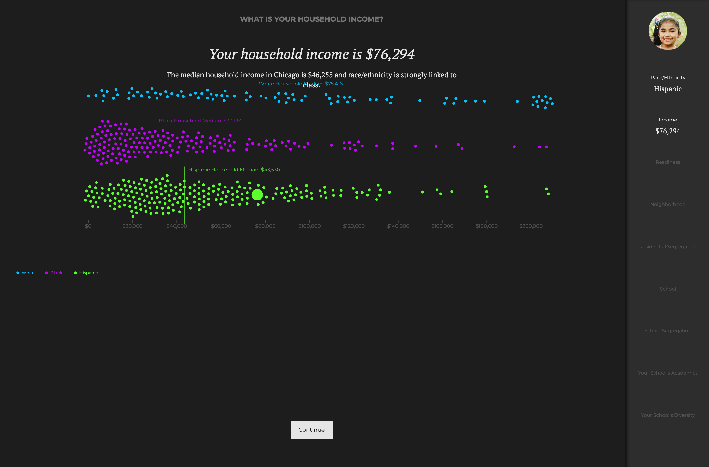
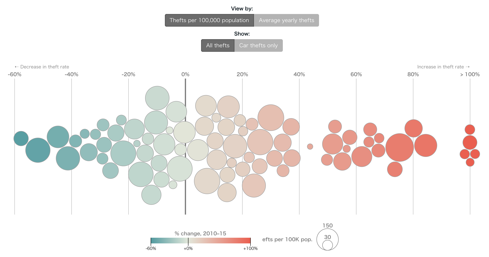
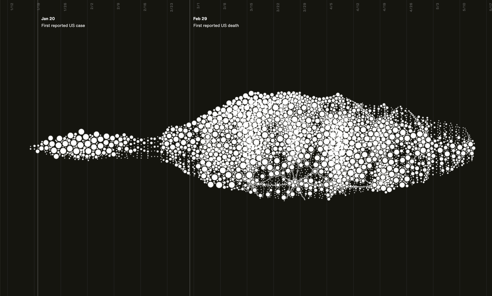
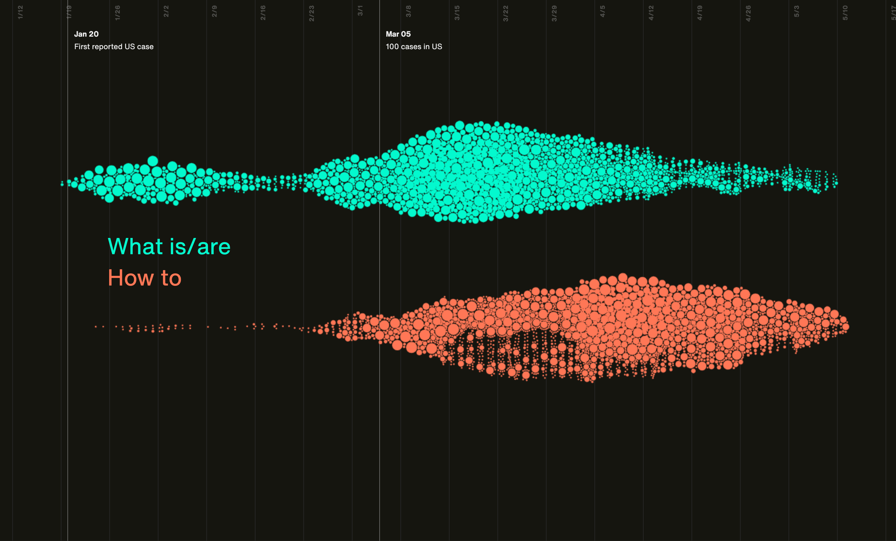

+++
author = "Yuichi Yazaki"
title = "ビースウォーム・プロットの事例"
slug = "beeswarm-example"
date = "2020-08-04"
description = ""
categories = [
    "chart"
]
tags = [
    "",
]
image = "images/searchingcovid19_2.png"
+++

「ビースウォーム・プロット」が利用されている事例を紹介します。

<!--more-->

## 作例

### 人種別世帯収入の比較

[Educate Your Child](https://gabriellelamarrlemee.github.io/thesis-simulation/)

### アメリカの80都市で報告された銃窃盗事件（2010-15年）

[Reported Gun Theft in 80 American Cities, 2010–15](https://www.thetrace.org/features/stolen-guns-violent-crime-america/#interactive)

### タイタニック号の乗客

[Alan Smith on Twitter.](https://twitter.com/theboysmithy/status/1006801643076247552)

### COVID-19関連の検索語の推移

[searchingcovid19](https://searchingcovid19.com/)

