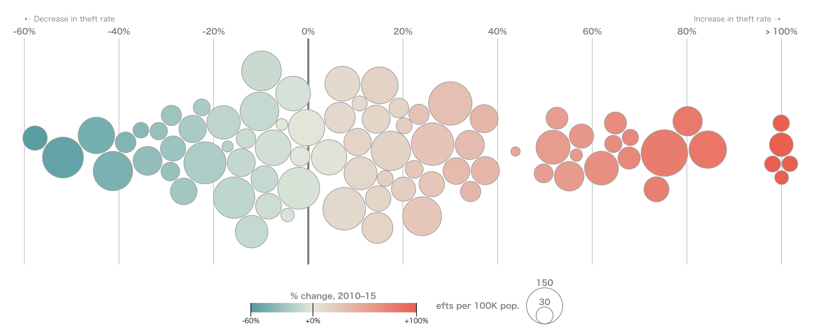

+++
author = "Yuichi Yazaki"
title = "Beeswarm Plot"
slug = "beeswarm"
date = "2025-09-28"
description = ""
categories = [
    "chart"
]
tags = [
    "",
]
image = "images/cover-beeswarm.png"
+++

A **beeswarm plot** shows a distribution by placing individual data points so that they do not overlap. It sits between a scatterplot and summary charts such as box plots or violin plots, preserving individual observations while revealing density.

The name comes from the way the points cluster like a swarm of bees.

<!--more-->

## Background

Beeswarm plots became familiar through the R `beeswarm` package and are now available in many visualization libraries, including Python's `seaborn.swarmplot()` and Plotly strip charts. They reflect a broader trend toward showing raw observations rather than only statistical summaries.

## Data Structure

| Variable | Meaning | Type |
|---|---|---|
| category | Group to compare | string |
| value | Numeric measurement | number |

The plot can show one distribution or compare several groups.

## Purpose

The goal is to show the detailed distribution of data while retaining individual points. This is especially useful for sample sizes from dozens to hundreds, where every observation can still be displayed.

## Use Cases

- experimental or medical measurements by group
- educational or survey score distributions
- supplementing a box plot with raw data
- SHAP beeswarm plots for machine-learning interpretation

## How to Read It

One axis shows the numeric value, while the other axis separates categories. Points are moved sideways only to avoid overlap. The wider the swarm at a value range, the more observations are concentrated there.

## Design Notes

- Use transparency or sampling for larger datasets.
- Adjust point size and spacing carefully.
- Limit the number of categories.
- Remember that horizontal spread is not a precise quantitative scale.

## Alternatives

| Chart | Use case |
|---|---|
| Box plot | Large samples and summary statistics |
| Violin plot | Smoothed distribution shape |
| Strip plot | Simpler point display for small data |

## Summary

Beeswarm plots balance individuality and distribution. Used with an appropriate sample size, they reveal outliers, clusters, and spread more directly than summary-only charts.

## References

- [Data Visualization Guide: Beeswarm Plots](https://data.europa.eu/apps/data-visualisation-guide/beeswarm-plots)
- [Data-to-Viz: Beeswarm plot](https://www.data-to-viz.com/graph/beeswarm.html)
- [Python Graph Gallery: Beeswarm Plot](https://python-graph-gallery.com/beeswarm-plot/)
- [R beeswarm package](https://cran.r-project.org/web/packages/beeswarm/beeswarm.pdf)
- [Seaborn swarmplot](https://seaborn.pydata.org/generated/seaborn.swarmplot.html)
- [SHAP beeswarm plot](https://shap.readthedocs.io/en/latest/example_notebooks/api_examples/plots/beeswarm.html)
