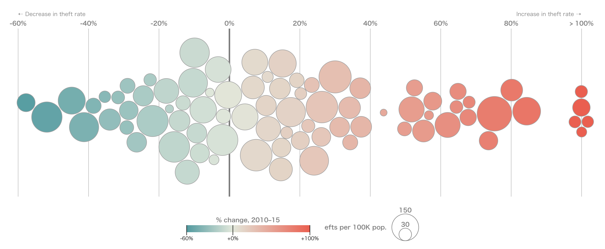

+++
author = "Yuichi Yazaki"
title = "ビースウォーム・プロット（Beeswarm Plot）とは？"
slug = "beeswarm"
date = "2025-09-28"
description = ""
categories = [
    "chart"
]
tags = [
    "",
]
image = "images/cover-beeswarm.png"
+++

データの分布を表現する方法には、箱ひげ図やバイオリンプロット、ヒストグラムなど様々なものがあります。その中で「すべてのデータ点を表示しつつ、分布の特徴も一目で分かる」手法として注目されているのが ビースウォーム・プロット（Beeswarm Plot） です。名前の通り、ミツバチの群れのようにデータ点が広がって見えるのが特徴です。

<!--more-->

## ビースウォーム・プロットの仕組み

- **基本構造** ...縦軸（あるいは横軸）に数値データを、横軸（あるいは縦軸）にカテゴリ変数を配置します。
- **重なりの解消** ...単純なストリッププロット（strip plot）では点が重なってしまいますが、ビースウォームではアルゴリズムによって点をずらし、衝突しないように散らします。
- **配置の意味** ...数値軸方向はデータ値を保持し、カテゴリ軸方向には重なりを避けるための調整だけが行われます。そのため、点が横に広がるほど「その数値付近に多くの観測がある」ことを意味します。

## メリットと注意点

### メリット

- **すべての点が見える** ：要約統計だけでなく、外れ値や個々の観測をそのまま確認可能。
- **分布の偏りが直感的** ：点の群れ具合から、密集やばらつきがすぐに分かる。
- **比較がしやすい** ：カテゴリごとに並べることで、グループ間の分布差を直接見比べられる。

### 注意点

- **大量データには不向き** ：数万件単位のデータでは処理も表示も重くなる。
- **「幅」に定量性はない** ：横方向の広がりは単なる重なり回避であり、密度を厳密に測るものではない。
- **視覚的調整が必要** ：パラメータ設定を工夫しないと点が雑然として見えることがある。

## 応用例

- **統計可視化** ：箱ひげ図やバイオリン図と組み合わせ、要約統計と生データを両立。
- **機械学習の解釈（SHAP）** n：特徴量の重要度を視覚化する際に beeswarm プロットが使われ、個々の観測の影響度を直感的に理解できます。
- **教育・プレゼン** ：点が「生きている」ように散らばるため、聴衆に分布の雰囲気を伝えるのに効果的。

## まとめ

ビースウォーム・プロットは、データの「個別性」と「分布性」を同時に示せる可視化手法です。適切なデータサイズで用いれば、他のチャートでは見えにくい外れ値や集中度を明快に伝えることができます。
今後のデータ可視化の現場でも、ますます利用される機会が増えていくでしょう。

## 参考リンク

- [R: beeswarm package (CRAN)](https://cran.r-project.org/web/packages/beeswarm/beeswarm.pdf)
- [Seaborn swarmplot (Python)](https://seaborn.pydata.org/generated/seaborn.swarmplot.html)
- [SHAP beeswarm plot (公式ドキュメント)](https://shap.readthedocs.io/en/latest/example_notebooks/api_examples/plots/beeswarm.html)
- [Data Visualization Guide: Beeswarm Plots (EU)](https://data.europa.eu/apps/data-visualisation-guide/beeswarm-plots)
