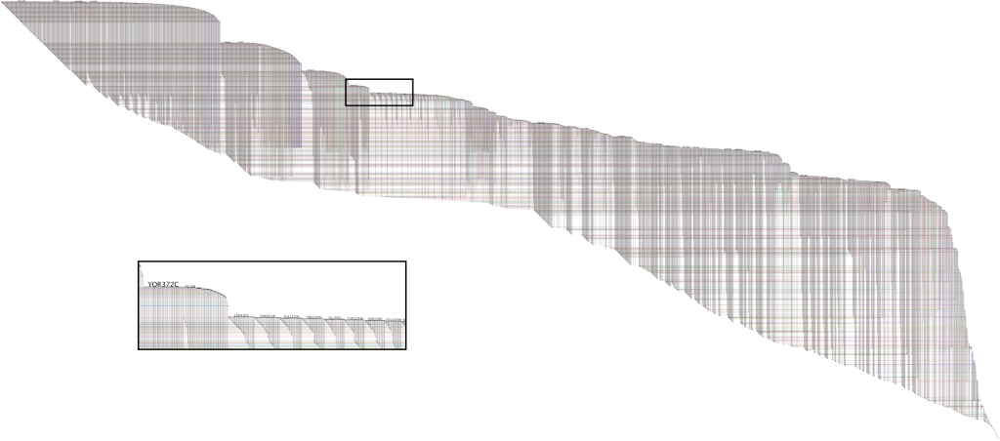

+++
author = "Yuichi Yazaki"
title = "BioFabric"
slug = "bio-fabric"
date = "2025-10-11"
categories = [
    "chart"
]
tags = [
    "",
]
image = "images/cover.png"
+++

BioFabric is a network visualization method that represents nodes as horizontal lines and edges as short vertical marks crossing those lines. This differs from conventional node-link diagrams and can make large networks more orderly.

<!--more-->

## Purpose

The purpose is to avoid node overlap and tangled links in large networks. By turning nodes into lines, BioFabric gives every node a visible row and every edge a position.

## Design Notes

- Ordering of nodes and edges is critical.
- Use interaction to inspect details.
- Explain the unfamiliar encoding to readers.
- Consider it for large networks where node-link diagrams become unreadable.

## Summary

BioFabric is a distinctive alternative to node-link diagrams. It can reveal structure in large networks by trading familiar geometry for a more scalable tabular-like layout.
