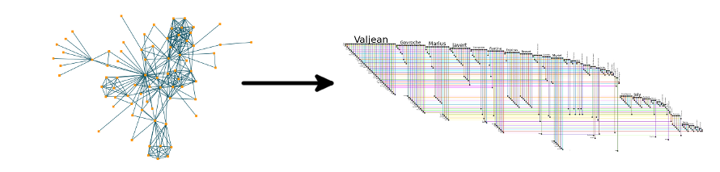
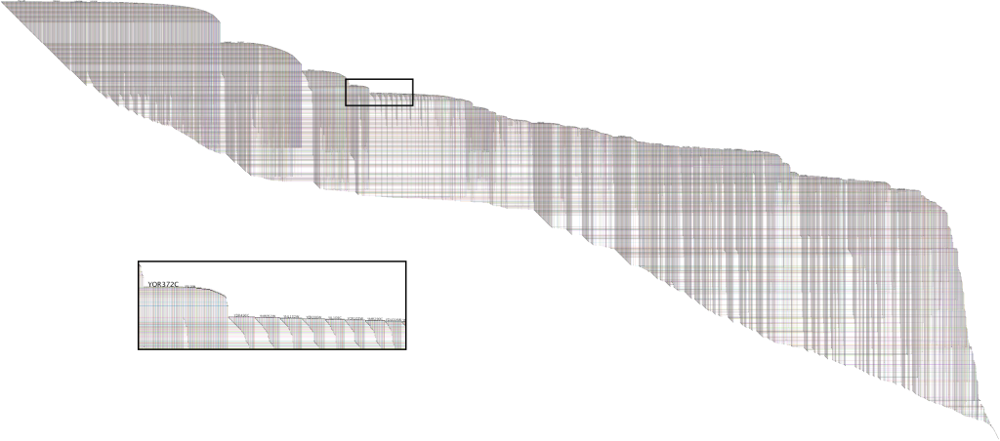

+++
author = "Yuichi Yazaki"
title = "BioFabric: 複雑なネットワークを「髪の毛をとかす」ように可視化する"
slug = "bio-fabric"
date = "2025-10-10"
categories = [
    "chart"
]
tags = [
    "",
]
image = "images/cover.png"
+++

BioFabric（バイオファブリック）は、生命科学や社会ネットワークなどの **複雑な相互関係を持つネットワーク構造** を、従来の「ノードとエッジのパラパラ図」ではなく **線と格子によって秩序化された構造** として再構築・可視化するツールです。開発はGary Baderらによるもので、Systems Biology領域での大規模データ解析に用いられています。

<!--more-->

上図は「Comb the Hairball with BioFabric（BioFabricで“毛玉”をとかす）」という公式デモの一例で、左が従来のネットワーク図（いわゆる“ヘアボール”）、右がBioFabricによる図です。

左図ではノードとエッジが錯綜しており、相関や構造を把握することが困難です。一方で、右図では **各ノードが水平線** 、 **エッジが垂直線** として表現され、全体が格子状に整列されています。これにより、接続関係の密度やモジュール構造を直感的に読み取ることができます。

## 図解の見方

| 要素 | 意味 | 見方のポイント |
|------|------|----------------|
| **水平線** | 各ノード（遺伝子・人物・要素）を表す | 一行が一つのノードに対応する。行の位置がノードの順序関係を示す。 |
| **垂直線** | エッジ（ノード間の関係）を表す | 上下に交差する点が接続関係。密集度が高いほど関連が強い部分群を示す。 |
| **ブロック構造** | クラスタ・モジュール構造 | 同じパターンの線群が塊を形成する部分。機能的モジュールやコミュニティに対応。 |
| **色分け** | 異なる属性や分類 | 例えば、系統分類、サブネットワーク、重みなどを色で識別できる。 |

右下の拡大図（YOR372Cなど）は、実際のデータセット「Yeast High-Quality Network（酵母の高品質ネットワーク）」からの部分です。局所的な接続構造が格子状に展開され、どのノードがどのような関係を持つかが整然と示されています。

## 背景と意義

従来のネットワーク図は、ノード数やエッジ数が増えると「毛玉状（hairball）」になり、情報が読み取れなくなる問題がありました。BioFabricはこの問題を**レイアウトの発想自体を変えることで解決**しました。  
ノードを線に変換することで、次のような利点が得られます：

- **重なりがない**ため、大規模ネットワークでも可視性が保たれる  
- **エッジ密度や構造的特徴を定量的に観察**できる  
- **ヒートマップや時系列データとの統合が容易**

この発想は「ネットワークをテキスト化・表形式化する」方向への橋渡しとも言え、情報可視化の一つの新しいパラダイムです。

## まとめ

BioFabricは、従来の「点と線の混沌」から脱却し、**構造の秩序と密度のパターン**を可視化する新しい手法です。  
ネットワークを“毛玉”ではなく“織物”として描くことにより、膨大な関係性の中から秩序や機能的構造を見出すことが可能になります。生命科学だけでなく、社会ネットワークや都市構造の解析などにも応用が期待されています。

## 参考・出典
- [BioFabric: A novel network visualization tool](https://biofabric.systemsbiology.net/)
- [Comb the Hairball with BioFabric (official tutorial)](https://biofabric.systemsbiology.net/gallery/index.html)
- [Longabaugh, W. J. R. “Combing the hairball with BioFabric: a new approach for visualization of large networks.” *BMC Bioinformatics* (2012)](https://bmcbioinformatics.biomedcentral.com/articles/10.1186/1471-2105-13-275)
- [wjrl/BioFabric: BioFabric is an open-source network visualization tool](https://github.com/wjrl/BioFabric)
- [BioFabric — Wikipedia (English)](https://en.wikipedia.org/wiki/BioFabric)
- [layout_tbl_graph_fabric — ggraph R package documentation](https://ggraph.data-imaginist.com/reference/layout_tbl_graph_fabric.html)