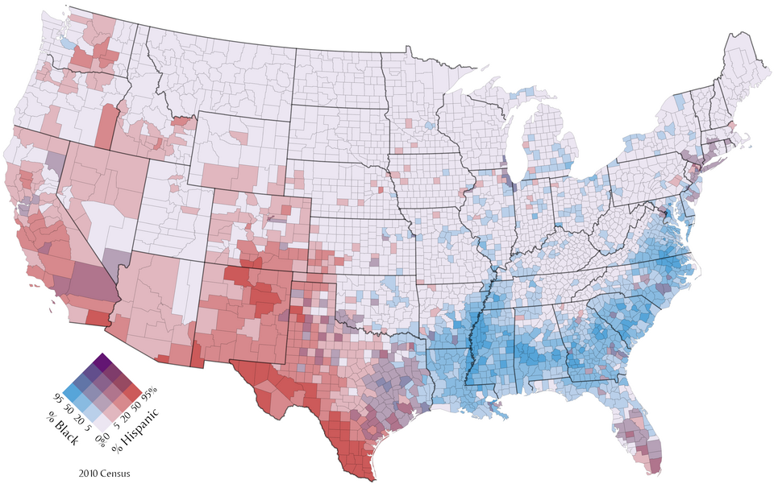

+++
author = "Yuichi Yazaki"
title = "Bivariate Choropleth Map"
slug = "bivariate-choropleth-map"
date = "2025-10-11"
categories = [
    "chart"
]
tags = [
    "地図",
]
image = "images/cover.png"
+++

A bivariate choropleth map represents two variables on one map. Instead of using one color scale for one variable, it combines two color axes so each region's color represents a paired value.

<!--more-->

## Purpose

The purpose is to show the spatial relationship between two variables, such as income and education, or vulnerability and exposure.

## Design Notes

- Use a simple 2x2 or 3x3 legend.
- Choose variables that have a meaningful relationship.
- Avoid too many color classes.
- Make sure readers understand the mixed-color legend.

## Summary

Bivariate choropleth maps are powerful for showing two-variable spatial patterns, but they require careful legends and restrained color design.
