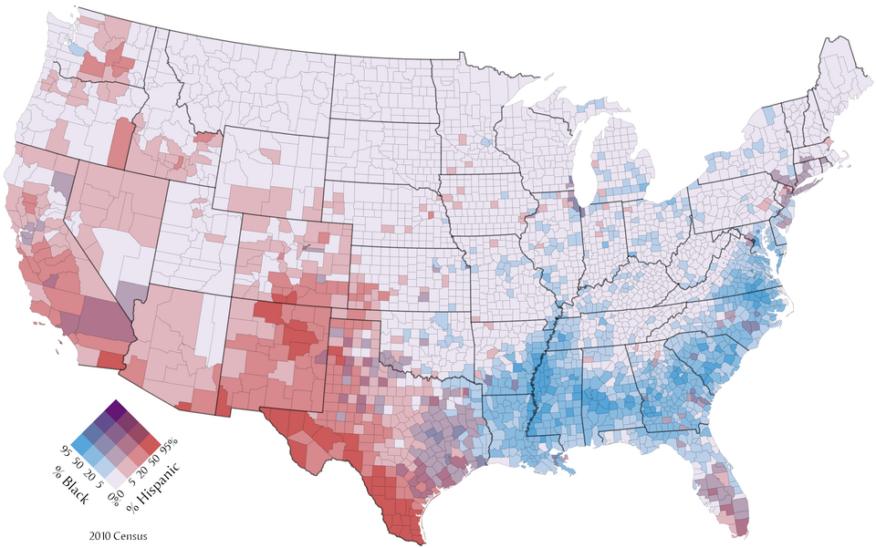

+++
author = "Yuichi Yazaki"
title = "二変数コロプレス・マップ（Bivariate Choropleth Map）とは"
slug = "bivariate-choropleth-map"
date = "2025-10-11"
categories = [
    "chart"
]
tags = [
    "",
]
image = "images/cover.png"
+++

二変数コロプレス・マップ（Bivariate Choropleth Map）は **2つの異なる変数を同時に地理的に表現する地図** です。通常のコロプレス・マップ（単変量地図）が地域ごとの1つの値（例えば人口密度や所得水準など）を色の濃淡で表すのに対し、二変数コロプレスでは **2軸（2つの変数）を組み合わせて色相と明度、または2色のブレンドによって表現** します。

例えば、「平均所得（高⇄低）」を赤系の濃淡で、「教育水準（高⇄低）」を青系の濃淡で表現し、結果として紫色の濃淡が現れる場合、その地域は「所得も教育水準も高い」と解釈できます。

<!--more-->

## 図解の見方

| 要素 | 説明 |
|------|------|
| **色相1** | 変数A（例：所得水準など）を表し、値の高低を色の濃淡で示す。 |
| **色相2** | 変数B（例：教育水準など）を表し、別の色系統で値の高低を示す。 |
| **色のブレンド（交点の色）** | 2つの変数が交差する地点を示す混色（例：赤×青＝紫）。地域の「2軸の組み合わせ的特徴」を表す。 |
| **凡例（Bivariate Legend）** | 2次元の色マトリクスとして表示され、縦軸・横軸の関係性を視覚的に理解できる。 |
| **地図本体** | 各地域が、2変数の組み合わせを色で表し、地理的分布と相関パターンを確認できる。 |

## 活用例と意義

二変数コロプレス・マップは **社会経済・健康・環境など、複数の要因が関係しあう現象を理解するために非常に有効** です。たとえば：

| 分野 | 変数A | 変数B | 意図 |
|------|--------|--------|------|
| 社会経済 | 所得水準 | 教育水準 | 経済と教育の地域格差の可視化 |
| 公衆衛生 | 高齢化率 | 医療施設密度 | 医療アクセスの地域差を把握 |
| 都市研究 | 住宅価格 | 犯罪率 | 都市環境と治安の関係を分析 |
| 環境統計 | 森林率 | CO₂排出量 | 環境保全と産業活動のバランスを検討 |

これらの関係を1枚の地図上で可視化することで、地域間の特徴や潜在的な課題をより立体的に把握できます。

## デザイン上の工夫

| デザイン要素 | 説明 |
|---------------|------|
| **2色選定** | 補色関係（例：青と赤）を選び、混色で中間値を自然に表現。 |
| **色の段階数** | 通常は3×3または4×4のマトリクス（9〜16段階）で表現。 |
| **凡例の配置** | 地図右下などに二次元マトリクス凡例を配置し、軸名と方向（高・低）を明示。 |
| **視認性の確保** | 色覚多様性に配慮し、ColorBrewerのBivariateスキームなどを使用。 |

## 関連する背景知識

二変数コロプレス・マップの概念は、20世紀後半以降の **多変量地図学（Multivariate Cartography）** の発展とともに注目されました。特にGIS技術が普及した1990年代以降、統計データの地理的相関を1枚で把握するための手法として定着しています。

代表的なツールとしては：
- **ArcGIS Pro**（Esri社）：「Bivariate Color Symbology」をサポート
- **QGIS**（オープンソースGIS）：スタイル設定で2変数表現が可能
- **R（ggplot2, tmap, cartographyパッケージ）**
- **Vega-Lite** などのWeb可視化ツールでも実装可能

## まとめ

二変数コロプレス・マップは、単一変数では見落としがちな **複雑な地域特性の関係性を、直感的に理解できる強力な可視化手法** です。特に社会科学・都市研究・公衆衛生などの分野で有効に用いられています。デザイン面では、色の選定と凡例の明確化が成否を左右します。

## 参考・出典

- [Multivariate map - Wikipedia](https://en.wikipedia.org/wiki/Multivariate_map)
- [Esri: Create a bivariate choropleth map](https://learn.arcgis.com/en/projects/create-a-bivariate-choropleth-map/)
- [Joshua Stevens: Bivariate Choropleth Maps](https://www.joshuastevens.net/cartography/make-a-bivariate-choropleth-map/)
- [How to make effective bivariate choropleth maps with Tableau](https://www.tableau.com/blog/how-make-effective-bivariate-choropleth-maps-tableau-83121)