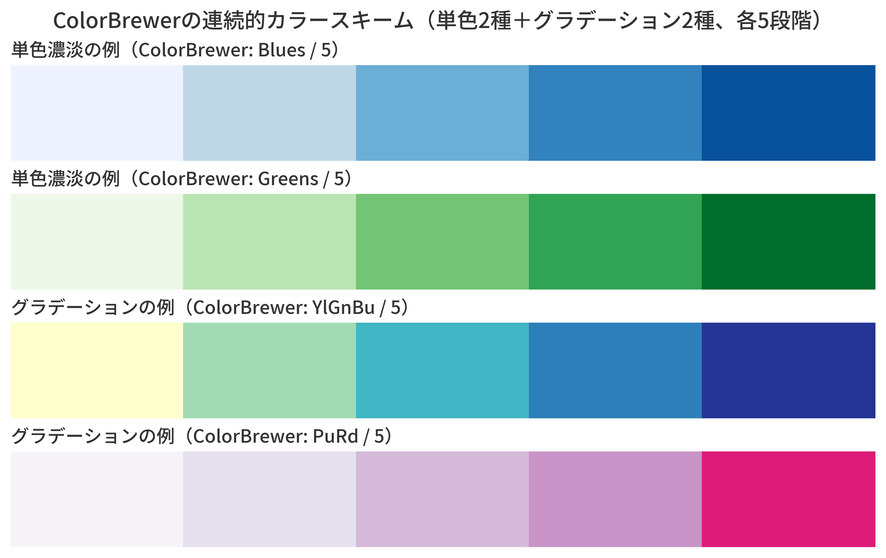
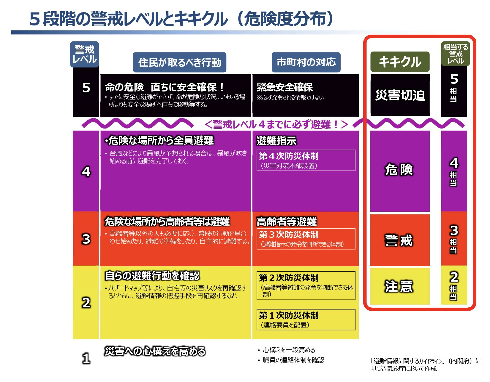
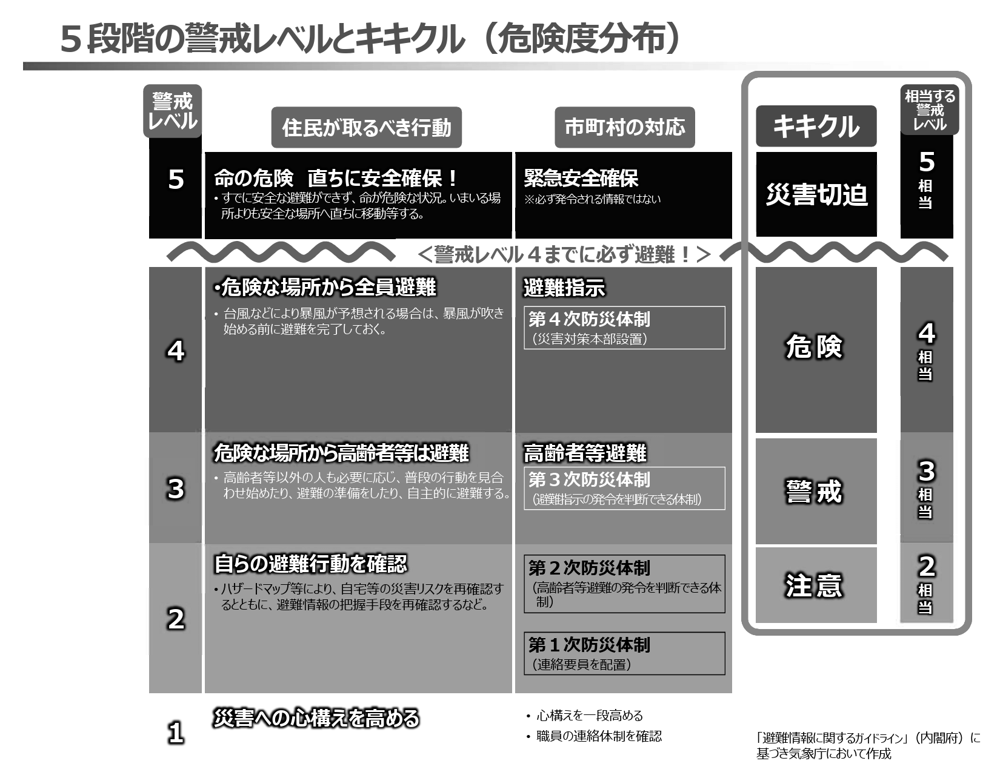
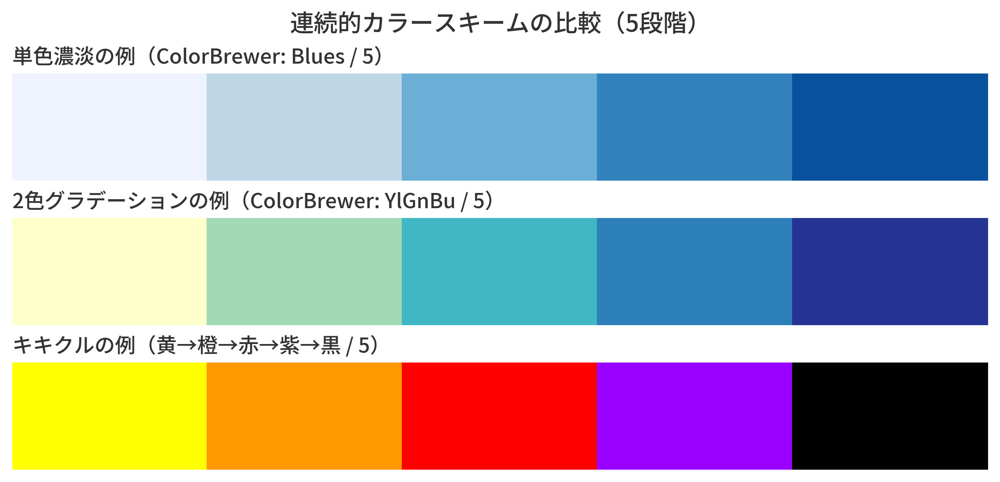
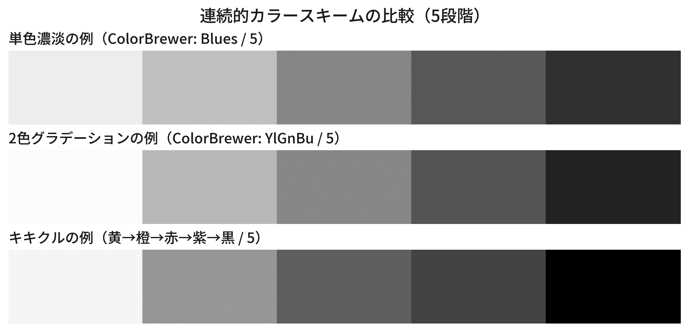

+++
author = "Yuichi Yazaki"
title = "防災情報「キキクル」に見られる独自の色彩設計の工夫"
slug = "bosai-kikikuru-color"
date = "2025-09-20"
categories = [
    "consume","technology"
]
tags = [
]
image = "images/sequential_kikikuru_compare_5_jp.png"
+++

この記事では、連続的カラースキームの基本と、防災情報「キキクル」に見られる独自の色彩設計の工夫を取り上げ、その示唆を考えます。

<!--more-->

## 連続的カラースキームとは？

データ可視化におけるカラースキームには、「連続的（sequential）」「発散的（diverging）」「定性的（categorical）」の3種類があります。
このうち 連続的カラースキーム（sequential color scheme） は、数値が大きい・小さいという一方向の大小関係を持つデータを表現するために使われます。

例：
- 人口密度
- 降水量
- 売上高
- 温度

人間の目は「明るさ」の違いを見分ける感度が高いため、データの大小や重要度を明度の差に対応させて表現するのが、データの性質にあったカラースキーム（複数の色のセット）を考える際の基本です。

そしてその実現のため **単色の濃淡（1つの色相×明度）** や **2色間のグラデーション（２つの色相×明度）** といった方法が典型例として広く使われています。

## キキクルの事例：3色以上を組み合わせた連続表現

しかし、気象庁の「キキクル」で用いられている手法は、この典型から外れています。キキクルとは、気象庁が提供する 大雨・洪水・土砂災害などの危険度を色分けして地図上に表示するサービスです。地域ごとに危険度を段階的に示し、住民が避難のタイミングを判断する手助けを目的としています。

キキクルではその危険度について、黄 → 橙 → 赤 → 紫 → 黒 という複数の色相を組み合わせながら、同時に明度を下げていく配色をしており、連続的カラースキームとしては珍しい設計です。通常の濃淡や2色グラデーションではなく、「段階性の強調」と「最終段階＝黒の終端感」を兼ね備えており、防災情報という利用シーンに合わせて工夫された特異な例といえます。

そして注目すべきは「黒」を最終段階に用いている点です。
通常の連続スキームではあまり使われませんが「命に関わる危険が切迫している」という強いメッセージを込めて配色の終端としています。
これにより、利用者は「ここが最終段階だ」と明確に理解できます。

## 一般的な連続スキームとの違い

### 一般的な連続スキーム
- 青の濃淡や緑→黄など、滑らかな変化を重視
- 中間値もスムーズに把握しやすい

### キキクルの連続スキーム
- 色相を切り替えて段階を強調
- リスク段階の境界が明確で、直感的に理解しやすい
- 特に「避難行動を促す」という防災・リスクコミュニケーションの文脈に合致

## 学びのポイント
- 連続スキームは 単色濃淡だけに限らない
- 特殊な色（黒など）も、目的が明確なら有効に使える

配色は「美的センス」だけではなく、データの意味と利用シーンに根ざした設計であることを示す好例と言えるでしょう。

## 参考・出典

 - [キキクル（危険度分布）「黒」の新設、「うす紫」と「濃い紫」の統合](https://www.jma.go.jp/jma/kishou/minkan/koushu220610/siryo1.pdf)

この事例は私が担当している武蔵野美術大学「データサイエンス入門」受講の学生が教えてくれました。ありがとう！