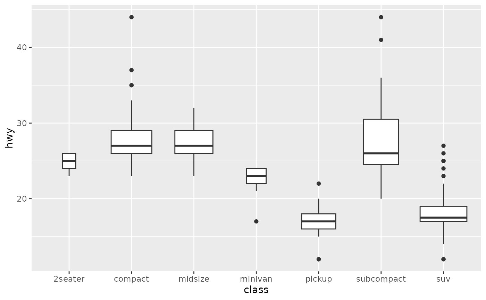

+++
author = "Yuichi Yazaki"
title = "Box-and-Whisker Plot"
slug = "box-and‐whisker-plot"
date = "2025-10-11"
categories = [
    "chart"
]
tags = [
    "",
]
image = "images/cover.png"
+++

A box-and-whisker plot summarizes a distribution using the minimum, first quartile, median, third quartile, and maximum, often with outliers shown as individual points. The box represents the interquartile range, or IQR.

<!--more-->

## Purpose

The purpose is to compare distributions compactly across groups. Box plots show center, spread, skew, and outliers without plotting every observation.

## Design Notes

- Explain the whisker rule when necessary.
- Use alongside raw points for small datasets.
- Do not hide important distribution shape when multimodality matters.
- Consider violin plots when density shape is important.

## Summary

Box plots are compact and robust distribution summaries. They are especially useful for comparing many groups.
