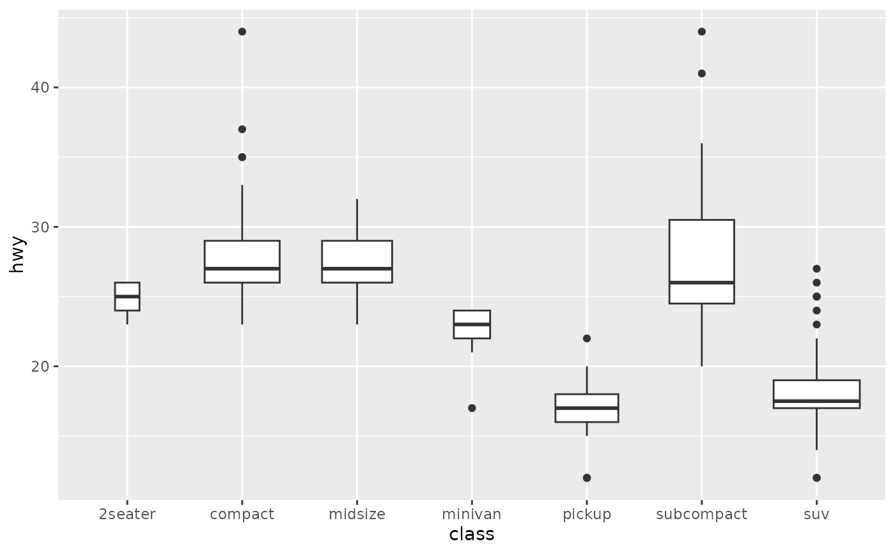

+++
author = "Yuichi Yazaki"
title = "箱ひげ図（Box-and-Whisker Plot）"
slug = "box-and‐whisker-plot"
date = "2025-10-11"
categories = [
    "chart"
]
tags = [
    "",
]
image = "images/cover.png"
+++

箱ひげ図（Box-and-Whisker Plot）は、データの分布を視覚的に要約し、外れ値や偏りを直感的に把握できる統計グラフです。データの最小値、第1四分位数（Q1）、中央値（Q2）、第3四分位数（Q3）、最大値を用いて構成され、箱（ボックス）は四分位範囲（IQR＝Q3−Q1）を表します。箱から伸びる「ひげ（Whisker）」はデータの広がりを示し、外れ値は点で描かれることが一般的です。

<!--more-->

## 歴史的経緯

箱ひげ図は1970年代にアメリカの統計学者ジョン・W・テューキー（John W. Tukey）が提唱しました。彼の著書『Exploratory Data Analysis（1977）』において、データの特徴を探索的に理解する手法の一つとして紹介されました。それ以前は平均値や分散などの単一指標でデータを把握するのが主流でしたが、テューキーは視覚的・直感的な統計理解の重要性を強調しました。

## データ構造

箱ひげ図に必要なデータ構造は、基本的に**単変量（1変数）**の数値データです。複数のカテゴリを比較する場合は、カテゴリごとに箱ひげを並べて描画します。主に以下の5つの統計量（「5数要約」）を用います。

| 指標 | 意味 |
|------|------|
| 最小値 | データの最小値（ただし外れ値を除く） |
| 第1四分位数（Q1） | データの下位25%点 |
| 中央値（Q2） | データの中央値 |
| 第3四分位数（Q3） | データの上位75%点 |
| 最大値 | データの最大値（外れ値を除く） |

## 目的

箱ひげ図の目的は、データのばらつきや偏り、外れ値の有無を視覚的に示すことです。平均値に依存しないため、外れ値に強いロバストな分布比較が可能です。また、グループ間の分布差を直感的に比較するのに適しています。

## ユースケース

箱ひげ図は、複数のカテゴリやグループ間で分布を比較する際に非常に有効です。例えば、男女別の試験点数や年度別の売上分布などを同一スケールで比較できます。また、外れ値（異常値）の検出にも適しており、データ品質確認や異常検知の初期分析でもよく用いられます。

- 成績分布の可視化（クラスごとの得点分布）
- 品質管理（製造工程でのばらつき検出）
- 医療・生物統計（臨床データのばらつき）
- データ分析の初期段階での探索的可視化（EDA）

## 特徴

- 平均値ではなく中央値を基準とする
- 外れ値を明示的に可視化できる
- 分布の偏り（右裾／左裾）を容易に把握できる
- 複数グループの比較が容易

## チャートの見方

| 要素 | 意味 | 表現 |
|------|------|------|
| 最小値 (Minimum) | データの最も小さい値 | 左端のひげの先端 |
| 第1四分位数 (Q1) | 下位25%の境界 | 箱の左端 |
| 中央値 (Median, Q2) | データの中心 | 箱内の線 |
| 第3四分位数 (Q3) | 上位25%の境界 | 箱の右端 |
| 最大値 (Maximum) | データの最も大きい値 | 右端のひげの先端 |
| 四分位範囲 (IQR = Q3 - Q1) | 中央50%のばらつき | 箱の幅 |
| 外れ値 (Outliers) | 1.5×IQRを超える値 | ひげの外に点で表示 |

箱の中の線が箱の中央より左にある場合は分布が右に歪んでおり、右にある場合は左に歪んでいると読み取れます。ひげの長さの非対称性は分布の偏りを、箱の大きさは中間データの散らばりを示します。

## デザイン上の注意点

- 箱の幅は統一する（データ数に比例させると誤解を招くことがあります）
- スケールを固定して比較する（縦軸の範囲が異なると誤解されやすい）
- 外れ値の表現は一貫させる（点・星印など）
- 色を使う場合はカテゴリ区分を明確にする
- 背景グリッドや補助線を適度に配置して読みやすくする

## 応用例

近年では **変形版として「バイオリンプロット（Violin Plot）」や「ビーズプロット（Beeswarm Plot）」** など、分布形状の情報をより詳細に付加したバリエーションも登場しています。ただし、箱ひげ図はあくまで5点要約（five-number summary）に基づく可視化であり、分布の形状（例えば双峰性や歪度）を完全に表現するものではありません。

- **バイオリンプロット（Violin Plot）**：箱ひげ図に分布密度を加えた形式。密度の形状を視覚化できる。
- **ビースウォームプロット（Beeswarm Plot）**：個々のデータ点を重ならないように配置して分布を直に示す。
- **スウォーム＋箱ひげのハイブリッド型**：SeabornやPlotlyでは箱ひげと点分布を重ねて表現することが可能。

## 代替例

| チャート名 | 特徴 | 適用シーン |
|-------------|------|-------------|
| ヒストグラム | 階級ごとの頻度を表示 | 分布の形を把握したい場合 |
| バイオリンプロット | 密度形状を含めて分布を表示 | 分布の滑らかさや多峰性を見たい場合 |
| ストリッププロット | 個々の値を可視化 | サンプルサイズが小さい場合 |

## まとめ

箱ひげ図は、分布の特徴を簡潔に要約し、比較や外れ値検出を支援する基本的な統計グラフです。データの散らばりや偏りを直感的に理解できるため、探索的データ分析やレポート作成、教育など幅広い分野で利用されています。

EDA（探索的データ分析）における基本的かつ不可欠な可視化手法として、今なお多くの分野で利用されています。

ただし、平均値や標準偏差の情報は含まれないため、必要に応じて他の可視化（ヒストグラム・密度プロットなど）と併用するのが望ましいです。

## 参考・出典

- [Box plot — Wikipedia](https://en.wikipedia.org/wiki/Box_plot)
- [Understanding Boxplots — Towards Data Science](https://towardsdatascience.com/understanding-boxplots-5e2df7bcbd51)
- [Seaborn Boxplot Documentation](https://seaborn.pydata.org/generated/seaborn.boxplot.html)
- [Plotly Box Plot Documentation](https://plotly.com/python/box-plots/)
- [Box plot - Wikipedia](https://en.wikipedia.org/wiki/Box_plot)
- [Build a Box Plot — Tableau Help](https://help.tableau.com/current/pro/desktop/en-us/buildexamples_boxplot.htm)
- [Box and Whisker Plots — The Data Visualisation Catalogue](https://datavizcatalogue.com/methods/box_plot.html)
- [1.3.3.7. Box Plot — NIST/ITL Engineering Statistics Handbook](https://www.itl.nist.gov/div898/handbook/eda/section3/boxplot.htm)
- [Box plot review — Khan Academy](https://www.khanacademy.org/math/statistics-probability/summarizing-quantitative-data/box-whisker-plots/a/box-plot-review)
- [geom_boxplot — ggplot2 reference](https://ggplot2.tidyverse.org/reference/geom_boxplot.html)