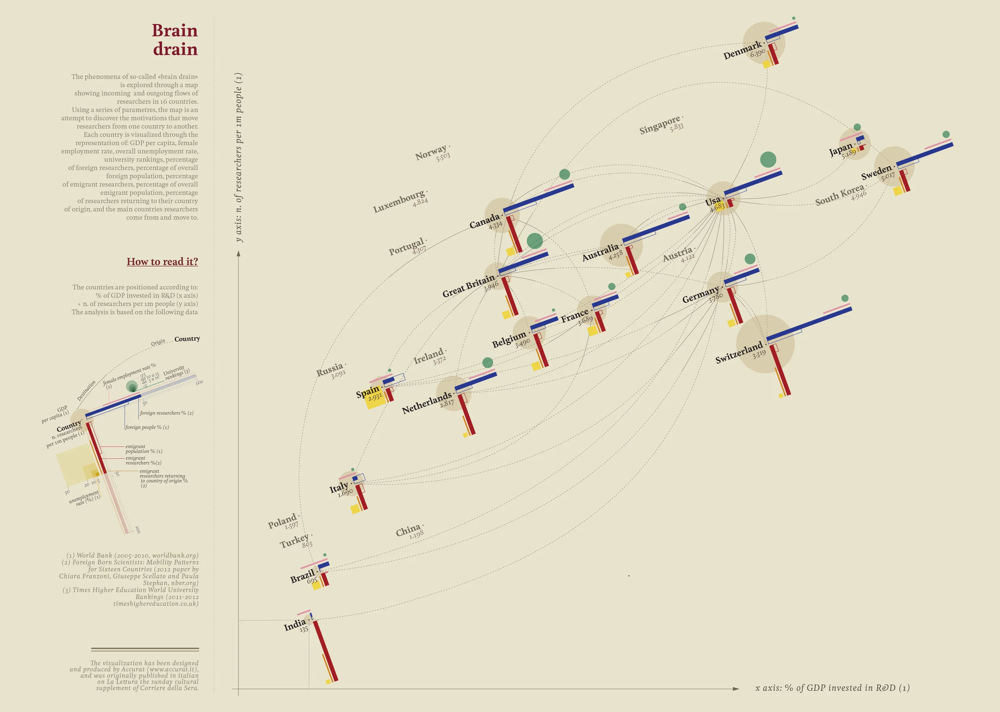
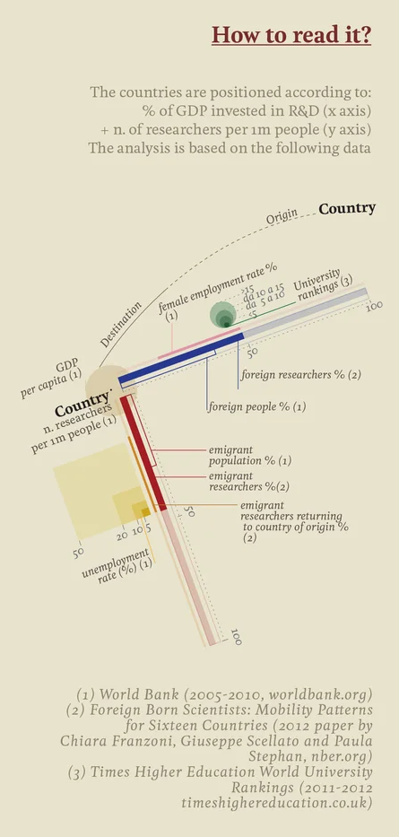

+++
author = "Yuichi Yazaki"
title = "Visualizing Brain Drain"
slug = "brain-drain"
date = "2025-10-10"
categories = [
    "consume"
]
tags = [
    "オリジナルのビジュアル変換",
]
image = "images/cover.png"
+++

This visualization depicts **brain drain** as the international movement of researchers. It was created by **Giorgia Lupi** of Accurat for the *Visual Data* series in *La Lettura*, the cultural supplement of *Corriere della Sera*.

Countries are positioned according to quantitative indicators such as R&D expenditure as a share of GDP and the number of researchers per million people. Lines then connect countries through flows of scientific migration.

Rather than functioning as a simple statistical map, the work makes visible the circulation of knowledge and the asymmetry of scientific opportunity between nations.

<!--more-->

## How to Read It

The "How to read it?" panel explains the graphic as a multivariate view of research environments and researcher mobility.

### 1. Country Position

- **X axis**: R&D investment as a percentage of GDP
- **Y axis**: researchers per one million people

Countries toward the upper right invest more in research and have a higher concentration of researchers.

### 2. Color and Marks

| Visual element | Meaning | Main source |
|---|---|---|
| Blue horizontal bar | Share of foreign researchers | Franzoni et al., 2012 |
| Lower blue bar | Share of foreign-born population | World Bank |
| Red vertical bar | Share of researchers from that country working abroad | Franzoni et al., 2012 |
| Pale red elements | Citizens abroad and returning researchers | World Bank / Franzoni et al. |
| Thin yellow line | Unemployment rate | World Bank |
| Green small circles | Female employment rate | World Bank |
| Gray band | University ranking score | Times Higher Education |
| Beige circle | GDP per capita | World Bank |

### 3. Connections Between Countries

Dotted arcs behind the country marks indicate routes of researcher movement from origin to destination. They form a network of knowledge flows rather than a conventional geographic map.

### 4. Reading Strategy

First read the country position to understand research capacity. Then compare the blue and red bars to see whether a country gains or loses research talent. Finally, use the supporting variables to understand the social, economic, and educational context.

## Background

**Brain drain** refers to the migration of highly educated or skilled people, especially scientists, engineers, and researchers, toward countries with better economic or research conditions. The pattern has long been discussed as a structural problem for developing and emerging economies.

The visualization combines:

- World Bank indicators from 2005-2012
- the Foreign Born Scientists Mobility dataset by Franzoni, Scellato, and Stephan
- Times Higher Education World University Rankings 2011-2012

## Design Features

The work shows Lupi's characteristic information design: precise geometry combined with organic curves, a strong color grammar for inflow and outflow, and an abstract spatial composition that treats the world as a knowledge-economy coordinate system rather than a physical map.

## Summary

"Brain drain" presents a global map of knowledge circulation. It shows not only where researchers go, but also which countries are structurally positioned to attract, retain, or lose scientific talent. In doing so, it turns migration statistics into a visual argument for education policy and research support.

## References

- [Visual Data — Giorgia Lupi](https://giorgialupi.com/lalettura)
- [Visual Data — La Lettura](https://www.corriere.it/la-lettura/infografiche-visual-data/)
- [Research and development expenditure (% of GDP) — World Bank](https://data.worldbank.org/indicator/GB.XPD.RSDV.GD.ZS)
- [Foreign Born Scientists: Mobility Patterns for Sixteen Countries — NBER Working Paper 18067](https://www.nber.org/papers/w18067)
- [World University Rankings 2011-2012 — Times Higher Education](https://www.timeshighereducation.com/world-university-rankings/2012/world-ranking)
