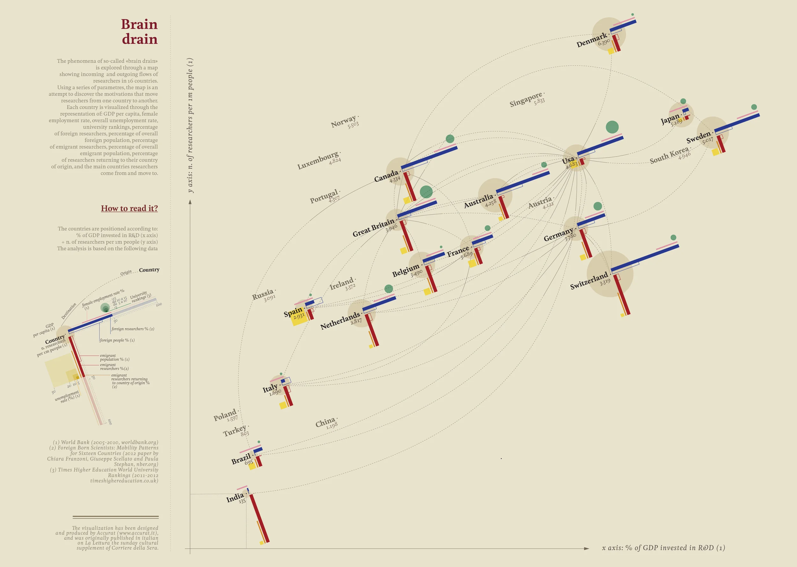
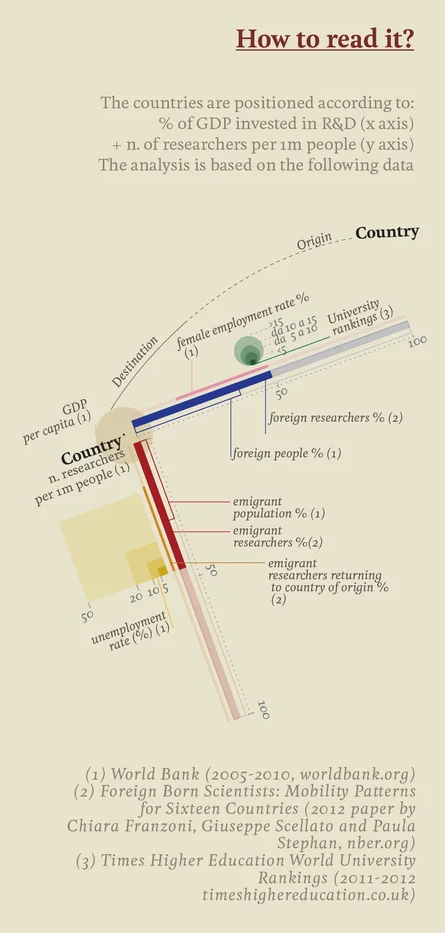

+++
author = "Yuichi Yazaki"
title = "頭脳流出の可視化"
slug = "brain-drain"
date = "2025-10-10"
categories = [
    "consume"
]
tags = [
    "オリジナルのビジュアル変換",
]
image = "images/cover.png"
+++

この作品は、**「頭脳流出（Brain drain）」** と呼ばれる現象を、各国間での研究者の移動として可視化したものです。Giorgia Lupi（Accurat）が、イタリアの新聞 *Corriere della Sera* の文化面「La Lettura」連載 *Visual Data* のために制作しました。

国ごとに、研究開発（R&D）へのGDP投資割合や人口あたりの研究者数といった定量的な指標を配置軸とし、研究者の流入・流出関係を線で結んでいます。

この作品は単なる統計地図ではなく、科学研究の「知の循環」や「国家間の知的格差」を直感的に読み解く構成になっています。

<!--more-->

## 作品の見方

図の読み方は左下に「How to read it?」として明示されています。
この図は、各国の研究環境と研究者の国際移動を多変量的に可視化したものです。
横軸と縦軸の位置関係で研究環境を、色線と記号で社会的・経済的要因を示します。

### 1. 作品全体における座標（国の位置）

- **X 軸** ... R&D 投資率（% of GDP invested in R&D）
    - 国内総生産に占める研究開発費の割合。研究への経済的投資度合いを表す。
- **Y 軸** ... 人口100万人あたりの研究者数（researchers per 1 million people）
    - 研究者密度の高さ。研究職の社会的集積度を示す。

この2 軸の交点として各国が配置されます。右上ほど「研究に投資が多く、研究者密度が高い」国です。

### 2. 色と線の意味（国ごとのビジュアル表現）

| 視覚要素 | 表す内容 | 主な出典 |
|:--|:--|:--|
| **青の横棒** | **外国人研究者の割合 (%)** — 他国から来た研究者が全研究者に占める比率。 高いほど国外人材を受け入れている。 | (2) Franzoni et al., 2012 |
| **青の下層棒** | **外国生まれ人口の割合 (%)** — 社会全体での国際化度合い。 | (1) World Bank |
| **赤の縦棒** | **国外で活動する自国出身研究者の割合 (%)** — 研究者流出の規模。 | (2) Franzoni et al., 2012 |
| **赤の淡色部分／補助線** | **国外在住自国民 (%)** および **出身国へ帰国した研究者 (%)** — 流出人口と帰還率を補足。 | (1)(2) |
| **黄の細線** | **失業率 (%)** — 国内労働環境の安定度。 | (1) World Bank |
| **緑の小円群** | **女性就業率 (%)** — 女性の社会進出度。 小円は区間（\<5%、5–10%、10–15%、\>15%）で表現。 | (1) World Bank |
| **灰色の帯** | **大学ランキング指標（0–100スケール）** — 高等教育水準を示す。 | (3) Times Higher Education 2011–2012 |
| **ベージュの円（背景）** | **一人あたりGDP (GDP per capita)** — 経済的豊かさ。円が大きいほど高い。 | (1) World Bank |

### 3. 線でつながる国々

各国の背後を走る **点線のアーク（弧線）** は、研究者の移動経路（origin → destination）を示します。太さではなく存在と方向を表すもので、知の流れのネットワークを描いています。

### 4. 読み取りのコツ

- 1. **座標位置** で研究環境の水準を把握（投資と密度）。
- 2. **青と赤の棒** で、知の流入／流出の非対称性を見る。
- 3. **補助要素（黄・緑・円・灰帯）** で、社会・経済・教育背景を読み解く。

このように、図中の青＝受け入れ、赤＝流出、そのあいだを結ぶ曲線が研究者の移動経路を示し、
研究開発への投資と人材循環の関係を一枚で描き出しています。

## 背景：頭脳流出とは何か

**頭脳流出（Brain drain）** とは、高度な教育・専門技能を持つ人材（特に科学者・技術者・研究者）が、より良い経済的・研究環境を求めて国外へ移動する現象を指します。特に発展途上国や新興国から、欧米先進国へ向かう流れが長年問題視されています。

この作品では、  
- **World Bank**（2005–2012）によるGDPデータ、  
- **Foreign Born Scientists Mobility dataset**（Franzoni, Scellato, Stephan, 2012）、  
- **Times Higher Education World University Rankings (2011–2012)**

が基礎データとして使われています。これらのデータを統合し「科学研究という無形資本の流れ」をグローバルに描き出しています。

## デザイン上の特徴
Lupi特有の情報詩的な設計が随所に見られます：

- **幾何的精密さ** と **有機的曲線** の対比  
- カラーの三原則（青＝流入、赤＝流出、黄＝定着）による視覚言語  
- 背景の余白が「世界地図」的構図を暗示し、地理的配置ではなく **知識経済の座標空間** として世界を再構成

そのため、視聴者は「どこが豊かか」ではなく、「どこが知を失い、どこがそれを得ているか」という **非対称的構造** を一目で理解できます。

## まとめ

この「頭脳流出」可視化は、単なる移民統計ではなく、「知の流れ」という新しいグローバル地図を提示しています。
国家間の科学的ネットワークと格差を同時に映し出し、教育政策・研究支援の必要性をビジュアルに訴えかける作品です。  

## 参考・出典

- [Visual Data — Giorgia Lupi (La Lettura)](https://giorgialupi.com/lalettura)
- [Visual Data — La Lettura (Corriere della Sera)](https://www.corriere.it/la-lettura/infografiche-visual-data/)
- [Research and development expenditure (% of GDP) — World Bank](https://data.worldbank.org/indicator/GB.XPD.RSDV.GD.ZS)
- [Foreign Born Scientists: Mobility Patterns for Sixteen Countries — NBER Working Paper 18067 (2012)](https://www.nber.org/papers/w18067)
- [World University Rankings 2011–2012 — Times Higher Education](https://www.timeshighereducation.com/world-university-rankings/2012/world-ranking)
