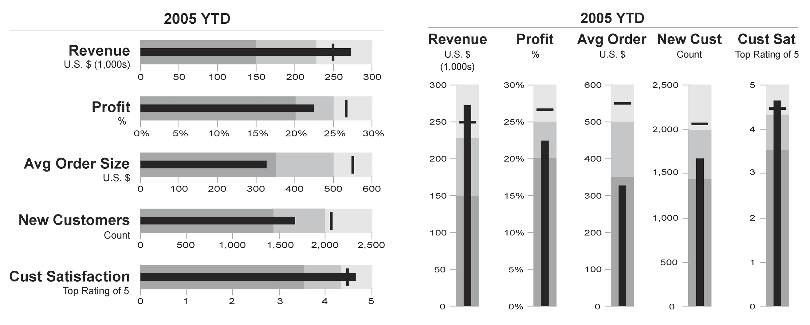

+++
author = "Yuichi Yazaki"
title = "Bullet Graph"
slug = "bullet-graph"
date = "2025-10-11"
categories = [
    "chart"
]
tags = [
    "",
]
image = "images/cover.png"
+++

A bullet graph is a compact chart for showing performance against a target. It extends a bar chart by combining an actual value, qualitative ranges such as poor, satisfactory, and good, and a target marker.

<!--more-->

## Historical Background

Bullet graphs were developed by Stephen Few as a more space-efficient and informative alternative to dashboard gauges.

## Design Notes

- Use a clear target marker.
- Keep qualitative ranges subtle.
- Avoid decorative gauge-like styling.
- Use consistent scales when comparing multiple bullet graphs.

## Summary

Bullet graphs are strong dashboard components because they show actual value, target, and performance context in a compact form.
