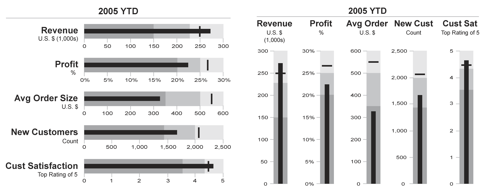

+++
author = "Yuichi Yazaki"
title = "ブレット・グラフ（Bullet Graph）"
slug = "bullet-graph"
date = "2025-10-11"
categories = [
    "chart"
]
tags = [
    "",
]
image = "images/cover.png"
+++

ブレット・グラフ（Bullet Graph）は、棒グラフを拡張して設計された可視化手法で **目標値と実績値を一目で比較** することを目的としています。2005年にデータ可視化の専門家スティーブン・フュー（Stephen Few）によって提案されました。ダッシュボードや業務レポートでの利用に最適化されており、従来のメーターやゲージ型グラフよりも情報密度が高く、省スペースで多くの比較情報を伝えられます。

<!--more-->

## 図解の見方

ブレット・グラフは、以下の要素で構成されます。

| 要素 | 内容 | 視覚的表現 |
|------|------|------------|
| 実績値（メインバー） | 現在の達成状況 | 横向きの太い棒（濃色） |
| 目標値（ターゲット） | 目標または基準値 | 細い縦線（通常は黒線） |
| 比較範囲（定性的レンジ） | 良・可・不可などの基準領域 | 背景の階層的な濃淡バー（薄〜濃） |
| 補助指標（オプション） | 前期値や平均値などの追加情報 | 小さな補助線や別色バー |

この構造により **「どの程度目標に近づいているか」「現状は良・可・不可のどの水準か」** をすぐに読み取ることができます。棒の長さが「実績」、縦線が「目標」、背景の帯が「評価基準」として機能します。

## 背景と特徴

ブレット・グラフは、従来の **スピードメーター型ゲージ（Dial Gauge）** の代替として開発されました。メーター表示は直感的ではあるものの、スペースを多く取り、数値精度や比較情報の提示に不向きでした。これに対し、ブレット・グラフは以下の特徴を持ちます。

- **情報密度が高い**：目標・実績・評価レンジを1本のバーで表現。
- **省スペース**：複数指標を縦に並べやすく、ダッシュボード向き。
- **モノクロでも判読可能**：階調表現に依存し、色覚バリアフリー。
- **定量比較が容易**：バーの長さで数値を直接比較できる。

## 主な用途と応用例

| 分野 | 使用例 | 表現目的 |
|------|---------|-----------|
| ビジネスダッシュボード | 売上・利益・KPI進捗 | 目標達成率を簡潔に表示 |
| 教育・行政統計 | 評価指標の目標値対比 | 政策目標とのギャップを視覚化 |
| 医療・健康管理 | 検査値と基準範囲 | 正常域・注意域・危険域の把握 |
| 製造・品質管理 | 生産効率・不良率 | 規格内外の判定 |

たとえば「売上：目標1000万円、実績850万円、平均域：600〜900万円」という場合、ブレット・グラフは「平均より上だが目標未達」と即座に読み取れます。

## まとめ

ブレット・グラフは **「目標との距離を一目で伝える」** ことに特化したシンプルかつ強力なチャートです。視覚的ノイズが少なく、省スペースで複数の指標を並列比較できるため **経営ダッシュボードや報告資料における定番可視化手法** として高く評価されています。色や装飾を最小限にとどめ、意味を明確に設計することが、効果的な活用の鍵となります。

## 参考・出典
- [Stephen Few: Bullet Graph Design Specification (Perceptual Edge)](https://www.perceptualedge.com/articles/misc/Bullet_Graph_Design_Spec.pdf)
- [Tableau Help: Bullet Graphs](https://help.tableau.com/current/pro/desktop/en-us/buildexamples_bullet.htm)
- [D3.js Bullet Chart Example by Mike Bostock](https://observablehq.com/@observablehq/plot-bullet-graph)