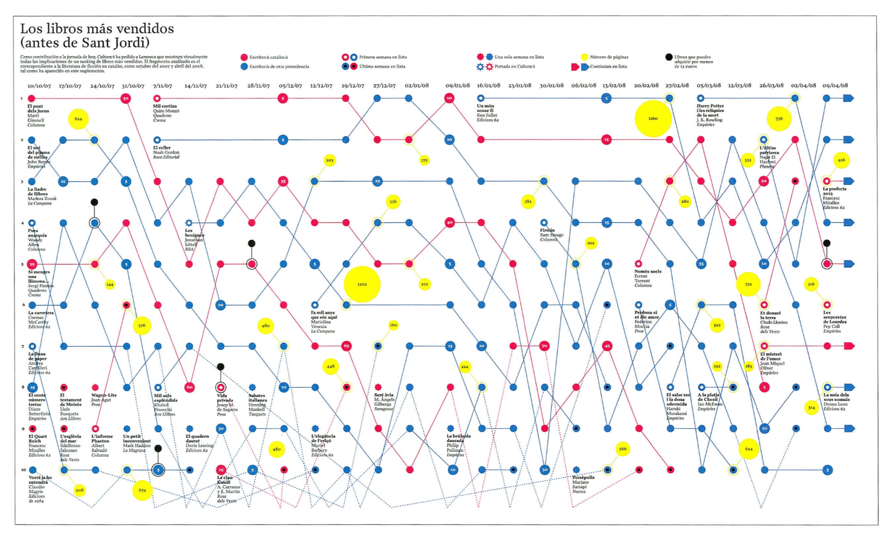

+++
author = "Yuichi Yazaki"
title = "バンプ・チャート（Bump Chart）の事例"
slug = "bump-chart-example"
date = "2020-08-03"
description = ""
categories = [
    "chart"
]
tags = [
    "ランキング",
]
image = "images/Dogchangev4.jpeg"
+++

バンプ・チャート（Bump Chart）の事例を紹介します。

<!--more-->

## #Election2016 米大統領候補のTwitterバズ

[#Election2016: US Presidential Candidate Twitter Buzz](https://interactive.twitter.com/candidateRace16/)

## 過去20年間におけるアメリカで人気の犬種ランキング

[America’s favorite dog breeds for the past two decades, ranked](https://www.washingtonpost.com/news/wonk/wp/2015/02/27/americas-favorite-dog-breeds-for-the-past-two-decades-ranked/?arc404=true)

## ワールドカップ・ランキング

[World Cup Ranking](https://gengo.com/world-cup/)

## G20諸国別 CO2排出量ランキング

[Ranking G-20 Nations by CO2 Emissions](https://datatodisplay.com/examples/co2/)

## 1996-2013年の間で、最も人気のある20のウェブサイトを追跡

[From Lycos to Ask Jeeves to Facebook: Tracking the 20 most popular web sites every year since 1996](https://www.washingtonpost.com/news/the-intersect/wp/2014/12/15/from-lycos-to-ask-jeeves-to-facebook-tracking-the-20-most-popular-web-sites-every-year-since-1996/)

## サン・ジョルディ前のベストセラー可視化 ― バンプチャートの発展形

### 図の概要

この図は、スペイン・カタルーニャ地方で行われる「サン・ジョルディの日」（毎年4月23日、本とバラを贈り合う伝統的な祝祭）の直前に、最も売れた書籍を可視化したものです。制作はバルセロナの新聞 La Vanguardia（ラ・バンガルディア）。2007年10月から2008年4月までの26週間にわたるベストセラー・ランキングの推移を、独自のインフォグラフィックとして発表しました。

**図のタイトルは「Los libros más vendidos (antes de Sant Jordi)」＝「サン・ジョルディ前のベストセラー」** 。この地域における出版文化を象徴的に記録した作品といえます。

### 表現の構造

- 横軸：時間（2007年10月〜2008年4月、週単位で26ステップ）
- 縦軸：順位（1位が最上段）
- 線の色：
    - 赤 = カタルーニャ語の著者
    - 青 = その他の著者
- 追加の記号：
    - 黄色円 = ページ数
    - 黒丸 = 特別価格（プロモーション）
- 実線 = トップ10に残り続けた週
- 点線 = トップ10圏外との接続

これにより、「どの本が、いつ売れ始め、どのくらいランキングを維持したか」が一目でわかります。

### バンプチャートとの関係

この図は、基本構造として **バンプチャート（Bump Chart）** を採用しています。

- バンプチャートの基本形は「縦軸に順位、横軸に時間、線で対象の推移を示す」ものです。
- 本作品もまさにその構造に従っており、週ごとのランキング推移を線でつないでいます。

ただし、本図は単なるバンプチャートを超えて以下の拡張を加えています：
	
- **1.多変量情報の統合**
    - 著者の属性（赤・青）
    - ページ数（黄色円）
    - 特別価格（黒丸）
- **2.ランキング外の動態を可視化**
    - トップ10から外れても点線で継続的に追跡し、「一時的なヒット」と「ロングセラー」を比較できる。
- **3.文化的背景の反映**
    - サン・ジョルディという文化的イベントに関連付け、単なる商業データを超えた「文化現象」として位置づけている。

このため、この図は「ランキングと時系列を組み合わせた可視化」であり「バンプチャートの発展形」と呼ぶのがふさわしいでしょう。

