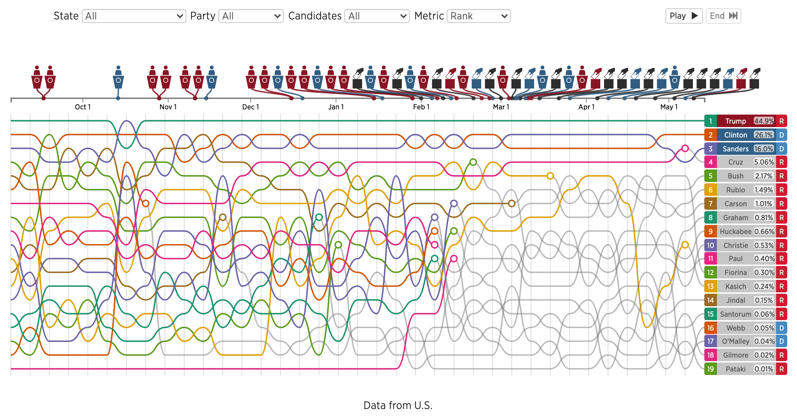
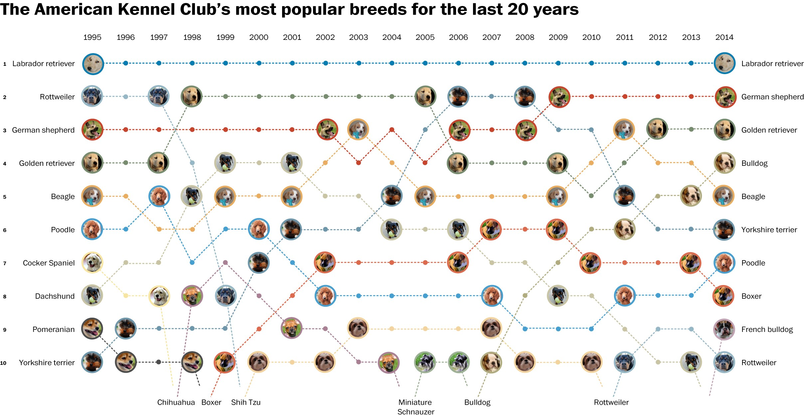
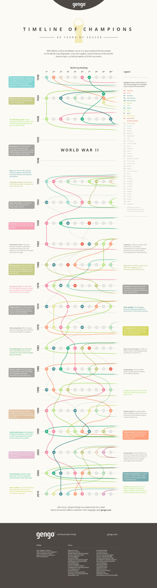
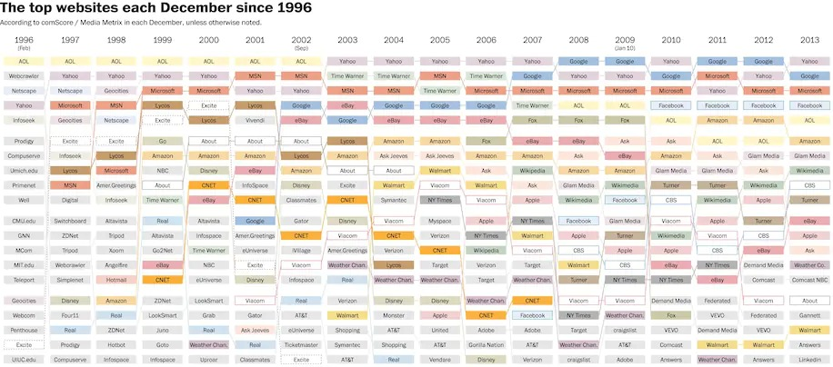

+++
author = "Yuichi Yazaki"
title = "バンプ・チャート（Bump Chart）"
slug = "bump-chart-example"
date = "2020-08-03"
description = ""
categories = [
    "chart"
]
tags = [
    "",
]
image = "images/Dogchangev4.jpeg"
+++

「バンプ・チャート」が利用されている事例を紹介します。

<!--more-->

スロープグラフに似ていますが、スロープグラフは、（たとえ何らかの基準でソートされていたとしても）比較する定性データが、経年でどの位置にいるかを比較します。バンプ・チャートは順位を基準とします。

## 作例

### #Election2016 米大統領候補のTwitterバズ

[#Election2016: US Presidential Candidate Twitter Buzz](https://interactive.twitter.com/candidateRace16/)

### 過去20年間におけるアメリカで人気の犬種ランキング

[America’s favorite dog breeds for the past two decades, ranked](https://www.washingtonpost.com/news/wonk/wp/2015/02/27/americas-favorite-dog-breeds-for-the-past-two-decades-ranked/?arc404=true)

### ワールドカップ・ランキング

[World Cup Ranking](https://gengo.com/world-cup/)

### G20諸国別 CO2排出量ランキング

[Ranking G-20 Nations by CO2 Emissions](https://datatodisplay.com/examples/co2/)

### 1996-2013年の間で、最も人気のある20のウェブサイトを追跡

[From Lycos to Ask Jeeves to Facebook: Tracking the 20 most popular web sites every year since 1996](https://www.washingtonpost.com/news/the-intersect/wp/2014/12/15/from-lycos-to-ask-jeeves-to-facebook-tracking-the-20-most-popular-web-sites-every-year-since-1996/)

## 他の呼び方

Bumps Chart, Rank Chartと呼ばれることもあります。

