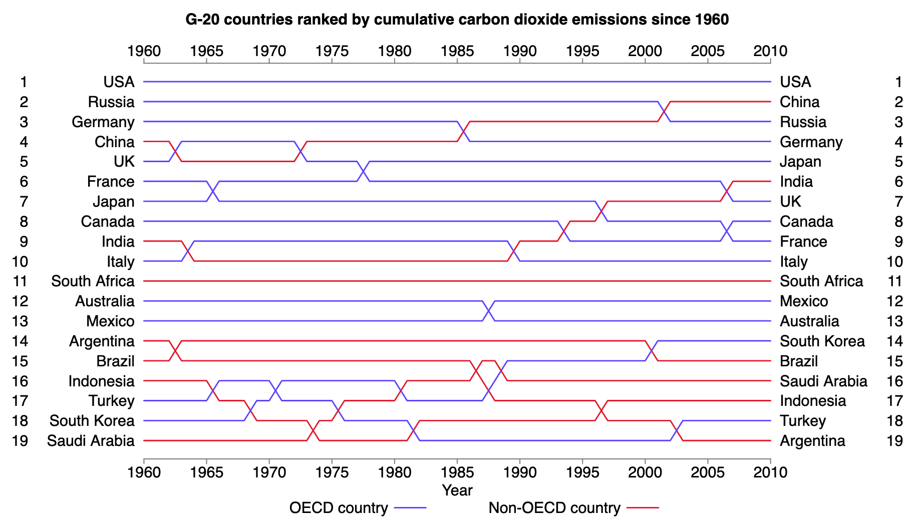
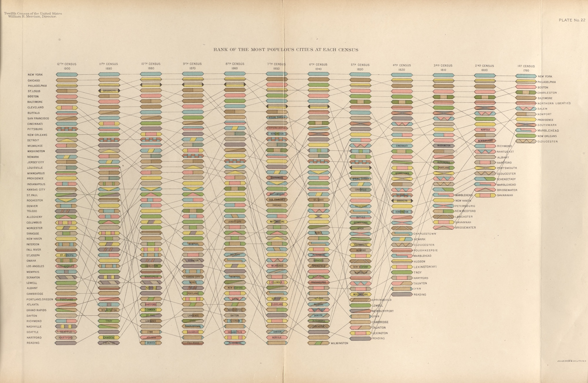
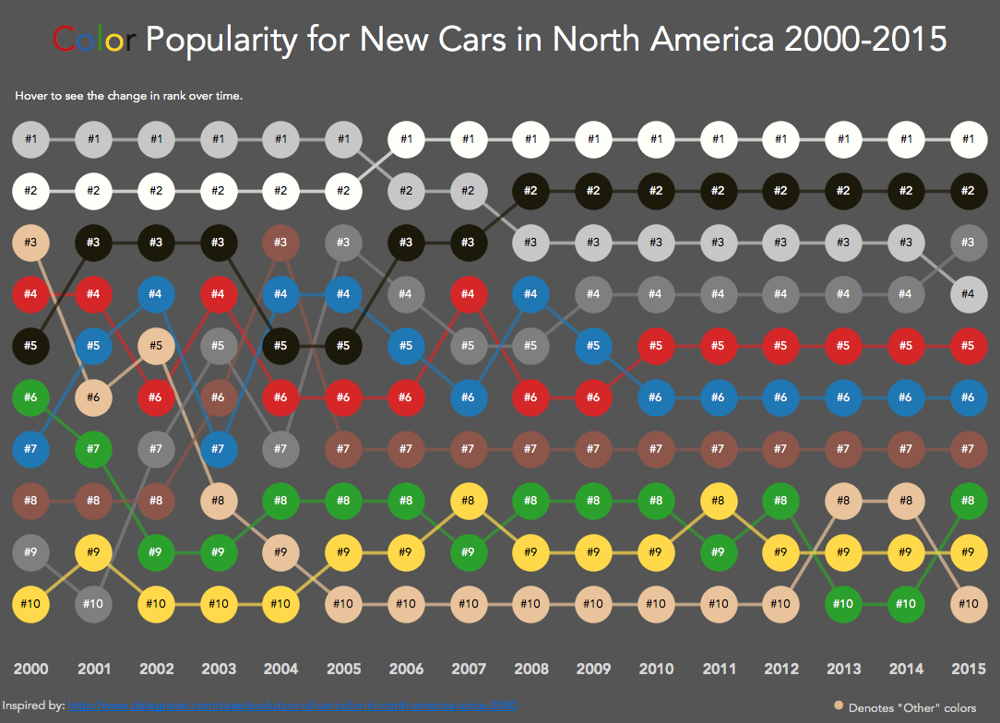

+++
author = "Yuichi Yazaki"
title = "Bump Chart"
slug = "bump-chart"
date = "2025-09-30"
description = ""
categories = [
    "chart"
]
tags = [
    "",
]
image = "images/G-20-countries-ranked.png"
+++

A **bump chart** visualizes changes in rank over time. Each line represents a category, such as a team, product, brand, or country. The horizontal axis shows time, and the vertical axis shows rank.

Unlike a line chart, which focuses on changes in value, a bump chart focuses on changes in relative position.

<!--more-->

## Historical Background

The idea predates the modern name. One early example appears in the 1890 *Statistical Atlas of the United States*.

This chart, edited by geographer Henry Gannett and others, connects the population ranks of U.S. states and territories across censuses from 1790 to 1890. It lets readers see not only rankings at each census, but also how each place moved over time.

Modern use of the term "bump chart" spread through data visualization practice in the 2010s, including Tableau examples such as Matt Chambers's **Car Color Evolution**.

## Data Structure

| Category | Time | Rank |
|---|---|---|
| A | 2020 | 1 |
| B | 2020 | 2 |
| A | 2021 | 2 |
| B | 2021 | 1 |

Rank 1 is usually placed at the top.

## Use Cases

- sports league standings
- market-share rankings
- school, company, or city rankings
- election polls or popularity rankings

## How to Read It

- Each line is one entity.
- The vertical position shows rank.
- Crossings show rank reversals.
- A line moving upward means the entity gained rank.

## Design Notes

- Put rank 1 at the top.
- Limit the number of lines when possible.
- Label lines directly at the right edge.
- Use subtle grid lines for important ranks.

## Alternatives

- Slope chart for two time points
- Line chart for actual values rather than ranks
- Dot plot for static rank comparison

## Summary

Bump charts are useful when the story is not the absolute value, but how relative position changes. They are especially effective for competition, ranking, and trend narratives.

## References

- [Wikipedia: Bump chart](https://en.wikipedia.org/wiki/Bump_chart)
- [Vintage Visualization Restoration — Bump Chart Edition](https://www.bocoup.com/blog/vintage-visualization-restoration-bump-chart)
- [Matt Chambers: Color Popularity for New Cars](https://www.sirvizalot.com/2016/03/color-popularity-for-new-cars-2000-2015.html)
- [Datawrapper Academy: Bump charts](https://academy.datawrapper.de/article/347-how-to-create-a-bump-chart)
- [Vega-Lite: Bump Chart](https://vega.github.io/vega-lite/examples/line_bump.html)
