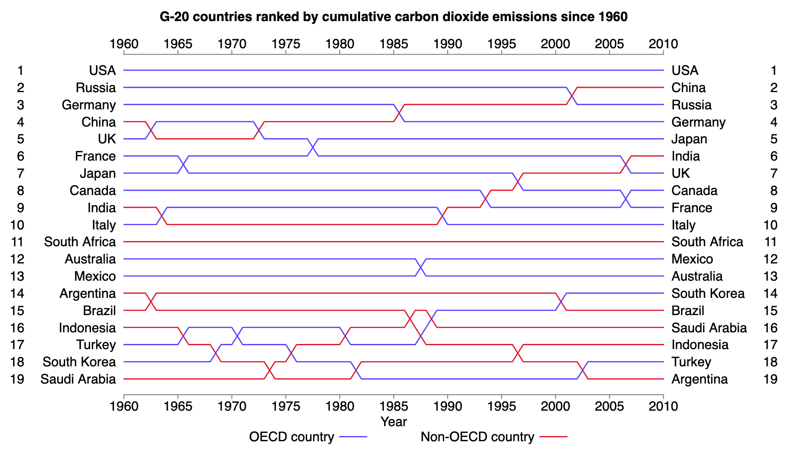
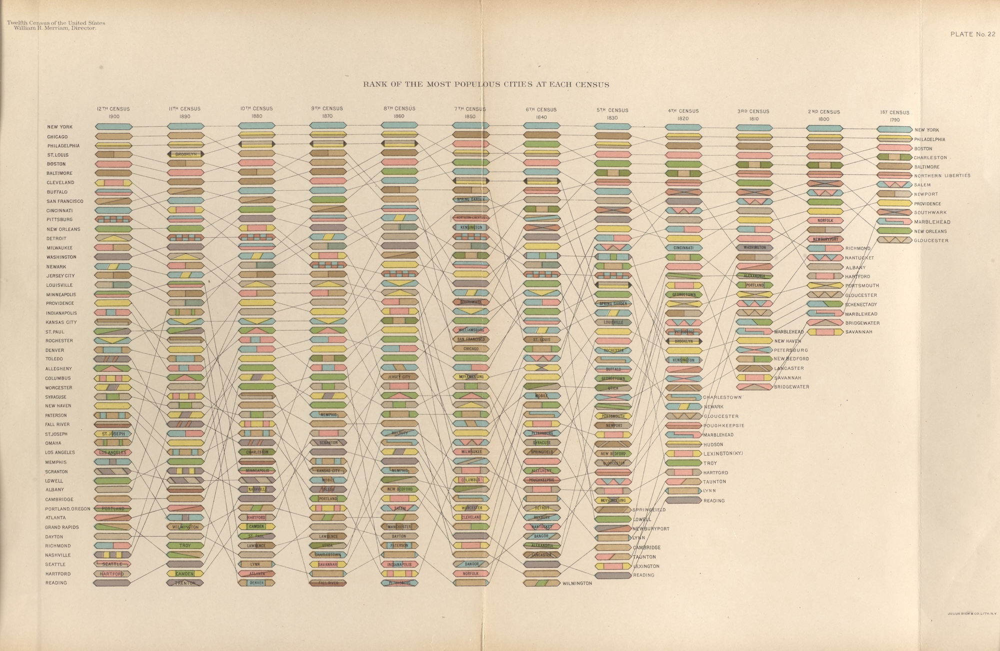
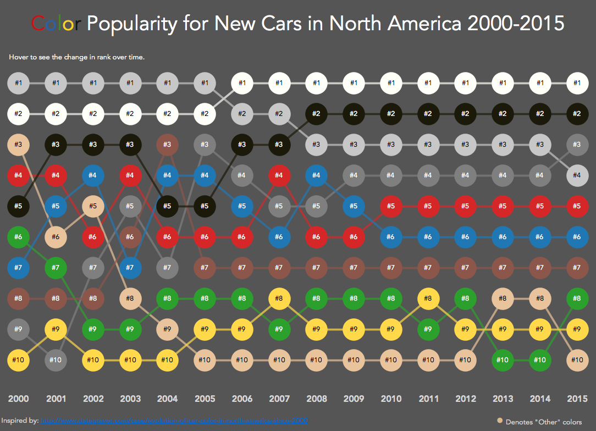

+++
author = "Yuichi Yazaki"
title = "バンプ・チャート（Bump Chart）の歴史と役割"
slug = "bump-chart"
date = "2025-09-30"
description = ""
categories = [
    "chart"
]
tags = [
    "",
]
image = "images/G-20-countries-ranked.png"
+++

バンプ・チャート（Bump Chart）は、順位の変化を時系列で示す可視化手法です。縦軸に順位、横軸に時間を置き、カテゴリごとの推移を線で結びます。折れ線グラフが「値の変動」を伝えるのに対し、バンプ・チャートは「相対的な位置付けの入れ替わり」を視覚化することに主眼があります。複数の線が交差することで **「どの対象がいつ上位に食い込み、または下がったか」** を直感的に読み取れる点が特徴です。

<!--more-->

## 起源 ― 19世紀の統計図表

「誰が最初に発明したのか」を一人に帰すのは難しいですが、バンプ・チャートの原型はすでに19世紀に見られます。

米国センサス局の地理学者 Henry Gannett らが編集した1890年版 Statistical Atlas of the United States には、1790年から1890年までの都市人口ランキングの推移を示す図版が含まれていました。この図は、ある時点の上位都市を比較できると同時に、個別の都市の順位がどのように変動してきたかを追跡できる構成となっています。

その目的は明確で **「人口規模そのものではなく、都市の相対的な地位の変化を可視化する」** ことでした。国勢調査の結果を単に列挙するのではなく、社会的な位置付けのダイナミクスを一目で伝えるための工夫と言えます。

このように「順位を時系列で追う」発想は、現代的な意味でのバンプ・チャートの基本思想と一致しています。

## 名称の誕生と再発見

当時は「バンプ・チャート」という名称は存在せず、後にデータ可視化コミュニティで再発見・命名されました。

- 2013年 Datagraver による可視化例が、その後の基盤となりました。
- 2015年〜2016年 Matt Chambers が Tableau Public に発表した Car Color Evolution は Reddit で30万ビュー以上の反響を呼び、モダンな「バンプ・チャート」の代表例として一気に広まりました。
- Rody Zakovich はこの表現をシグモイド曲線などで洗練し、視覚的な見やすさを強化しました。

こうした実践を通じて、「順位の推移を描く線グラフ」が「バンプ・チャート」という呼び方とともに定着したのです。

## 現代での普及とツール実装

現在、バンプ・チャートは多くの可視化ツールに組み込まれています。

- **Datawrapper** の公式解説では「順位の変化を示すチャート」として紹介され、ランキングデータに特化した用途を推奨しています。
- **Flourish** では専用テンプレートが用意され、インタラクティブにハイライトや注釈を加えることが可能です。
- **Vega-Lite** では rank-transform を利用して順位を生成し、それを折れ線で結ぶ例が公式ドキュメントに掲載されています。
- **Malloy** などのモダンBI言語でも「時間×順位」を組み合わせた標準的なチャート型として紹介されています。

このように、19世紀に端を発する発想が、21世紀のデータ可視化ツールに正式な「チャート・タイプ」として組み込まれるまでに発展しました。

## 特徴と活用領域

バンプ・チャートが適しているのは **「相対的な位置の変化そのものがストーリーになる」** ケースです。

- **スポーツ** リーグ戦の順位推移（シーズンを通じてどのチームが浮き沈みしたか）
- **市場** 企業や製品のシェアランキングの変動
- **世論** 人気投票やランキング調査の入れ替わり
- **教育・都市** 大学ランキングや都市人口順位の長期推移

絶対値よりも「順位の上下動」に意味がある領域で特に有効で、見る人は即座に「勝者と敗者」を把握できます。

## まとめ
- バンプ・チャートの思想は 1890年統計アトラスに見られるように、19世紀から存在していた。
- 発明者を一人に特定することはできないが、Henry Gannett らが国勢調査の都市順位を示す中で **「相対的な位置の変化を可視化する」** 発想が実践されていた。
- 現代では Matt Chambers や Rody Zakovich の活動を通じて再発見され、「Bump Chart」という呼称とともに普及。
- Datawrapper や Vega-Lite など主要ツールに公式実装され、ランキングのストーリーを伝えるための定番チャートになっている。

バンプ・チャートは、社会の中での位置付けがどう変わったかを描くことができるチャートです。歴史的にも現代的にも「競争と変化」を伝えるのにちょうどいい表現手法の一つと言えるでしょう。

## 参考リンク

- [Statistical Atlas of the United States (1890) – FRASER](https://fraser.stlouisfed.org/title/statistical-atlas-united-states-5587)
- [Vintage Visualization Restoration – Bump Chart Edition (Bocoup)](https://www.bocoup.com/blog/vintage-visualization-restoration-bump-chart)
- [How To: Using Ranks to Create Bump Charts in Tableau (Matt Chambers)](https://www.sirvizalot.com/2016/03/color-popularity-for-new-cars-2000-2015.html)
- [Area Bump Chart (Rody Zakovich, Tableau Public)](https://public.tableau.com/views/AreaBumpChart/AreaBumpChart?:showVizHome=no)
- [How to create a bump chart – Datawrapper Academy](https://academy.datawrapper.de/article/347-how-to-create-a-bump-chart)
- [How to create an area bump chart – Flourish Help Center](https://helpcenter.flourish.studio/hc/en-us/articles/9951629626383-How-to-create-an-area-bump-chart)
- [Bump Chart – Vega-Lite Examples](https://vega.github.io/vega-lite/examples/line_bump.html)
- [Bump charts – Malloy Documentation](https://docs.malloydata.dev/blog/2023-10-26-malloy-bump-chart/)