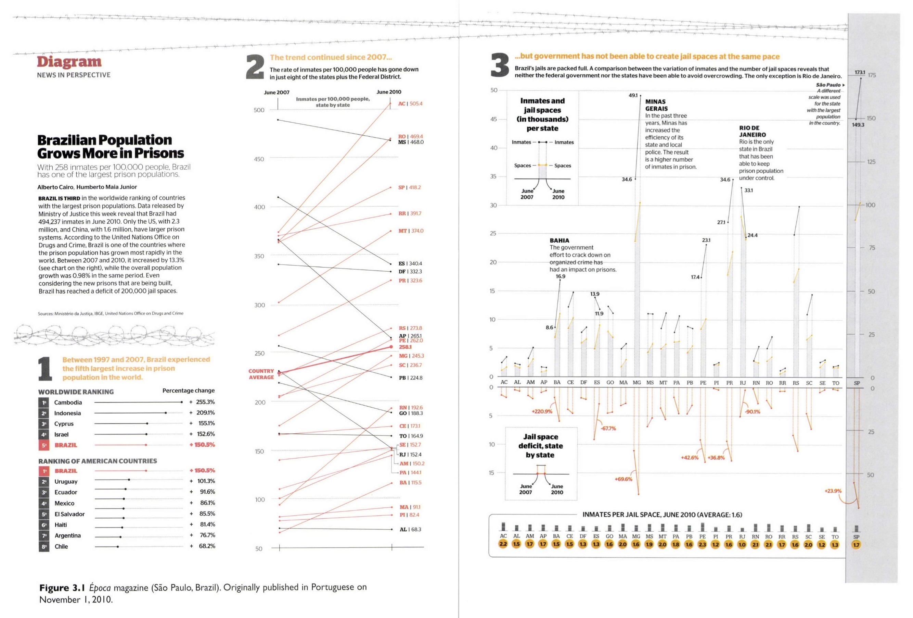
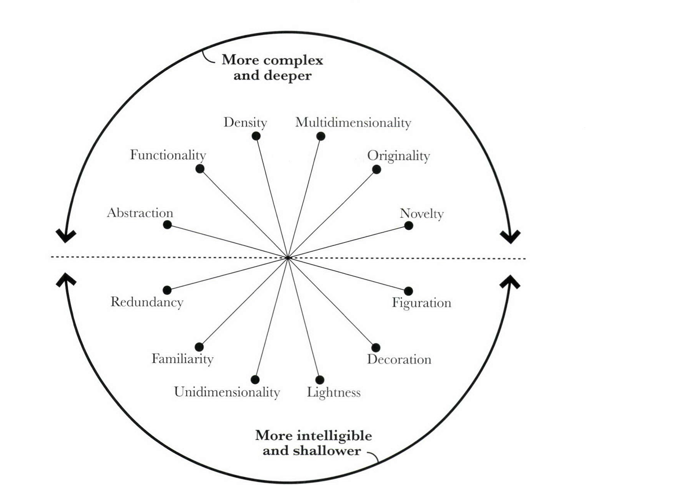
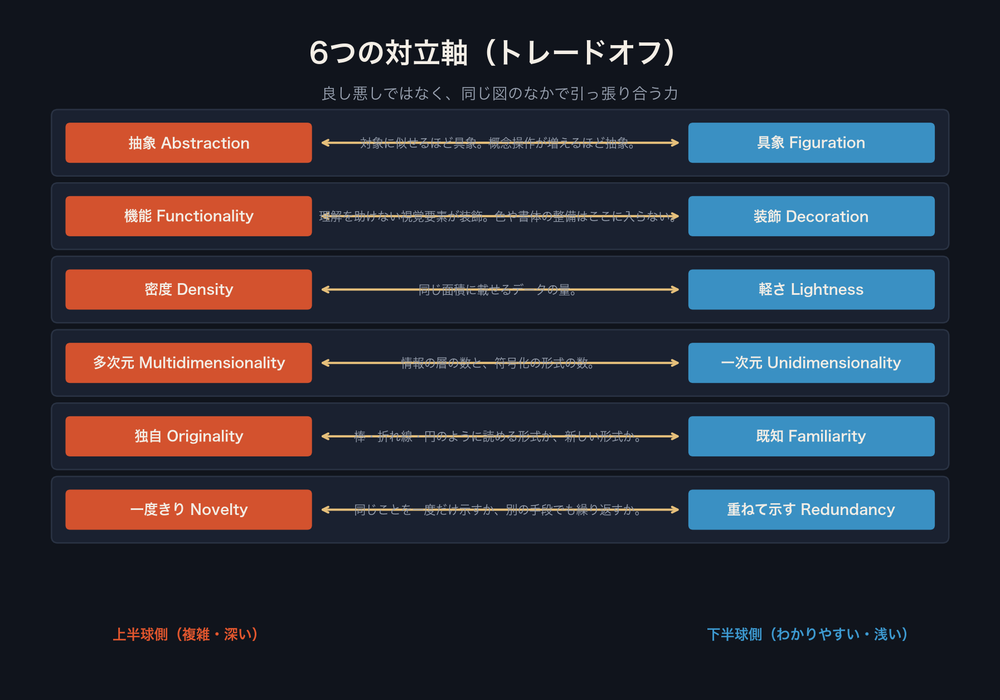
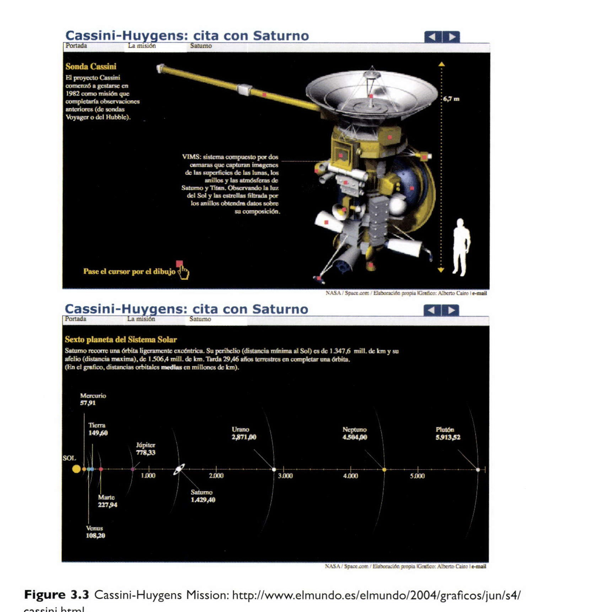
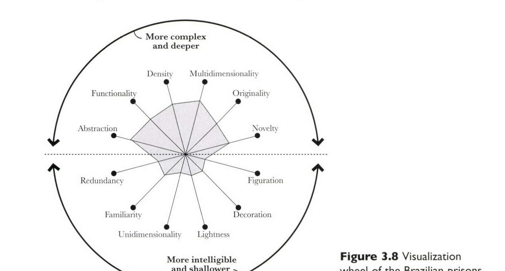
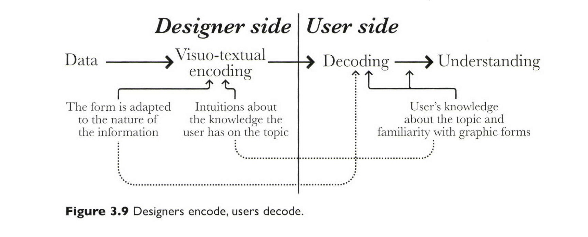
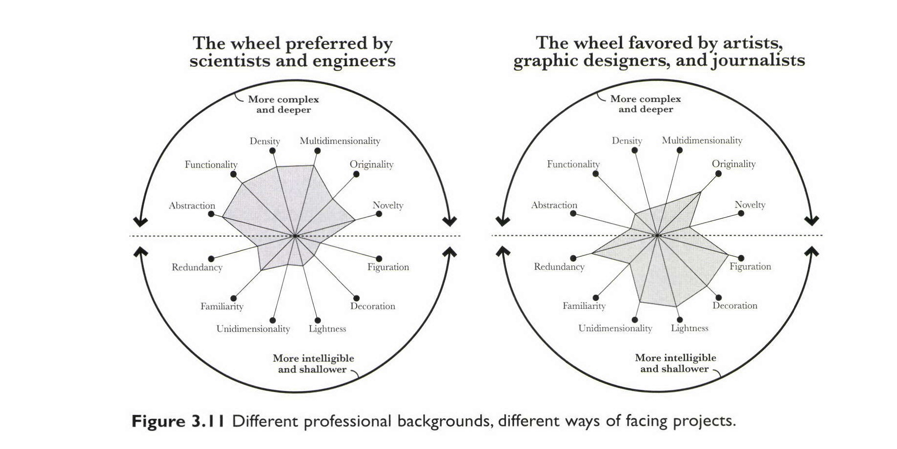

+++
author = "Yuichi Yazaki"
title = "「醜い」と言われた図から、Visualization Wheel が生まれた"
slug = "cairo-visualization-wheel"
date = "2026-08-18"
description = "良し悪しの採点表ではない。編集会議の「複雑すぎる」「醜い」を、12の対立する力として見返すための思考の道具。"
categories = [
    "principle"
]
tags = [
    "cairo"
]
image = "images/cover.png"
+++

Visualization Wheel の面白さは、12個の項目を並べたことではありません。編集会議で「醜い」「複雑すぎる」と言われた図を、良い／悪いではなく、引っ張り合う力として見返すための道具であることです。Alberto Cairo（アルベルト・カイロ）が『The Functional Art』（2012）第3章で書いた枠組みです。Cairo 自身は tension wheel（緊張の車輪）とも呼んでいます。

出典は同書の第3章 “The Beauty Paradox: Art and Communication” です。邦訳は出ていません。日本語で読める Cairo は、のちの『How Charts Lie』（2019）を訳した『グラフのウソを見破る技術』（薮井真澄訳、ダイヤモンド社、2020）です。以下は、原著の該当箇所に沿います。

<!--more-->

## 2010年、編集会議で「醜い」と言われる

2010年11月1日。カイロが当時勤めていたブラジルの週刊誌 Época で、ブラジルの刑務所人口を扱った見開きの図が載ります。タイトルは “Brazilian Population Grows More in Prisons”。共同制作者は Humberto Maia Junior。2週間かけて組んだもので、見出しが読者を三つの層に案内します。1997–2007年の収容者増は世界5位。2007年以降も、州ごとの人口10万人あたり収容者はほとんど増えている。収容能力は、その速さに追いついていない。カイロは infographics director として、毎週の「Diagram」欄を担当していました。

Alberto Cairo／The Functional Art より引用（Figure 3.1）。Época, São Paulo。原図はポルトガル語。

週明けの会議で、こう言われます。複雑すぎる。抽象的すぎる。読者が期待する見た目から遠い（「醜い」）。密度が高すぎる。一年後、この図はインフォグラフィックの賞 Malofiej を取ります。会議の評価と、分野の評価が、同じ図で割れています。

カイロは席を外して、ペンと紙で同僚の言葉を書き出します。同僚の経験を合わせると100年を超える、と書いてあります。批判会議は自分の仕事を弁護する場ではなく、改善の提案を聞く場だ、とも。そのうえで、2008年のスペイン語の前著『Infografía 2.0』で使っていた道具を引っ張り出します。それが Visualization Wheel です。着想は、スペインのデザイン研究者 Joan Costa の『La esquemática』（1998）第1章にある似た車輪だ、と明記しています。軸を増やし、中身を変えた、と書いてあります。

Alberto Cairo／The Functional Art より引用（Figure 3.2）

## 定量評価のための道具ではない

本は、先に警告を置きます。位置は主観である。学術的・定量的な分析には使えないだろう。自分の図を考えるための補助であり、「可視化を計画するための可視化」（meta-visualization）だ、と。

外側は二つの半球に分かれ、それぞれ6つの特徴があります。上半球は、より深く、より複雑な図。ここでの複雑さは、読者が読み解くのに要する労力です。深さは、情報の層の数です。変な形式でどうでもよいデータを載せれば、複雑で浅い図にもなり得ます。ありふれた形式で大量のデータを載せれば、単純で深い図にもなり得ます。ただ一般には、データが多い図ほど読みにくく、そのぶん報われる、と書いています。

軸は6本です。対立する力が、同じ線の両端にあります。

**抽象–具象。** 対象と表現がそっくりであるほど具象。距離が開くほど抽象。極端には、関係は慣習的になります。カイロ自身の例は、スペイン紙 *El Mundo* に載せた土星探査機 Cassini-Huygens のインタラクティブです。同じ稿の二つの画面が、同じ軸の両端に分かれます。探査機に似せた絵は具象。惑星を色の円に還元し、距離の尺度に載せた画面は抽象です。

Alberto Cairo／The Functional Art より引用（Figure 3.3）。元のインタラクティブ: [El Mundo, 2004](http://www.elmundo.es/elmundo/2004/graficos/jun/s4/cassini.html)

**機能–装飾。** 可読性を上げる書体や配色は、ここでは装飾に数えません。理解を直接助けない視覚要素です。刑務所の図にある有刺鉄線が、その例です。装飾はそれ自体が悪いのではない。情報の邪魔をしなければ、と書いています。

**密度–軽さ。** 同じ面積に対して、どれだけデータを載せているか。Época でほぼ同じ大きさの、スケート大会の図と、オマキザルのシロアリ狩りを説明する図を並べ、前者を密、後者を軽として示しています。

**多次元–一次元。** 読者が潜れる層の数と、データを符号化する形式の数。刑務所の図は、州ごとの収容者と収容能力を、別の形式でも見られるので多次元側だ、と自己評価しています。別例は、2004年米大統領選の *The New York Times* です。得票を郡と人口密度で、選挙人を choropleth と cartogram で、さらに比例シンボルマップを重ねています。

**独自–既知。** 棒グラフ、折れ線、円グラフは、いまでは文章に近いほど読めます。Playfair の時代には革命的でした。形式を新しくしようとする衝動は、可視化が広がった結果でもある。例に挙げるのは、Periscopic が Yahoo! 向けに作った stream graph（theme river）です。

**一度きり–重ねて示す。** 多くのことを一度だけ説明するのが novelty。同じことを別の手段で何度も示すのが redundancy。新規は飽きさせないために要る。ある程度の繰り返しは、理解のために要る。巨大な波の解説図では、段階ごとのコピーが、絵に既に入っている情報を言い直しています。複雑な統計図なら、目立たせたい点をハイライトするのも、必要な冗長だ、と書いています。

## 刑務所の図を、車輪に載せる

カイロは、問題になった図を自分で車輪に置きます。チャートは物理的現実に似ていないので抽象。装飾はほとんどなく、機能に寄る。色と書体の一貫性には手を入れた、と書いてあります。層は少なくとも5つあり、多次元。形式は棒、slopegraph、表など、ありふれたもの。収容者と収容能力は、別形式でも出て、説明文もあるので、冗長はかなりある。

Alberto Cairo／The Functional Art より引用（Figure 3.8）

この組み合わせは妥当か。同僚の反対にもかかわらず、過負荷でも、読めないほど難しくもない、とカイロは書きます。一番きれいではない。いちばん醜くもない。上半球に寄っている。複雑で深い。それでも、Época のような媒体の読者には障害になるべきではない。政府上層の汚職を 8,000語で読む読者に、子ども向けの図を添えるのはおかしい。大人向けの記事に、子ども向けの図を付けることが起きている、というのが、ここでの本の主張です。

## 読者を誰だと思っているか

図の複雑さは、平均的な読者の性質に合わせる。言うのは簡単で、行うのは難しい、と続いています。デザイナーと読者のあいだを左右するのは、少なくとも二つです。物語に、視覚形式が合っているか。読者が、その主題と、その形式の読み方を、すでに知っているか。棒グラフは散布図より普通です。本はこれを、デザイナーが visuo-textual encoding し、読者が decoding する図にしています。

Alberto Cairo／The Functional Art より引用（Figure 3.9）

専門誌なら、前提を多く置けます。本が挙げるのは、*PLoS ONE* に載った神経精神疾患の家族内共起の図です。カイロ自身、完全には読めない、と書いています。研究者は同業者を想定している。説明や凡例を、一般誌のデザイナーが足すほどには要らない。一般誌では、「複雑すぎないか」「データ量に圧倒されないか」が問われる。そのとき多くの作り手が、明瞭にするのではなく単純化し、かわいいアイコンを足す。三つの編集局で、面識のない三人のマネージャーから、ほぼ同じ台詞を聞いた、とカイロは書いています。「読者は馬鹿だ」。

章の扉に置いてあるのは、E. B. White です。読者の知性を信じない者、上から目線の者は、まともに書けない。過大評価は起きにくい。過小評価のほうが普通だ、と本は続けます。

この対立を、カイロは職業文化としても描きます。機能を先にする人（統計、地図、計算機科学、工学）と、感情と美を先にする人（グラフィックデザイン、美術、ジャーナリズム）。境界はぼやけている。本は、同じ車輪を二つ並べて、その偏りを見せます。左は科学者・技術者が寄りがちな形。抽象、機能、密度、多次元に寄る。右はアーティスト、グラフィックデザイナー、ジャーナリストが寄りがちな形。具象、装飾、軽さ、新奇さに寄る。

Alberto Cairo／The Functional Art より引用（Figure 3.11）

両端の象徴になるのが Edward Tufte と Nigel Holmes です。Tufte は 1990年の『Envisioning Information』で、USA Today 以降の絵入りチャートを chartjunk と呼び、Holmes が *Time* に描いたダイヤモンドの図を槍玉に挙げます。Holmes 側は、何百もある仕事から一つだけ拾い、逸話をカテゴリに上げた、と反論しています。Tufte の計算では、その図のデータインク比はおよそ 150／1,000＝0.15 です。1.0 に近いほど良い、というのが Tufte の立場です。

カイロは Tufte の、データを真剣に扱うこと、読者を馬鹿にしないこと、雑然さを減らすことには同意します。一方で、[データインク比](/data-ink-ratio/)が常に理解を助ける、という主張は疑わしい、とも書きます。グリッドや、主題を示す控えめなアイコンは、邪魔ではなく理解を助けることがある。本が直後に置くのは、二つの研究です。Ben-Gurion 大学の Inbar ら（2007）は、従来の棒グラフと、データインク比を最大化した棒グラフを学生87人に見せ、後者を多くの参加者が拒んだ、とします。速さや正確さに有意差はなかった。Saskatchewan 大学の Bateman ら（2010）は、Holmes の装飾図と、同じデータを剥いだ図を比べます。理解に差は出なかった。三週間後の想起では、装飾図のほうが主題と内容をよく覚えていた。カイロはこれを、chartjunk が常に邪魔だとは限らない、という材料にしています。脚注では、Stephen Few が Bateman らの方法を批判していることも書いてあります。

第4章では、車輪を実務の経験則に落とします。**形式が珍しいほど、冗長を足す。** 新しい見せ方をするなら、仕組みの説明と、手がかりを置け、ということです。章の終わりでカイロは、Tufte の密な図と、Holmes や Otto Neurath の pictogram のどちらが正しいか、と問います。総合は可能だ、というのが答えです。密度も軽さも、車輪の位置であって、勝者ではありません。

## 第三者はこの車輪をどう見たか

本そのものへの評価は厚いです。車輪だけを独立に検証した研究は、多くありません。

- Stephen Few（*Show Me the Numbers*）は、普段 infographic に厳しい立場から推薦を書いています。「Nigel Holmes と Edward Tufte に子どもがいたら、その名は Alberto Cairo」。インフォグラフィックの世界に、成熟した、科学に足のついた視点を入れた、と。この本が今後何年も第一の文献になるだろう、とも書いています。
- Robert Kosara（eagereyes）は「読め」とだけ言えば足りる、とします。ジャーナリストなら必須。可視化の研究者なら、なおさら必須。ここ25年、可視化に欠けていたものだ、と。第2章の「形は機能に従う」ではなく「機能が形を制約する」を、本から持ち帰るべき一点に挙げています。Lamarck の進化の話は長すぎる、DVD は本文より弱い、という留保もあります。
- Nathan Yau（FlowingData）は、ニュース室の経験がある点が、絵集まがいの本と違う、と書いています。強みはイラストレーションと情報。視覚的データ分析や統計概念の本ではない、とも明言しています。
- *The Guardian* Data Blog の Simon Rogers は、データ可視化に関心があるなら読むだけでなく、レッスンを吸収せよ、とします。棒がバブルより比較に向く理由など、チャートを本業にしない人にも届く、と。
- Cole Nussbaumer Knaflic（storytelling with data）は、基礎部で Visualization Wheel が competing priorities を評価するために導入される、と要約しています。
- Graphic Sociology の Laura Norén は、ジャーナリズム教育の教科書として推しつつ、二つの欠けを書いています。紹介されるデザイナーの女性比が低いこと。認知の章が基礎の復習に偏り、応用が少ないこと。カイロ自身の逸話として、Malofiej を取った刑務所の図が、上司からは「醜い」と叱られたことも拾っています。インフォグラフィック部長がアートディレクター（多くはグラフィックデザイナー）の下に置かれる組織では、機能と形式の誤解が起きやすい、という本の指摘です。

車輪を測る道具として使った研究もあります。Locoro ら（2017, *Computers in Human Behavior*）は、日常のインフォグラフィックの静的版とインタラクティブ版を比較する際、デザイン品質の次元に Visualization Wheel を使いました。複雑さと美学のトレードオフを見るためです。結果として、インタラクティブはより複雑に知覚されるが、体験は良い、としています。Cairo 本人は「定量評価には使えないだろう」と書いています。それでも第三者は、主観の軸を、質問票の次元として借りています。

実務と授業では、車輪の形そのものへの不満も出ます。Ernesto Garbarino（2022）は、矢印が円を回る元の図がわかりにくいので、対立する次元を並置し直した、と書いています。Ferdinando Iavarone は、ダッシュボードの事後チェックに使い、Excel のレーダーで描き、同僚に「どこを先に見るか」を聞く、としています。ウィスコンシン大学の可視化授業（CS765, 2022）では、学生に軸を二つ選ばせ、機能–装飾と独自–既知を、目的と読者の話として書かせています。

普及側の解説は、単純化しがちです。Code Conquest は、科学者・工学者には上半球、政治家やデザイナーには下半球、と読者を二分します。本の議論は、そこまできれいではありません。Época の読者は一般誌の読者です。カイロが拒んでいるのは、一般誌だから子ども向けにする、という短絡です。

## 使い道

この車輪の使い道は、完成図の採点ではありません。描く前に、どの力を引き受けるかを決めることです。同じ車輪は、作り手の職業文化の偏りを見るためにも使えます。技術者の図が上半球に寄り、デザイナーの図が下半球に寄る、という Figure 3.11 は、好みの話ではなく、前提の話です。

上に寄せれば、層は増え、労力も増えます。下に寄せれば、最初の数秒で読めますが、浅くなります。両方を最大にはできません。形式を新しくするなら、同じことを別の手段でも示す。装飾を足すなら、有刺鉄線がデータに重ならないかを見る。読者が主題も形式も知っているなら、説明を削れる。知らないなら、単純化するのではなく、手がかりを足す。同じミッションでも、探査機の絵と距離の尺度では、車輪の位置が変わる。

カイロが会議のあとで紙に描いたのは、反論のためではありません。同僚の「醜い」が、どの軸の話なのかを切り分けるためです。複雑さなのか、抽象なのか、密度なのか、期待される美なのか。賞を取ったあとも、その切り分けは残ります。可視化の仕事は、きれいさの判定で終わらない。どの緊張を、誰のために引き受けるかで終わります。

## 参考・出典

**一次情報**

- Alberto Cairo, *The Functional Art: An introduction to information graphics and visualization*, New Riders, 2012（奥付によっては 2013）。第3章 “The Beauty Paradox: Art and Communication”（Visualization Wheel, pp.50–72）。Figure 3.1（Época の刑務所見開き、Alberto Cairo and Humberto Maia Junior）、3.2（車輪）、3.3（Cassini-Huygens）、3.8（刑務所の図の位置）、3.9（encode / decode）、3.11（職業文化の二つの車輪）。第4章の車輪の再開（形式が珍しいほど冗長を足す）。[Peachpit](https://www.peachpit.com/store/functional-art-an-introduction-to-information-graphics-9780321834737) / [著者サイト](https://www.albertocairo.com/)
- Alberto Cairo, *Infografía 2.0: Visualización interactiva de información en prensa*, Alamut, 2008。車輪の初出側。英語版なし。
- Joan Costa, *La esquemática: visualizar la información*, Paidós, 1998。Cairo が車輪の着想源として挙げる。
- B.C. Campbell & S.S. Wang, “Familial Linkage between Neuropsychiatric Disorders and Intellectual Interests,” *PLoS ONE* 7(1): e30405, 2012。Cairo が専門読者向けの図の例として挙げる。 [doi:10.1371/journal.pone.0030405](https://doi.org/10.1371/journal.pone.0030405)
- Ohad Inbar, Noam Tractinsky, Joachim Meyer, “Minimalism in Information Visualization: Attitudes Towards Maximizing the Data-Ink Ratio,” *ECCE ’07*, ACM, 2007。 [doi:10.1145/1362550.1362597](https://doi.org/10.1145/1362550.1362597)
- Scott Bateman et al., “Useful Junk? The Effects of Visual Embellishment on Comprehension and Memorability of Charts,” *CHI 2010*, ACM。 [doi:10.1145/1753326.1753716](https://doi.org/10.1145/1753326.1753716)
- Donald A. Norman, *Emotional Design*, Basic Books, 2003。Cairo が「美しいものはより機能的だ」として引く。
- Otto Neurath, *From Hieroglyphics to Isotype*, Hyphen Press, 2010, p.113。Cairo が大衆教育と魅力の関係として引く。
- アルベルト・カイロ（薮井真澄訳）『グラフのウソを見破る技術』ダイヤモンド社、2020年。原著: *How Charts Lie*, W. W. Norton, 2019。[ダイヤモンド社](https://www.diamond.co.jp/book/9784478110348.html)

**第三者評価**

- Stephen Few, “Here at Last, ‘The Functional Art’,” *Perceptual Edge*, 2012-09-27. [書評](https://www.perceptualedge.com/blog/?p=1356)
- Stephen Few, “The Chartjunk Debate,” *Visual Business Intelligence*, 2011. Cairo が Bateman らへの批判として脚注に挙げる。[PDF](https://www.perceptualedge.com/articles/visual_business_intelligence/the_chartjunk_debate.pdf)
- Robert Kosara, “Review: Alberto Cairo, The Functional Art,” *eagereyes*, 2012. [書評](https://eagereyes.org/blog/2012/review-alberto-cairo-functional-art)
- Nathan Yau, “Review: The Functional Art,” *FlowingData*, 2012-09-12. [書評](https://flowingdata.com/2012/09/12/review-the-functional-art/)
- Simon Rogers, “Data visualisation: how Alberto Cairo creates a functional art,” *The Guardian* Data Blog, 2012-10-12. [紹介](https://www.theguardian.com/news/datablog/2012/oct/12/data-visualisation-alberto-cairo)
- Cole Nussbaumer Knaflic, “the functional art,” *storytelling with data*, 2012-12-12. [書評](https://www.storytellingwithdata.com/blog/2012/12/the-functional-art)
- Laura Norén, “The Functional Art by Alberto Cairo | book review,” *Graphic Sociology*, 2013-01-06. [書評](https://thesocietypages.org/graphicsociology/2013/01/06/the-functional-art-by-alberto-cairo-book-review/)
- Angela Locoro, Federico Cabitza, Rossana Actis-Grosso, Carlo Batini, “Static and interactive infographics in daily tasks: A value-in-use and quality of interaction user study,” *Computers in Human Behavior*, 71, 2017, pp.240–257. [doi:10.1016/j.chb.2017.01.032](https://doi.org/10.1016/j.chb.2017.01.032)
- Ernesto Garbarino, “Alberto Cairo’s Visualisation Wheel,” 2022-01-13. [解説](https://garba.org/posts/2022/cairo/)
- Ferdinando Iavarone, “The Tension Wheel in Visualization,” LinkedIn. [実務への適用](https://www.linkedin.com/pulse/tension-wheel-visualization-ferdinando-iavarone)
- University of Wisconsin–Madison, CS765 Data Visualization (2022), end-of-week survey on Cairo’s visualization wheel. [授業](https://pages.graphics.cs.wisc.edu/765-22/feedback/eow02/)
