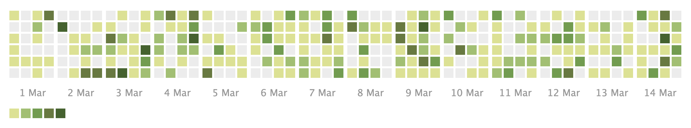

+++
author = "Yuichi Yazaki"
title = "Calendar Heatmap"
slug = "calendar-heat-map"
date = "2025-10-11"
categories = [
    "chart"
]
tags = [
    "",
]
image = "images/cover.png"
+++

A calendar heatmap visualizes date-based data using the structure of a calendar. Each day is represented by a cell, and color intensity shows the value for that day. It is useful for seeing daily activity, frequency, seasonality, and weekly patterns.

<!--more-->

## Use Cases

- Contribution or activity logs
- Daily sales or traffic
- Habit tracking
- Weather or environmental daily values

## Design Notes

- Make the calendar orientation clear.
- Use a color scale suited to the data.
- Label months and weekdays.
- Consider missing days and holidays.

## Summary

Calendar heatmaps are effective when the calendar structure itself matters. They reveal daily and seasonal patterns that ordinary line charts may hide.
