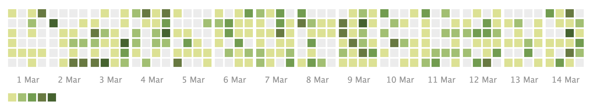

+++
author = "Yuichi Yazaki"
title = "カレンダー・ヒートマップ (Calendar Heat Map)"
slug = "calendar-heat-map"
date = "2025-10-11"
categories = [
    "chart"
]
tags = [
    "",
]
image = "images/cover.png"
+++

カレンダー・ヒートマップ（Calendar Heat Map）は、日付を単位としてデータの量や強度を可視化するためのグラフ形式です。1 年のカレンダーや月間のスケジュールを格子状に配置し、各日を色の濃淡で表現します。色は通常、値の大小を表し、濃いほど数値が高いことを示します。GitHub の「Contributions（貢献度）」グラフが代表的な例で、日ごとの活動量を直感的に把握できます。

この形式は「時系列データをカレンダー構造で配置する」ことで、週・月・季節などの周期的な傾向を視覚的に理解することを目的としています。

<!--more-->

### 図解の見方

| 要素 | 意味 | 表現方法 |
|------|------|-----------|
| 各セル（マス） | 日付 | 格子状に配置され、曜日と週で並ぶ |
| 色の濃淡 | 値の大小 | 濃い色ほど値が高く、薄い色ほど低い |
| 行（横軸） | 週 | 時間の進行方向を示す |
| 列（縦軸） | 曜日 | 各週の繰り返し構造を形成 |
| 凡例 | カラースケール | 最小値から最大値までの連続的な色で示される |
| 連続する高濃度領域 | 活動が集中する期間 | 特定の季節性やイベントを示唆 |

### 利用分野と応用例

| 分野 | 利用例 | 特徴 |
|------|--------|------|
| ソフトウェア開発 | GitHub のコミット履歴可視化 | 開発頻度や休止期間が一目でわかる |
| 健康・ライフログ | 歩数や睡眠時間の可視化 | 生活リズムや季節変動の把握 |
| 教育・学習 | 学習日数の記録 | 習慣形成や継続度の評価に利用 |
| ビジネス分析 | 売上や来店数の推移 | 曜日効果や月次トレンドの発見 |
| 環境データ | 気温・降水量の分布 | 季節的パターンや異常値の可視化 |

### 背景と歴史

この手法の起源は、1980〜1990年代における時系列データ可視化の研究に遡ります。2000年代に入り、ウェブアプリケーションの普及とともにカレンダー形式のデータ可視化が一般化し、特に 2012 年以降の GitHub「Contribution Graph」の登場によって、一般ユーザーにも広く知られるようになりました。現在では D3.js や Vega-Lite、Plotly、Tableau など多くの可視化ツールがカレンダー・ヒートマップをサポートしています。

### まとめ

カレンダー・ヒートマップは、日単位でのデータの変動を把握し、周期的な傾向を発見するための強力なビジュアル手法です。その見た目の親しみやすさと即時性により、個人のライフログから企業データまで幅広く利用されています。時間の流れを「数字」ではなく「季節やリズム」として捉え直す視点を提供する点に、この可視化の魅力があります。

### 参考・出典

- [Viewing contributions on your profile — GitHub Docs](https://docs.github.com/articles/viewing-contributions-on-your-profile-page)  
- [Calendar Example — Vega (calendar-view example)](https://vega.github.io/vega/examples/calendar-view/) 
- [Calendar Chart — Google Charts (calendar visualization)](https://developers.google.com/chart/interactive/docs/gallery/calendar)
- [Cal-Heatmap: Calendar Heat Map JS plugin](https://cal-heatmap.com/v2/)
- [Tutorial: Building a D3.js Calendar Heatmap](https://blog.risingstack.com/tutorial-d3-js-calendar-heatmap/)