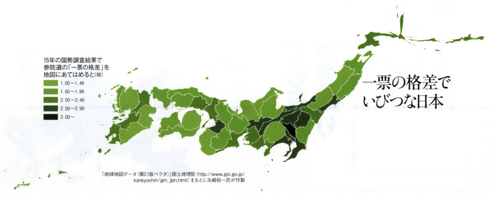
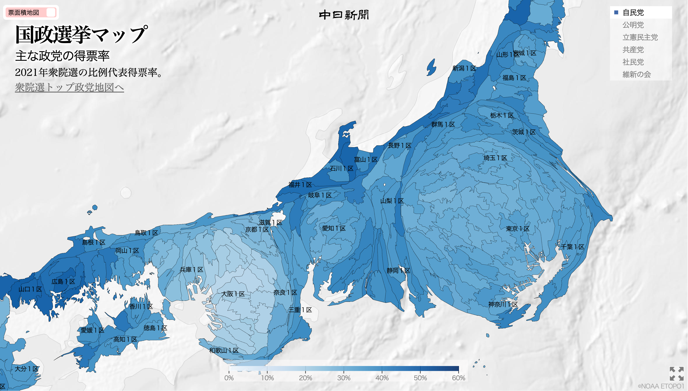
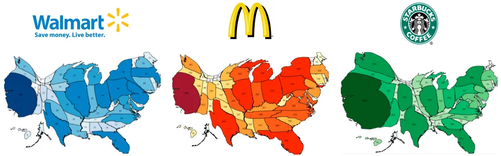
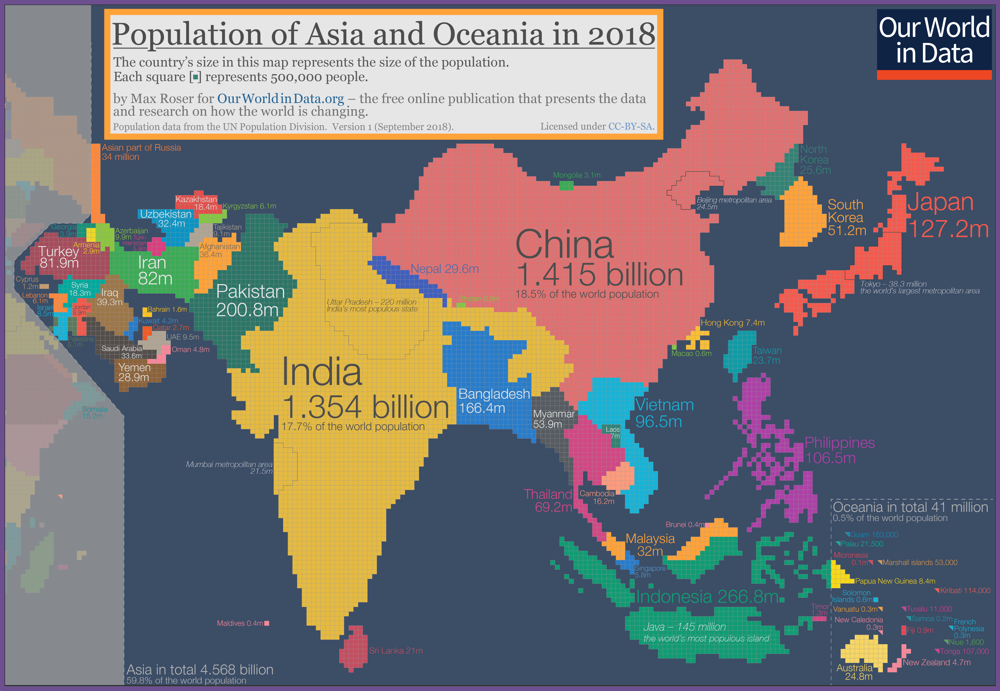
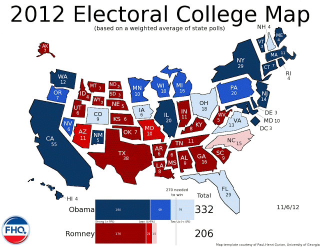
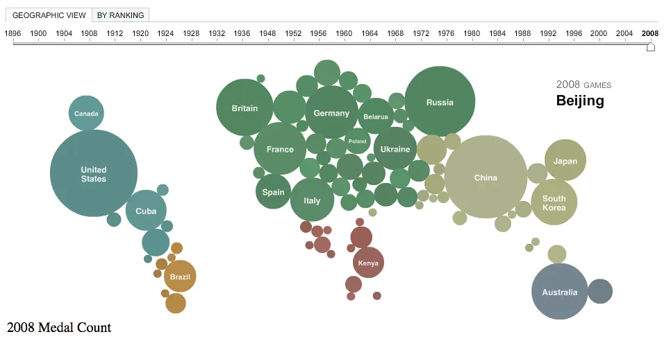
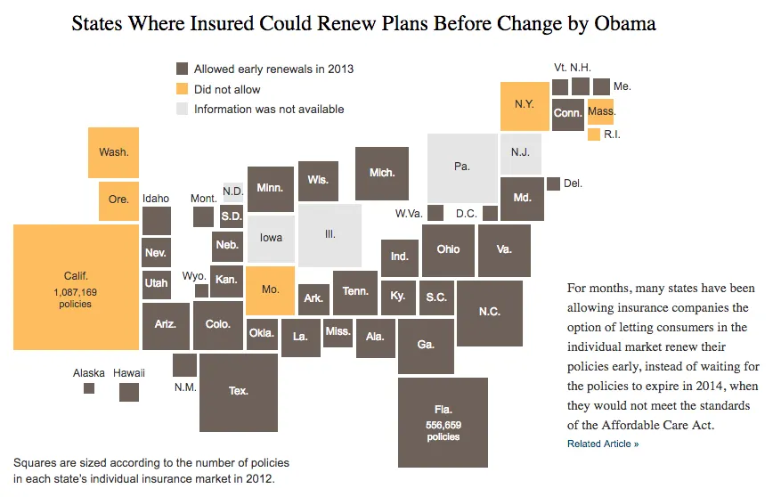
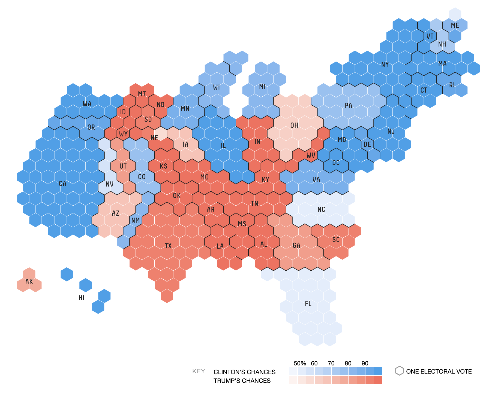

+++
author = "Yuichi Yazaki"
title = "カルトグラム：見慣れた地図がデータで歪む面白さ"
slug = "cartogram"
date = "2025-09-10"
categories = [
    "consume","technology"
]
tags = [
    "地図"
]
image = "images/cartogram.png"
+++

データをわかりやすく、そして印象的に表現する方法のひとつに「カルトグラム（Cartogram）」があります。これは地図上の領域（国や都道府県など）の面積や形を、人口や経済規模、投票数などの数値データに比例させて変形した地図です。普段見慣れている地図が大きく歪むことで、データの特徴が一目でわかるのが魅力です。ここではデータを面積に反映させる面積カルトグラムのうち、代表的な4種類のカルトグラムを紹介します。

<!--more-->

## カルトグラム手法の比較一覧

| 手法 | 特徴 | メリット | デメリット |
|------|------|-----------|-------------|
| 連続的カルトグラム | 隣接関係を保ちながら、面積をデータに比例させて変形 | 地図らしさが残るため直感的 | 全体的に歪んで読みにくい場合がある |
| 非連続的カルトグラム | 地域ごとに独立させ、面積をデータに比例 | 歪みが少なく比較しやすい | 隣接関係が失われる |
| 擬似連続カルトグラム | 丸や四角など幾何図形の大きさや色で表現 | データ比較がしやすい | 地形が失われる |
| グリッド・カルトグラム | グリッド単位で地域を置換 | 個数や色による表現が明確 | 位置関係が単純化されすぎる |

### 連続的カルトグラム (Continuous Cartogram)

#### 一票の格差でいびつな日本

#### 2021年衆院選の比例代表得票率 主な政党の得票率

[2021年衆院選の比例代表得票率 主な政党の得票率](https://static.chunichi.co.jp/chunichi/pages/feature/election/proportional_map.html)

#### カルトグラムを利用して、米国におけるウォルマート、マクドナルド、スターバックスの分布を表示する

[Supercenters, Hamburgers, and Coffee: Using density-equalizing cartograms to display the distribution of Walmarts, McDonalds, and Starbucks in the US](https://web.archive.org/web/20200510210032/http://www.stephabegg.com/home/projects/cartograms)

#### 地球規模の生活環境がどのように変化しているかを考えるために必要な地図

[The map we need if we want to think about how global living conditions are changing](https://ourworldindata.org/world-population-cartogram)

連続的カルトグラムは、国境や県境といった隣接関係を保ちながら、各地域をデータに応じて面積ごと変形する手法です。
たとえば人口を基準にすると、人口の多い地域は大きく、少ない地域は小さく変形されます。結果として全体の地図がぐにゃりと歪み、見慣れた地図とのギャップから「どこが大きく、どこが小さいのか」が直感的に理解できます。

### 非連続的カルトグラム (Non-Continuous Cartogram)

#### 選挙人地図（11/6/12）：選挙日

[The Electoral College Map (11/6/12): Election Day](https://www.frontloadinghq.com/2012/11/the-electoral-college-map-11612.html)

非連続的カルトグラムは、隣接性を捨てて各地域を独立させた上で、面積をデータに比例させる手法です。
たとえばアメリカの州ごとの投票結果を示す場合、州の位置や境界は保ちながらも州同士の距離感は無視されるため、全体としてはモザイク状の地図になります。隣接関係の形状の変化に影響を受けずに、それぞれの地域のデータ量が強調されるのが特徴です。

### 擬似連続カルトグラム (Pseudo-Continuous Cartogram)

#### ニューヨーク・タイムズ「オリンピックメダル地図」、2012年。

[A Map of Olympic Medals](https://archive.nytimes.com/www.nytimes.com/interactive/2008/08/04/sports/olympics/20080804_MEDALCOUNT_MAP.html)

#### オバマ大統領による変更前に、保険契約を更新できる州

[States Where Insured Could Renew Plans Before Change by Obama](https://archive.nytimes.com/www.nytimes.com/interactive/2013/11/20/us/which-states-will-allow-old-health-policies-to-be-renewed.html)

擬似連続カルトグラムは、地域を地形のまま表現するのではなく、丸や四角などの単純な幾何図形に置き換えた上で、それをデータに応じて大きさを変える方法です。
代表例は「ドーリング・カルトグラム（Dorling cartogram）」と呼ばれる手法で、国や地域を円の大きさで表し、位置関係をできるだけ近づけて配置します。地形の正確さを犠牲にする代わりに、データの比較がしやすくなるのが利点です。

### グリッド・カルトグラム (Gridded Cartogram)

#### すべては538人の選挙人票次第だ

[It’s all about the 538 Electoral College votes](https://web.archive.org/web/20241213042407/http://projects.fivethirtyeight.com/2016-election-forecast/?ex_cid=rrpromo#plus&electoral-map)

グリッド・カルトグラムは地形を、データに応じた個数のグリッド（四角形や六角形など）を並べて表現する方法です。個数以外に色でも別変数を表現することができます。位置関係をある程度保ちつつ、数の比較が直感的に理解できるのが特徴です。

## まとめ

カルトグラムは「地図」という馴染みのあるフォーマットにデータを組み込むことで、地域差や規模感を強く訴えることができる表現手法です。適切なタイプを選ぶことで、データが持つストーリーを効果的に伝えることができます。