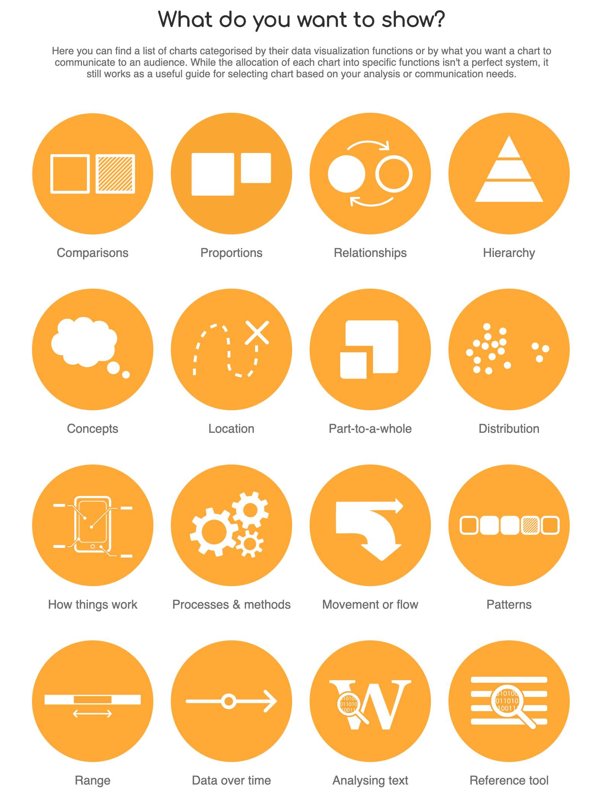
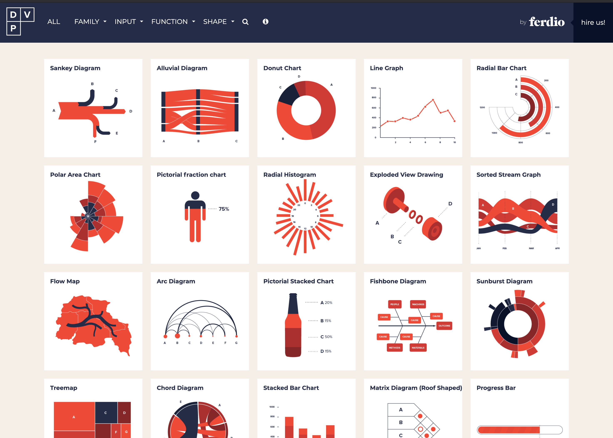
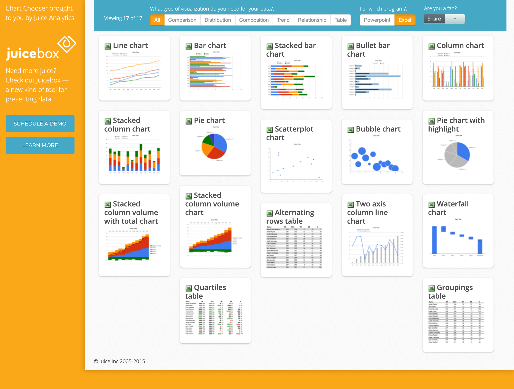
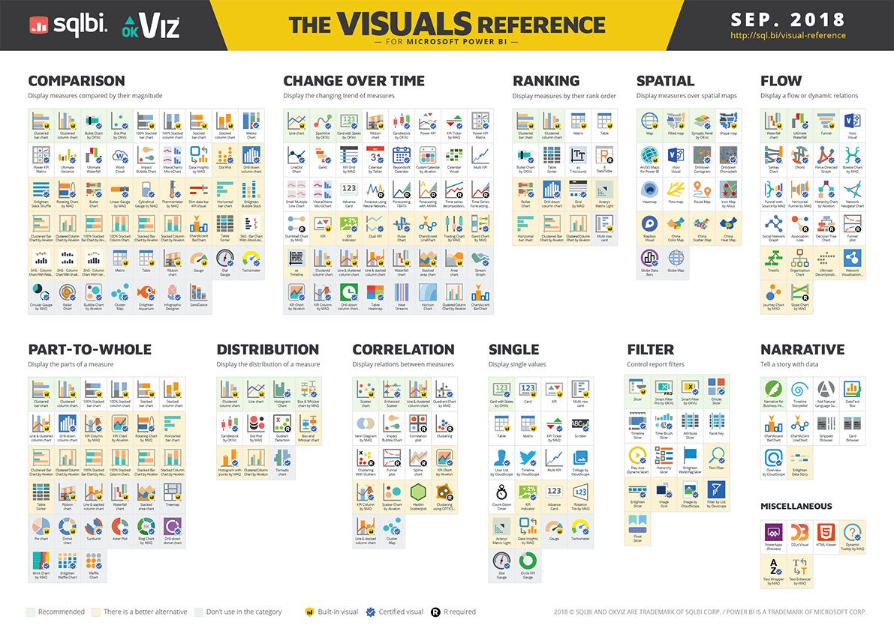
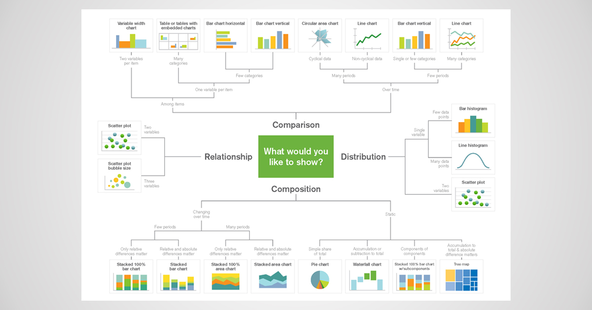
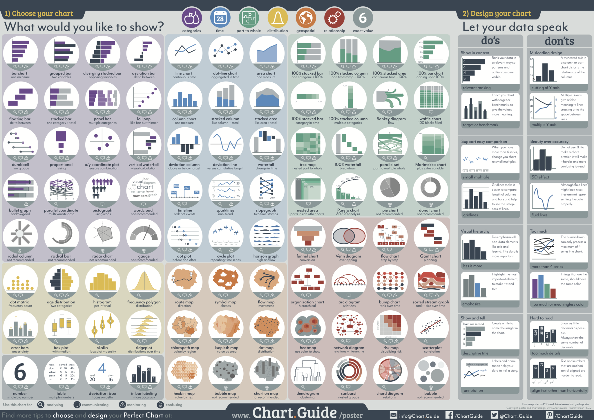
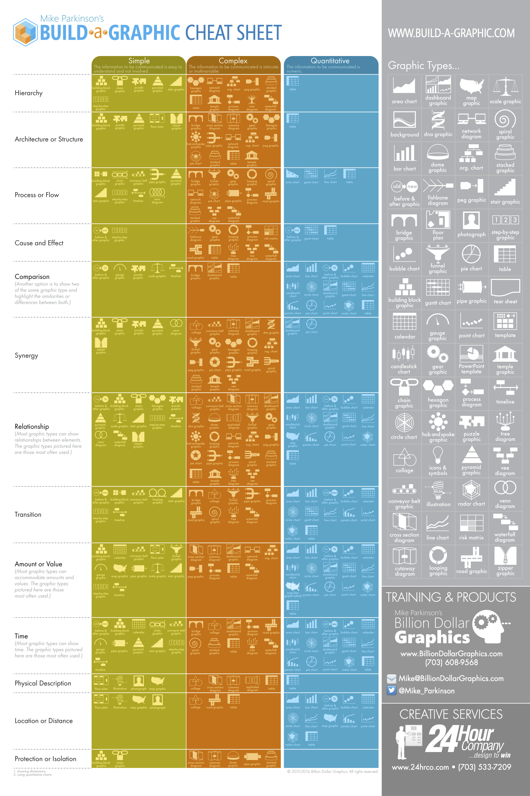
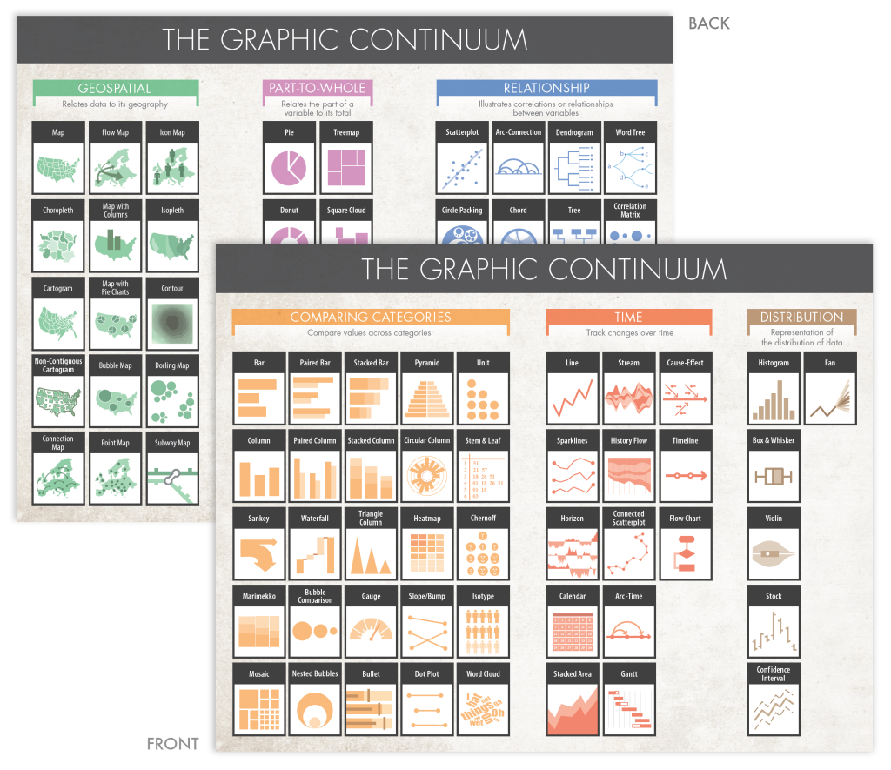

+++
author = "Yuichi Yazaki"
title = "タスク別チャート分類"
date = "2020-08-28"
description = ""
categories = [
    "chart"
]
tags = [
    "",
]
image = "chart_chooser.jpg"
+++

代表的な Visual Vocabulary を除いて、タスク別にチャート分類しているものをご紹介します。

<!--more-->

## The Data Visualization Catalogue

[The Data Visualization Catalogue](https://datavizcatalogue.com/)

## Data Viz Project

[Data Viz Project](https://datavizproject.com/)

## Juice Labs – Chart Chooser

ExcelやPowerpointで利用可能なチャートをタスク別に分類しています。テンプレートファイルのダウンロードも可能。

[Juice Labs – Chart Chooser](http://labs.juiceanalytics.com/chartchooser/index.html)

## The Visual Reference for Microsoft Power BI

[The Visual Reference for Microsoft Power BI](https://www.sqlbi.com/ref/power-bi-visuals-reference/#)

## The Chart Chooser

[The Chart Chooser](https://extremepresentation.typepad.com/blog/2006/09/choosing_a_good.html)

- [The Chart Chooser](https://extremepresentation.typepad.com/blog/2006/09/choosing_a_good.html)
- [The Slide Chooser](https://extremepresentation.typepad.com/blog/2015/01/announcing-the-slide-chooser.html)
- [Chart Chooser in MATLAB](https://extremepresentation.typepad.com/blog/2009/04/chart-chooser-in-matlab.html)

## The Chart Chooser Dissected

[The Chart Chooser Dissected](https://blog.qlik.com/third-pillar-of-mapping-data-to-visualizations-usage)

## Chart Chooser and Chart Designer Poster

## Graphic Cheat Sheet

[Graphic Cheat Sheet](https://blog.qlik.com/third-pillar-of-mapping-data-to-visualizations-usage)

## The Graphic Continuum

[The Graphic Continuum](https://policyviz.com/2014/11/11/graphic-continuum-desktop-version/)

- [公式デスクトップ版](https://policyviz.com/2014/11/11/graphic-continuum-desktop-version/)
- [公式ポスター版](https://policyviz.com/2014/09/09/graphic-continuum/)

