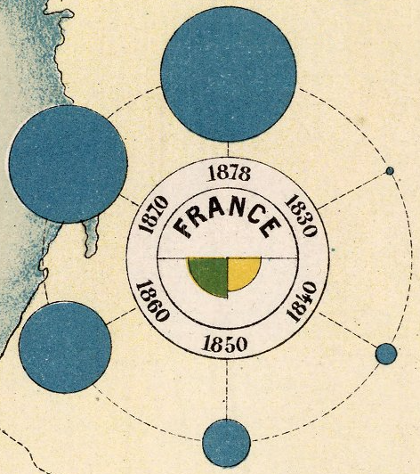

+++
author = "Yuichi Yazaki"
title = "鉄道の発展を「円の面積」で描いた鉄道発展図"
slug = "chart-map-railway"
date = "2025-09-15"
categories = [
    "technology"
]
tags = [
    "地図",
]
image = "images/12511022_closeup.png"
+++

19世紀のヨーロッパでは、鉄道の敷設がめまぐるしく進みました。その姿を人々にわかりやすく伝えるため、フランス公共事業省が1880年に発行したのが、この「鉄道発展図」です。

一見すると地図の上に青い円が散りばめられただけのように見えますが、そこには当時のデータ可視化の工夫が詰まっています。

<!--more-->

## 青い円の意味

外側に並ぶ青い円は、各国における鉄道の総延長を示しています。
1830年から1878年までの6つの時点（1830, 1840, 1850, 1860, 1870, 1878）が等間隔に配置され、時代が進むごとに円が大きくなっていくのがわかります。

ポイントは「円の面積」が鉄道延長距離に比例していること。
データ量を正しく表すため、凡例には「半径を距離の平方根に比例させる」計算式が書き込まれています。つまり、見た目の大きさが実際の鉄道網の成長に対応するよう設計されているのです。

## 中央の二色の扇形

中央の小さな円の中には、緑と黄色の半円が描かれています。
- 緑：領土面積に対する鉄道の比率
- 黄色：人口に対する鉄道の比率

この扇形も、面積が比率に応じて変わるように描かれています。絶対量だけでなく「どれだけ便利に鉄道を使えるか」という相対的な指標まで一枚の図に盛り込んでいるのです。

## なぜこの地図が作られたのか？

史実として明確な「動機」の記録は残っていません。しかし、当時の状況からいくつかの背景を推測することはできます。

- 成果の可視化...公共事業省が鉄道整備の進展を国民や議会に示し、「国家の進歩」をアピールする狙いがあった可能性があります。
- 国際比較の意識...イギリス、ドイツ、アメリカなどとの比較を通じて、フランスの位置づけを明らかにし、国力を誇示しようとした側面も見て取れます。
- 可視化文化の浸透...当時の技術官僚は、数値を地図や図表に落とし込み「説得力あるかたちで伝える」文化を持っていました。この地図もその延長線上にあると考えられます。

こうした点を踏まえると、この鉄道発展図は単なる統計資料というよりも、「国の物語」を可視化したインフォグラフィックスだったのではないでしょうか。

## 19世紀のデータ可視化の知恵

現代の私たちがインフォグラフィックスやダッシュボードで当たり前に使う「面積で数量を表す」「相対指標と絶対量を同時に見せる」といった工夫は、実は150年前から試みられていました。

この鉄道発展図は、単なる地図ではなく「統計とデザインを融合させた可視化表現」の先駆けといえます。

## まとめ
- 青い円の大きさ＝鉄道延長距離（面積で比例）
- 配置された6つの円＝1830〜1878年の時系列
- 中央の緑と黄色＝領土・人口に対する相対的な発展度
- 背景には「国家の進歩を示す」という行政的・国際的な意図が込められていた可能性がある

鉄道の広がりを「見える形」にしたこの図は、今見ても十分に新鮮で、データをどう表現するかを考えるヒントになります。

## 参考・出典

 - [Carte Figurative du Developpement des Chemins de Fer Dans les Principaux Etats de 1830 a 1878.](https://www.davidrumsey.com/luna/servlet/detail/RUMSEY~8~1~309011~90078926)

