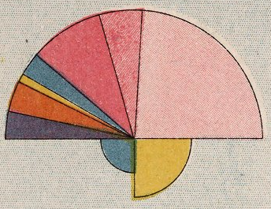

+++
author = "Yuichi Yazaki"
title = "交通インフラの内訳を可視化した統計チャート地図"
slug = "chart-map-transportation-infrastructure"
date = "2025-09-15"
categories = [
    "technology"
]
tags = [
    "Map",
]
image = "images/12511007_closeup.png"
+++

1879年、フランス公共事業省は全国の交通路の整備状況をまとめたユニークな地図を発行しました。
地形を描くベースマップの上に、各県ごとの「交通インフラの内訳」を扇形グラフにして地図上に配置した統計チャート地図です。

<!--more-->

## 扇形で描かれた交通路の内訳

地図上には県ごとに半円のダイアグラムが置かれています。上半分は7色に分かれ、交通路の種類ごとの延長距離を示します。
- 紫：国道
- 橙：県道
- 黄：水路（運河や航行可能な川）
- 青：鉄道
- ピンク（濃淡3段階）：地方道（大規模・重要・普通の共同道路）

色の面積がその種類の延長距離に比例しているため、一目で「どの県が道路中心なのか、鉄道が発展しているのか、水運が依然として重要なのか」が読み取れます。

## 下半円は「相対的な便利さ」

半円の下側には2つの扇形が加えられています。
- 左の青：領土面積に対する交通路の比率（＝土地に対してどれだけ道路が張り巡らされているか）
- 右の黄：人口に対する交通路の比率（＝住民一人あたりどれくらい交通インフラがあるか）

これにより、単なる総延長だけでなく、「住民や土地にとっての便利さ」まで表現されているのです。

## 凡例の並び順に見る当時のインフラ観

興味深いのは、凡例の並び順。現代の感覚では「道路を一括りにして鉄道や水路と対比する」ほうが自然ですが、この地図では国道と県道のあとに水路・鉄道が置かれ、最後に地方道がまとめられています。

この並び方には当時の価値観が反映されていると考えられます。
- 国道や県道は国家直轄の最重要インフラとして先頭に。
- 水路は伝統的な交通手段として続き、鉄道は新しいインフラとしてその後に。
- 地方道は細分化され、最後にまとめて扱われています。

つまり、この図からは 「鉄道はまだ新参者であり、道路が社会の基盤であった」 という19世紀末のフランスのインフラ観が浮かび上がってきます。

## まとめ

この地図は、
- 上半円で「交通路の種類別内訳」
- 下半円で「人口・領土に対する相対的な比率」
を同時に示すことで、インフラの姿を多面的に伝えています。

単なる統計表ではなく、色と形で「交通路の物語」を描いたこの図は、現代のインフォグラフィックスにも通じる工夫が随所に見られます。

1879年の人々がこの地図を見て、自分の県の鉄道や道路の充実ぶりをどのように感じたのか、想像するだけで面白くなってきます。

## 参考・出典

 - [Carte Figurative du Developpment des Voies de Communication Par Department au 31 Decembre 1878. - David Rumsey Historical Map Collection](https://www.davidrumsey.com/luna/servlet/detail/RUMSEY~8~1~309764~90078941)

