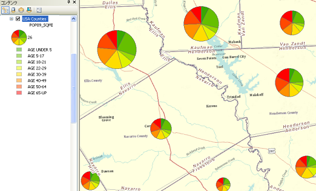
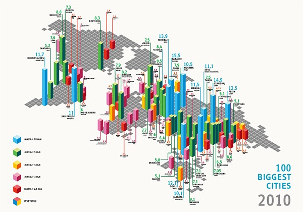

+++
author = "Yuichi Yazaki"
title = "チャート・マップ（Chart Map）とは？"
slug = "chart-map"
date = "2020-07-04"
categories = [
    "chart"
]
tags = [
    "",
]
image = "images/1_bUT8E8oOLmX_my3TTFhHfA.png"
+++

## どんな地図？

統計チャート（円グラフや棒グラフなど）を地図上に配置することで、地理的分布と統計的分布を同時に把握することを目的とした地図です。地図の位置情報に限定した[Small Multiple](https://visualizing.jp/small-multiples/)ともいえそうです。

## 主な作例

#### ナショナルアトラス

<figure>

<figcaption>

[http://www.gsi.go.jp/atlas/atlas-etsuran.html](http://www.gsi.go.jp/atlas/atlas-etsuran.html)

</figcaption>

</figure>

#### Pie Chart Map — Belfast

<figure>

<figcaption>

[http://cain.ulst.ac.uk/victims/gis/maps/gismaps-16.html](http://cain.ulst.ac.uk/victims/gis/maps/gismaps-16.html)

</figcaption>

</figure>

#### Bar Chart on a Map — Tableau

<figure>

<figcaption>

[https://www.dataplusscience.com/BarChartMaps.html](https://www.dataplusscience.com/BarChartMaps.html)

</figcaption>

</figure>

#### Pie chart on a symbol map — Tableau

<figure>

<figcaption>

[http://arunethan.com/?p=270](http://arunethan.com/?p=270)

</figcaption>

</figure>

#### パイ・チャート・マップ（Pie Chart Map） — ArcGIS

<figure>

<figcaption>

[http://desktop.arcgis.com/ja/arcmap/10.3/map/working-with-layers/drawing-features-to-show-quantities-drawing-pie-ch.htm](http://desktop.arcgis.com/ja/arcmap/10.3/map/working-with-layers/drawing-features-to-show-quantities-drawing-pie-ch.htm)

</figcaption>

</figure>

<figure>

<figcaption>

[https://www.e-education.psu.edu/natureofgeoinfo/c3\_p17.html](https://www.e-education.psu.edu/natureofgeoinfo/c3_p17.html)

</figcaption>

</figure>

#### パイ・チャート・マップ（Pie Chart Map） — Coloremaps

<figure>

<figcaption>

[https://coloremaps.com/visualization-map-types/chart-maps/](https://coloremaps.com/visualization-map-types/chart-maps/)

</figcaption>

</figure>

#### 100 biggest cities in 2010

<figure>

<figcaption>

[https://www.behance.net/gallery/4610471/100-biggest-cities-2010-infographic](https://www.behance.net/gallery/4610471/100-biggest-cities-2010-infographic)

</figcaption>

</figure>

#### コラム・チャート・マップ（Columns chart maps） — Coloremaps

<figure>

<figcaption>

[https://coloremaps.com/visualization-map-types/chart-maps/](https://coloremaps.com/visualization-map-types/chart-maps/)

</figcaption>

</figure>

## 類似する手法

チャート・マップではうまくチャートの比較ができない場合もあり、その場合は[Small Multiplesという手法](https://visualizing.jp/small-multiples/)を用います。

## 参考文献

- 谷村 晋 (著), 金 明哲 (編集) — 地理空間データ分析 (Rで学ぶデータサイエンス 7)
