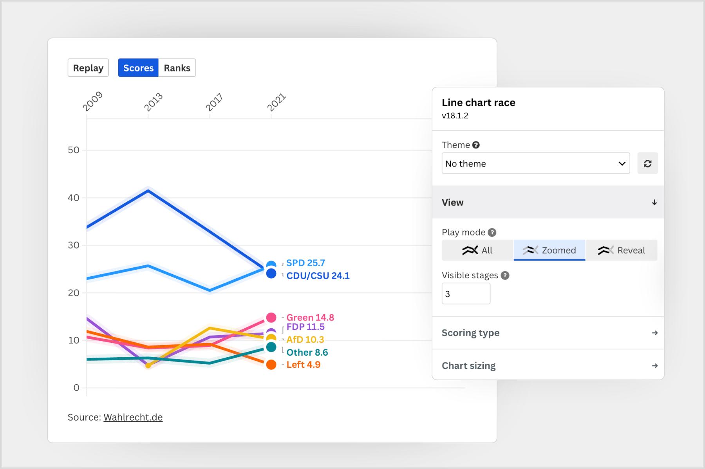

+++
author = "Yuichi Yazaki"
title = "What Is a Bar Chart Race?"
slug = "chart-race"
date = "2026-06-11"
categories = [
    "technology"
]
tags = [
    "",
]
image = "images/bar-chart-chart.png"
+++

A bar chart race is an animated form of bar chart that shows data changing over time, turning changes in rank and value into something that reads like a race. The format became widely known in 2019 after Financial Times data visualizer John Burn-Murdoch published a series of influential examples.

<!--more-->

## How to Read It

In a bar chart race, time advances along the animation while bars representing cities, brands, countries, or other entities grow, shrink, and change order. The viewer can immediately see which items rise, fall, overtake others, or disappear from the top ranks.

The appeal is not only that the chart moves. It is that the movement turns a long time series into a legible sequence of events. Pausing at a particular moment, slowing down the playback, or following one highlighted item can reveal the dynamics that a static table would hide.

John Burn-Murdoch's example showing the world's largest cities since 1500 made this especially clear: the viewer can see the center of urban scale shift from Europe and North America toward Asian and other emerging megacities.

## Background

Animated ranked bars existed before the phrase became common, but Burn-Murdoch's work spread widely on Twitter, now X, and helped establish the name "bar chart race." Mike Bostock's Observable notebook also contributed to the format's diffusion by making the technique easier to inspect and reproduce.

## What Is a Line Chart Race?

A line chart race, sometimes called a horserace chart, follows multiple series with animated lines. Instead of bars changing rank, the viewer watches lines rise, fall, cross, and compete over time. Flourish helped popularize this form around 2019 through an accessible template.

## How to Read a Line Chart Race

Each line represents a participant such as a player, brand, party, or country. The vertical position may show either the actual value or the rank, depending on the mode. Crossings and reversals make the competitive structure easy to see.

Flourish templates typically let authors choose between score and rank modes, add images, attach captions, and focus attention on specific lines. The format works especially well for sports rankings, election polling, market share, and other time-based comparisons where the story is about momentum.

## How to Make One

- **Bar chart race**: Flourish templates, the Python `bar_chart_race` library, and Observable notebooks are common options.
- **Line chart race**: Flourish's line chart race template is a practical starting point. Upload a CSV, configure the columns, and customize the presentation.

These formats are useful when the key point is not a single final value but the story of change over time.

## Summary

Bar chart races and line chart races are powerful animation techniques for communicating change, competition, and rank dynamics. Thanks to the work of John Burn-Murdoch, Flourish, and the broader data visualization community, they have become familiar tools for journalism, analysis, presentations, and public storytelling.

## References

- [Bar chart race: the most populous cities through time (FT)](https://www.ft.com/video/83703ffe-cd5c-4591-9b4f-a3c087aa6d19)
- [Bar chart race - the most populous cities in the world (Observable)](https://observablehq.com/@johnburnmurdoch/bar-chart-race-the-most-populous-cities-in-the-world)
- [Line chart race (Flourish)](https://flourish.studio/visualisations/line-chart-race/)
- [Line chart race template (Flourish)](https://app.flourish.studio/@flourish/horserace)
