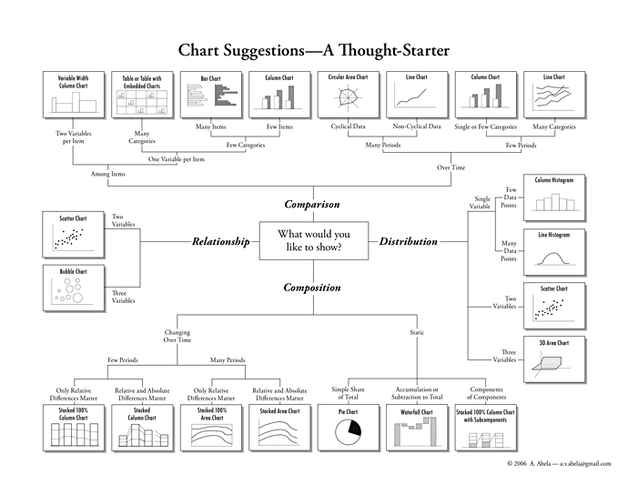

+++
author = "Yuichi Yazaki"
title = "どのチャートを使うべきか"
slug = "chart-suggestions"
date = "2013-10-26"
description = ""
categories = [
    "chart"
]
tags = [
    "",
]
image = "images/chartSuggestions-1.png"
+++

20年以上シニア・エグゼクティブたちにプレゼンテーションのコーチングやティーチングをしてきているDr.Abela氏が、“Extreme Presentation method”というプレゼンテーションのためのメソッドを公開し本としても出版もしているのですが、その中で、チャートについてのチャートがとてもわかりやすいのでご紹介します。

<!--more-->

[“Extreme Presentation method”](http://www.extremepresentation.com/)

データ同士の関係性を示したいのか、比較したいのか、分布を示したいのか、構成を示したいのか…などによって選択すべきチャートが異なります。この選択自体が間違っているとデータの内容が適切に示せないことがありえます。

たとえば棒グラフで表せる内容をツリーマップで表したり、ヒストグラムなのにバー同士の間隔が空いていて視覚的には棒グラフになっている、など。

これらは定番として骨組みや構造を理解し、これを元にそれぞれの要件にあったスタイリングをつけていくことが望ましいですし、これらだけがチャートの原型ではありません。

またこれは静的なチャートの話で、オンラインのデータ・ビジュアライズにおいては、データ軸を追加することが可能です。わかりやすい例では時間軸がそうです。これまでも同じチャートを何枚か使って例えば時間軸のみが異なる同じチャートを並べて提示することはできましたが、オンラインではそれらをすべて一つのチャートとして表現することが可能です。その際、図のあり方に介入しない方法としてチャート外のユーザーインターフェイスとして時間軸を扱えるようにする方法と、チャートのあり方に介入する方法として既存のチャートのスタンダードなあり方を更新する方法がありえます。これについてもケーススタディが集まっていく中でメソッド（方法論）が確立していくのでしょう。