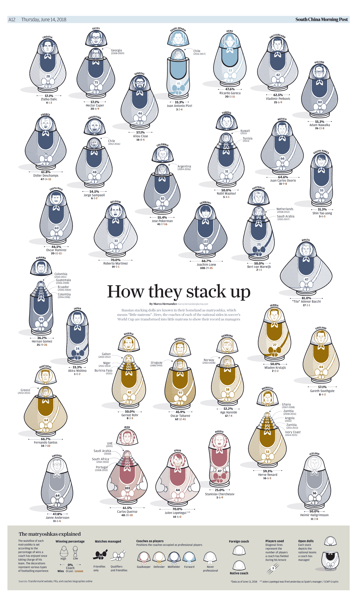
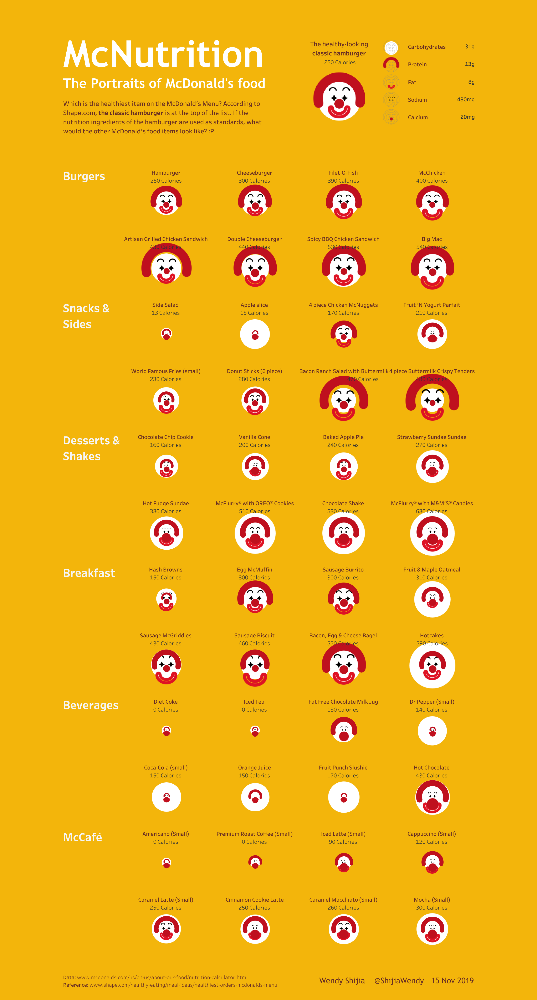
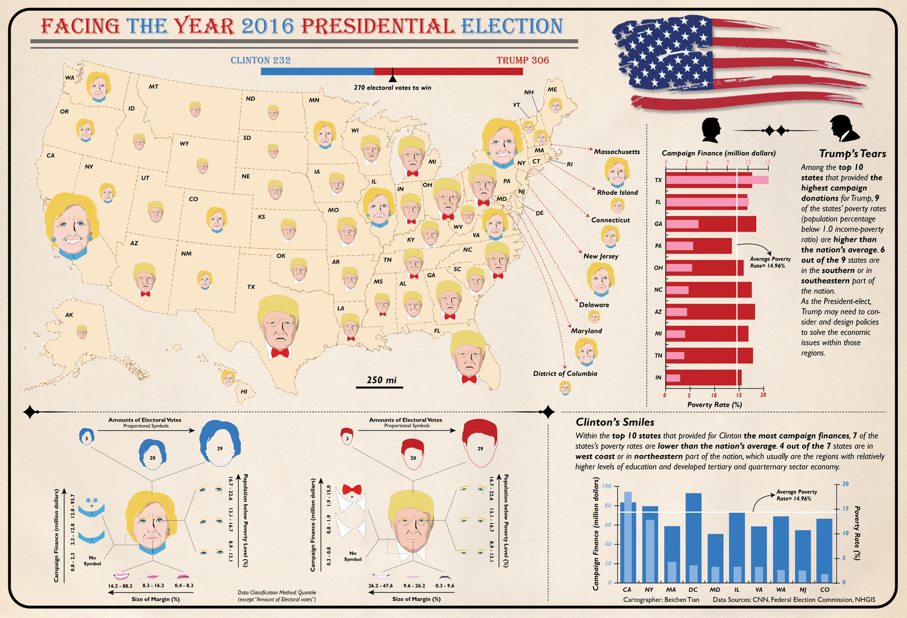
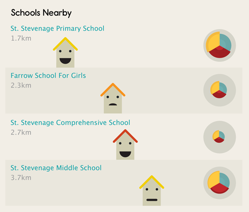
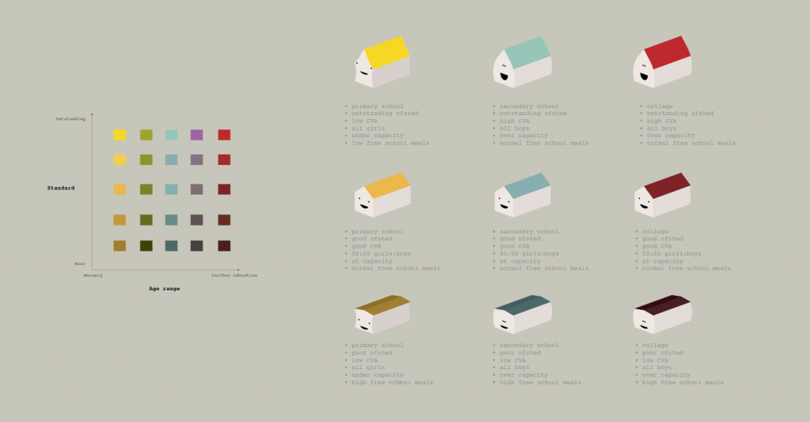
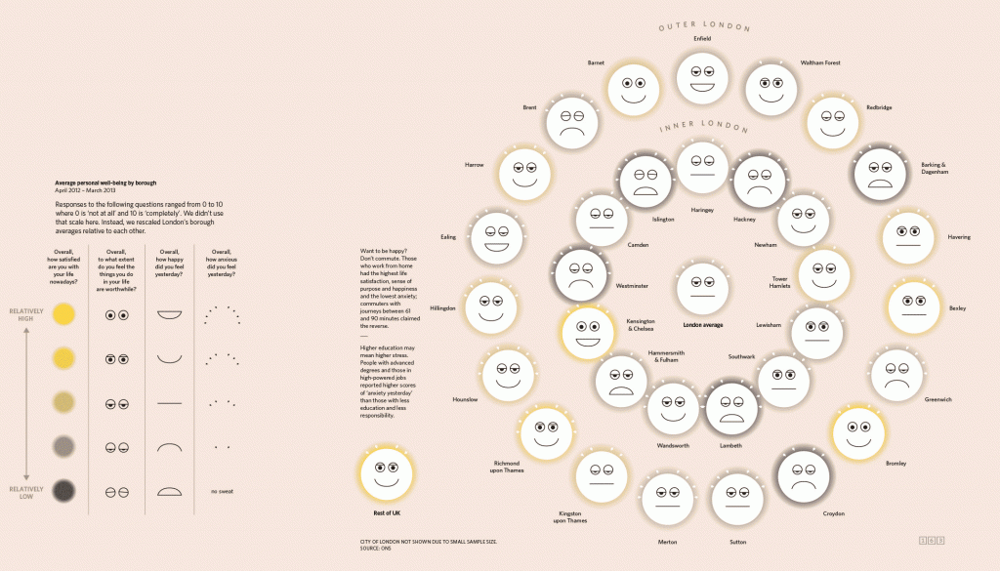
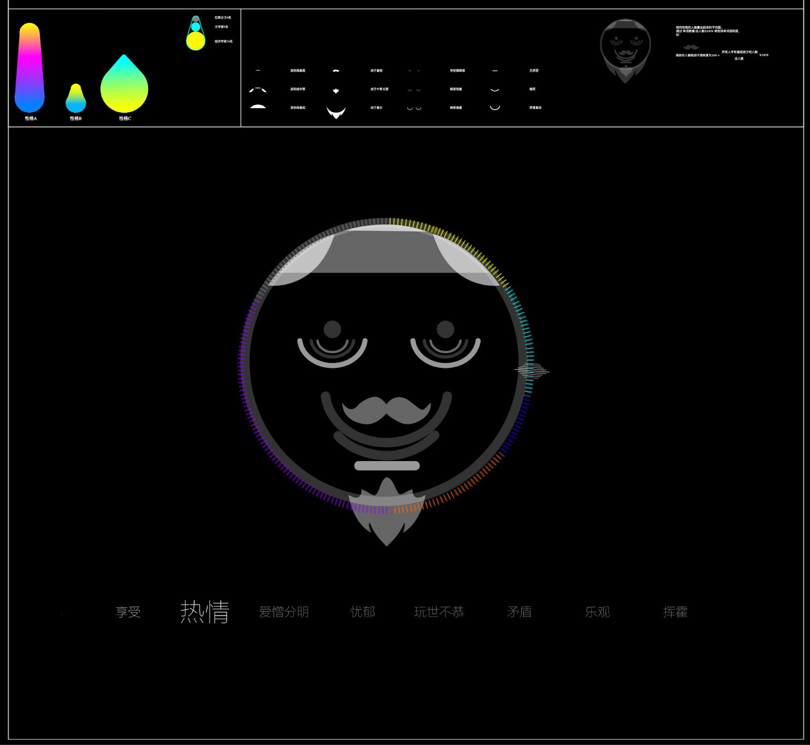

+++
author = "Yuichi Yazaki"
title = "デザイン性の高いチャーノフの顔"
slug = "chernoff-face-design"
date = "2025-09-25"
description = ""
categories = [
    "consume"
]
tags = [
    "オリジナルのビジュアル変換",
]
image = "images/cover.png"
+++

デザイン性の高いチャーノフの顔を集めてみました。

<!--more-->

## South China Morning Post Graphicsによる作品

[How they stack up](https://multimedia.scmp.com/culture/article/SCMP-printed-graphics-memory/lonelyGraphics/201806A176.html)

## Wendy Shijia 氏による作品

[McNutrition | Tableau Public](https://public.tableau.com/app/profile/wendy.shijia/viz/McNutrition/McDonaldsNutrition)

## Christian Swinehart 氏による作品

[Chernoff Faces](https://iv.samizdat.co/2021/chernoff-faces/index.html)

## Matt Jones 氏による作品

[Humanising data: introducing “Chernoff Schools” for Ashdown – Blog – BERG](https://berglondon.com/blog/2009/11/23/chernoff-schools/)

## Oliver Uberti 氏による作品

[Q&A: Oliver Uberti, Oliver Uberti Creative | AIGA Washington, DC](https://dc.aiga.org/qa-oliver-uberti-oliver-uberti-creative/)

## 作者不明

[FACE UP](https://46or01.axshare.com/face_up.html)

