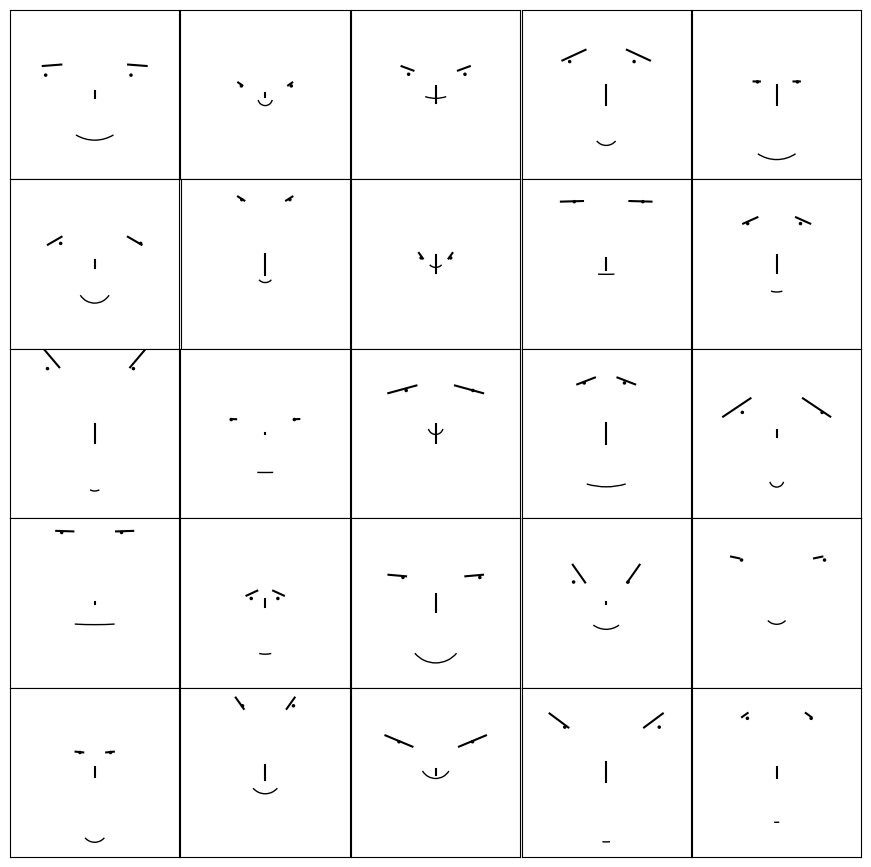
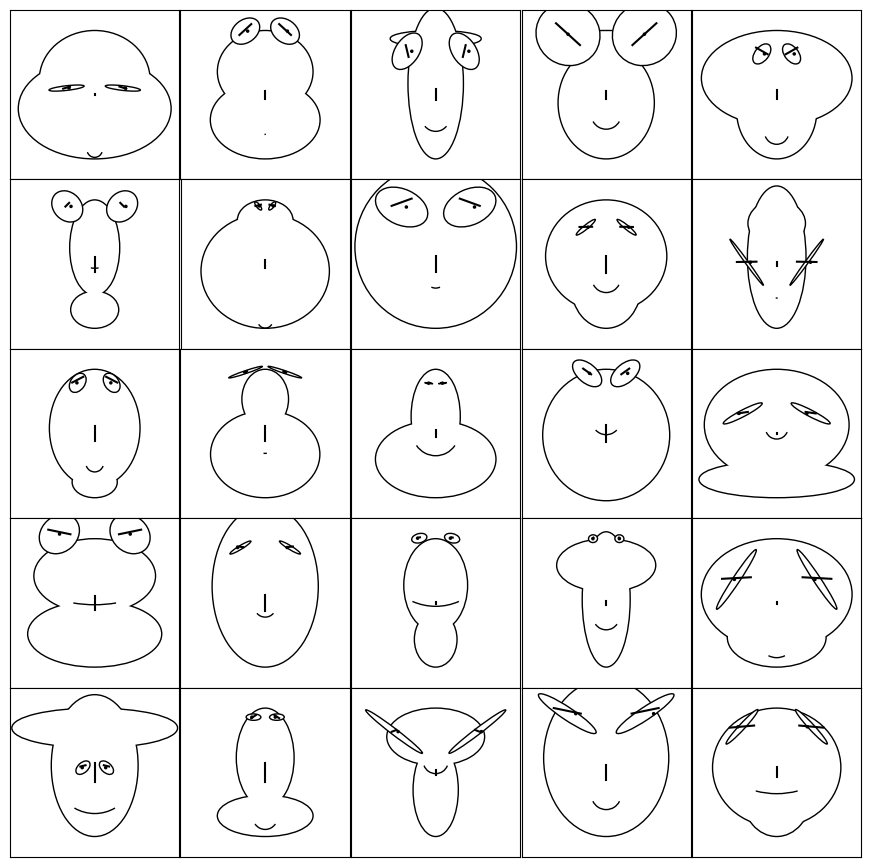
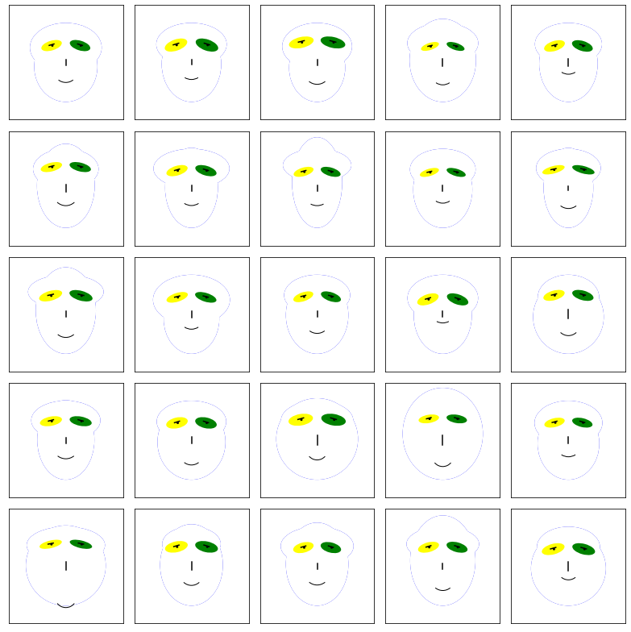
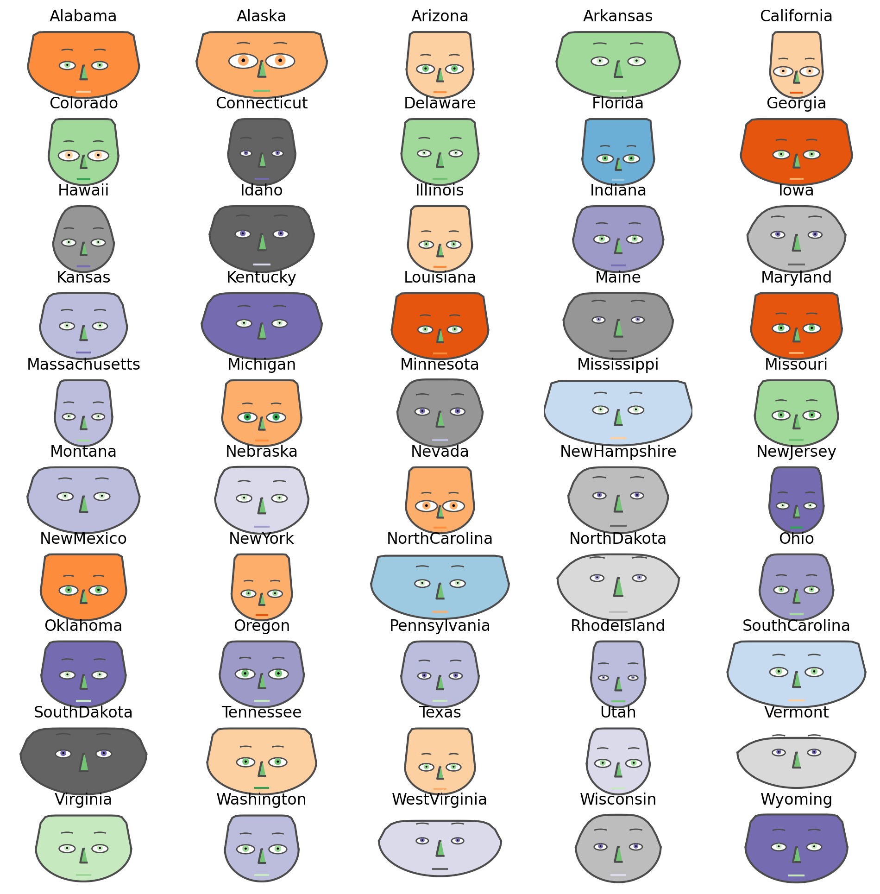
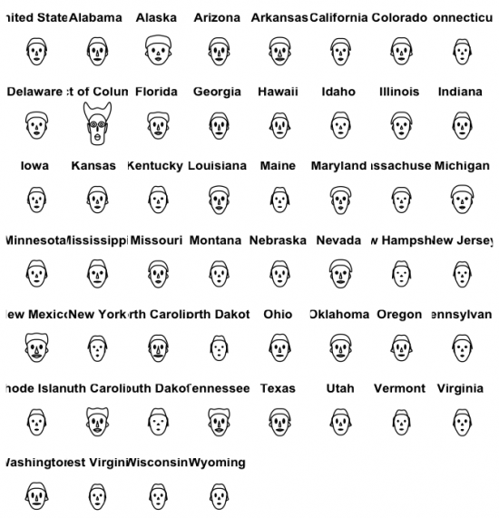
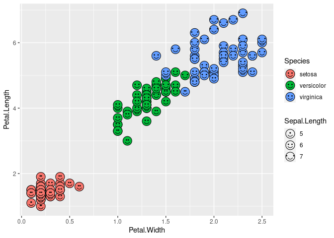

+++
author = "Yuichi Yazaki"
title = "データ分析言語によるチャーノフの顔の実装"
slug = "chernoff-face-implementation"
date = "2025-09-25"
description = ""
categories = [
    "technology"
]
tags = [
    "",
]
image = "images/P_Matplotlib/aflaxman.png"
+++

データ分析言語であるPythonやRを用いて、チャーノフの顔が実装されているものを集めてみました。

<!--more-->

## Python "Matplotlib"

### Abraham Flaxman 氏による実装

- [Chernoff Faces in Python with Matplotlib](https://gist.github.com/aflaxman/4043086)

### Tom White 氏による実装

- [Chernoff Faces in Python with Matplotlib](https://gist.github.com/dribnet/e26f52f423f0656c1bb8fc6f4e741cc2)

### Data Science Topics による実装

- [Chernoff Faces — Data Science Topics 0.0.1 documentation](https://datascience.oneoffcoder.com/chernoff-faces.html)

## Python "ChernoffFace"

- [Facing data with Chernoff faces | Python for Prediction](https://pythonforprediction.wordpress.com/2022/12/25/facing-data-with-chernoff-faces/)

## R the aplpack package

## R ggChernoff

### David Selby 氏による実装

- [Chernoff faces in ggplot2 · Tea & Stats](https://selbydavid.com/2017/06/25/ggchernoff/)
- [Selbosh/ggChernoff: R package for drawing Chernoff faces in ggplot2](https://github.com/Selbosh/ggChernoff)

