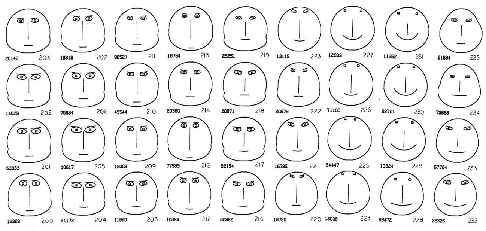
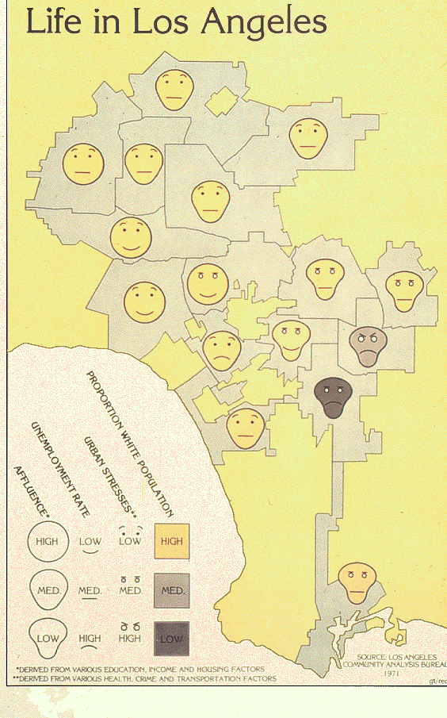

+++
author = "Yuichi Yazaki"
title = "顔で読むロサンゼルス：Eugene Turner『Life in Los Angeles』"
slug = "chernoff-face-on-map"
date = "2025-09-25"
description = ""
categories = [
    "consume"
]
tags = [
    "",
]
image = "images/lifeinla_cover.png"
+++

1970年代後半、カリフォルニア州立大学ノースリッジ校（CSUN）の地理学者 Eugene Turner は、社会経済データを可視化する独創的な地図作品 「Life in Los Angeles」 を発表しました。この作品は、統計学者 Herman Chernoff が提案した「チャーノフの顔」という手法を応用したもので、複雑な多変量データを「顔」の形や表情として表現したものです。

<!--more-->

## 背景：チャーノフの顔

チャーノフは1973年の論文で「顔を用いた多次元データの表現法」を提案しました。人間は顔の微妙な違いを敏感に識別できるため、統計的なパターンを直感的に把握できるのではないか、という発想です。

## Turner の作品「Life in Los Angeles」

ターナーはこのアイデアを地図に応用し、ロサンゼルス地域の生活状況を「顔」で表現しました。

- 制作年：1977年（ただし、文献によっては1979とされる）
- データ年：1970年の調査結果に基づく（公式ギャラリーには “Life in LA 1970” と表記）
- データ出典：Los Angeles Community Analysis Bureau, 1971 

## 実際の表現ルール（凡例）

この地図では以下の4変数が用いられました

- 顔の形 → Affluence（裕福度）
- 口の曲線 → Unemployment Rate（失業率）
- 眉（または目の傾き） → Urban Stresses（都市ストレス）
- 顔の色 → Proportion White Population（白人比率）

| 視覚要素 | 変数 | 値の対応 | 表現 |
|----------|------|----------|------|
| 顔の形   | Affluence（裕福度） | 高 | 丸い顔 |
|          |                      | 中 | 中間の形 |
|          |                      | 低 | 細長い顔 |
| 口       | Unemployment Rate（失業率） | 低 | 笑顔（口角上がり） |
|          |                                    | 中 | 直線的な口 |
|          |                                    | 高 | への字口（口角下がり） |
| 目       | Urban Stresses（都市ストレス） | 低 | 大きな丸い目 |
|          |                                      | 中 | 普通の目 |
|          |                                      | 高 | 半眼・小さい目 |
| 顔の色   | Proportion White Population（白人比率） | 高 | 薄い黄色 |
|          |                                                       | 中 | 中間色（薄い灰色） |
|          |                                                       | 低 | 濃い灰色〜黒 |

## ターナー自身の作品へのコメント

ターナー自身はこの作品について「おそらく私が作った地図の中で最も興味深いものの一つだ。なぜなら表情がデータに感情的な結びつきを呼び起こすからだ」とコメントしています。

## 受容と意義
- この地図は 受賞作 として高く評価されました。
- 一方で、Chernoff Faces 手法そのものは「感情的に解釈されやすい」「誤読のリスクがある」として一般的には広まらず、今日ではやや忘れられた存在になっています。
- しかし教育や研究の現場では、複雑な社会現象を直感的に伝える試みとして参照され続けています。実際に Spinelli & Zhou (2004) は授業プロジェクトでこの手法を再利用し、学生に「Quality of Life」を可視化させる教材として活用しています。

## おわりに

ターナーの「Life in Los Angeles」は、「人間の顔」という象徴的なモチーフを導入した実験的作品です。

## 参考・出典

- [MapCarte 353/365: Life in Los Angeles by Eugene Turner, 1977 – ICA Map Design](https://mapdesign.icaci.org/2014/12/mapcarte-353365-life-in-los-angeles-by-eugene-turner-1977/)  
- [Chernoff Faces: The data-rich maps that stare back at you – Big Think](https://bigthink.com/strange-maps/chernoff-faces/)  
- [eturner Home Page – CSUN（公式ギャラリー）](https://www.csun.edu/~hfgeg005/eturner/gallery.html)  
- [Mapping Quality of Life with Chernoff Faces – Spinelli & Zhou (PDF)](https://www.dis.uniroma1.it/~santucci/InformationVisualization/Slides/References/MappingQualityLifeChernoffFaces.pdf)  