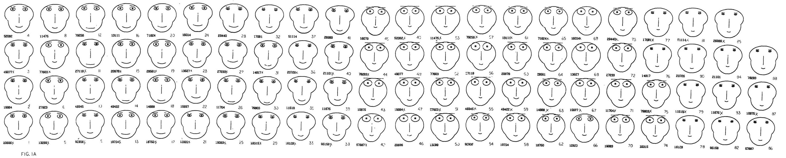
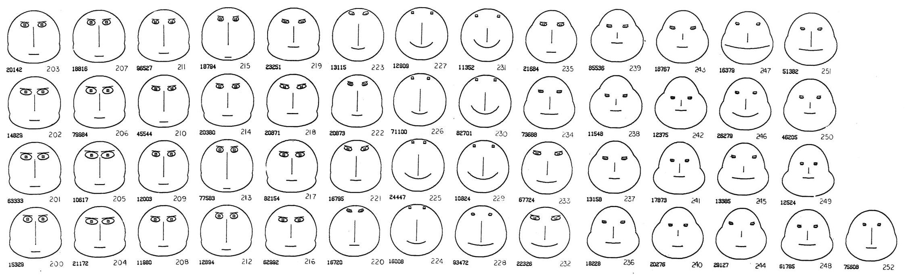

+++
author = "Yuichi Yazaki"
title = "Chernoff Faces"
slug = "chernoff-face"
date = "2025-09-24"
description = "A visual encoding that turns multivariate data into stylized faces."
categories = [
    "chart"
]
tags = [
    "",
]
image = "images/cover.jpeg"
+++

Chernoff faces are a method for representing multivariate data as stylized human faces. Each variable controls one facial feature, such as the size of the eyes, the shape of the mouth, the length of the nose, or the outline of the head. One data record becomes one face.

The method was proposed by statistician Herman Chernoff in 1973 in the paper "The Use of Faces to Represent Points in K-Dimensional Space Graphically."

<!--more-->

## Historical Background

Chernoff's idea came from a practical problem in statistics: how can analysts inspect data points with many dimensions at once? A scatterplot shows two variables clearly, and a 3D plot can show three, but many real datasets have more variables than that.

Chernoff proposed using the human ability to recognize faces. Instead of asking readers to compare long rows of numbers, the method converts each row into a face. Similar records should produce similar-looking faces, while unusual records should stand out as visually different.

## Data Structure

Chernoff faces use multivariate records.

| Data | Role |
|---|---|
| Observation | One face |
| Variable | One facial feature |
| Scaled value | Controls size, position, angle, or curvature |
| Label or group | Optional annotation for each face |

Before drawing, each variable is usually normalized so that different units and ranges can be mapped to comparable visual parameters.

## How It Works

Each variable is assigned to a facial feature. For example:

- face width
- face height
- eye size
- eye spacing
- eyebrow angle
- nose length
- mouth width
- mouth curvature

The mapping is subjective. A variable assigned to mouth curvature may dominate the reader's emotional impression more than the same variable assigned to ear size. This makes the design choice unusually important.

## Examples from Chernoff's Paper

In one example, Chernoff used faces to display measurements from fossil specimens. The goal was to help readers see clusters in multivariate data. Faces with similar features were interpreted as similar observations.

In another example, mineral composition data from a geological core was shown as a sequence of faces. Changes in facial appearance helped indicate points where the multivariate pattern shifted.

## Purpose

The purpose is exploratory pattern recognition. Chernoff faces are not designed for precise measurement. They are meant to help readers notice clusters, outliers, and changes across many variables at once.

## Use Cases

- Exploratory analysis of small multivariate datasets
- Demonstrating dimensionality in statistics education
- Detecting rough clusters or outliers
- Historical discussion of experimental visualization methods
- Data art or playful analytical interfaces

## Design Notes

- Use only a moderate number of observations.
- Explain the mapping from variables to facial features.
- Normalize variables before mapping them to face parameters.
- Avoid assigning critical variables to subtle features.
- Be careful with emotional interpretation, such as happy or sad mouths.
- Use Chernoff faces as a supplement, not as the only analytical view.

## Strengths

- Makes high-dimensional data memorable.
- Supports quick recognition of broad similarity and difference.
- Uses human sensitivity to facial variation.
- Works well as an educational example of visual encoding.

## Limitations

Chernoff faces are highly subjective. The same data can look very different depending on which variable controls which feature. They also make exact comparison difficult: readers can see that two faces differ, but they may not be able to tell which variable caused the difference.

Another risk is emotional bias. A downturned mouth may feel negative even if the underlying variable is not negative. This can make the chart rhetorically powerful but analytically fragile.

## Alternatives

| Alternative | When to Use It |
|---|---|
| Parallel coordinates | Compare many variables more systematically |
| Scatterplot matrix | Inspect pairwise relationships |
| Heatmap | Compare many variables across many observations |
| Radar chart | Show a small number of profiles |
| Principal component plot | Reduce high-dimensional data for overview |

## Summary

Chernoff faces are one of the most memorable experiments in multivariate visualization. They show how data can be encoded through familiar visual forms, but they also reveal the danger of subjective mappings. They are best used for exploration, teaching, and discussion rather than precise statistical communication.

## References

- [Herman Chernoff, "The Use of Faces to Represent Points in K-Dimensional Space Graphically" (1973)](http://wexler.free.fr/library/files/chernoff%20%281973%29%20the%20use%20of%20faces%20to%20represent%20points%20in%20k-dimensional%20space%20graphically.pdf)
- [Chernoff face - Wikipedia](https://en.wikipedia.org/wiki/Chernoff_face)
