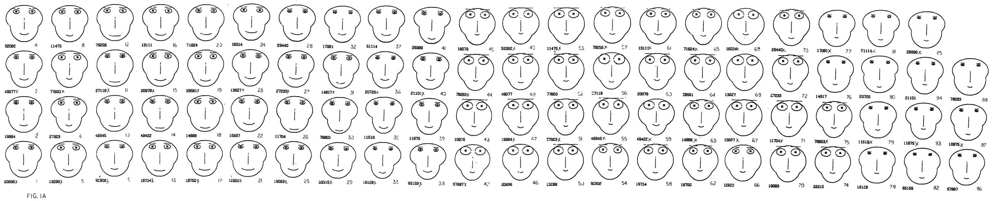
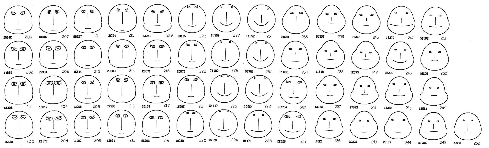

+++
author = "Yuichi Yazaki"
title = "データが「顔」に見える - チャーノフの顔という発想"
slug = "chernoff-face"
date = "2025-09-24"
description = ""
categories = [
    "consume"
]
tags = [
    "",
]
image = "images/cover.jpeg"
+++

1973年、統計学者ハーマン・チャーノフはちょっと風変わりなアイデアを論文で発表しました。タイトルは[「The Use of Faces to Represent Points in K-Dimensional Space Graphically」](http://wexler.free.fr/library/files/chernoff%20%281973%29%20the%20use%20of%20faces%20to%20represent%20points%20in%20k-dimensional%20space%20graphically.pdf)。
直訳すれば「K次元空間の点を顔で表現する方法」です。

<!--more-->

## 多次元データをどう見せるか

データ分析をしていると、変数が5個、10個と増えていくことはよくあります。けれど、縦横2軸しかないグラフでは表しきれない。数字の表を眺めていても頭に入ってこない。
そんなとき、チャーノフは「顔にしてしまえばいいのでは？」と考えました。

## 仕組みはシンプル
- データの各変数を、顔のパーツに割り当てます。
- 1つのデータ＝1枚の「顔」として描かれます。
- 似たデータは似た顔に、極端に違うデータは異様な顔に。

つまり、数字の塊が「表情」として私たちの目に飛び込んでくるのです。

## なぜ「顔」なのか

人間は顔の違いにとても敏感です。ほんの少し口角が下がっているだけで「怒っている？」と感じたり、眉が上がっているだけで「驚いている？」と思ったりします。
チャーノフはこの能力をデータ分析に応用しました。数字を数字のまま読むより、顔の違いとして認識したほうが直感的に理解できる、という狙いです。

さらに興味深いのは、その発想の逆転です。当時の人工知能研究は「人間の顔を数値に変換し、機械に識別させる」ことに力を注いでいました。ところがチャーノフはその逆で、「数値を顔に変換し、機械には顔を描かせ、人間に識別させる」方法を選びました。彼の言葉を借りれば **「顔を描くという重労働は機械に任せ、知能は人間に委ねる」** という発想です。

## 顔の部位とデータの対応ルール

チャーノフの顔では、顔を構成する部位を「変数の受け皿」として定義します。各変数の値によって形が変化し、それが表情として現れます。以下は代表的な対応例です。

| 顔の部位 | 割り当て可能な変数 | 見た目の変化 |
|----------|------------------|--------------|
| **顔の輪郭** | 縦横比、サイズ | 丸顔〜細顔に変化 |
| **目** | 大きさ、間隔、瞳孔サイズ | 目が大きい／小さい、寄り目／離れ目 |
| **眉** | 角度、長さ | 怒り顔／驚き顔などの感情的印象 |
| **鼻** | 長さ、幅 | 高い鼻／低い鼻、細い鼻／太い鼻 |
| **口** | 曲率、位置、幅 | 笑顔／無表情／しかめっ面 |

## 論文の図版と解説

実際の論文には、チャーノフが生成した「顔の配列」が数多く掲載されています。どの変数をどのパーツに割り当てるかで、同じデータでもまったく違った印象の顔が並びます。

### 顔の表情からクラスターを見つける

統計学でいう「多変量データ」（一つの対象に複数の測定値があるデータ）は、数値の羅列になりがちです。この数値の海の中から、互いに似ているデータ群、つまり **クラスター（集団）** を見つけ出すのは至難の業です。もしその複雑なデータを、私たちの脳が最も得意とする「 **顔** 」の形として表現できたらどうでしょうか？

図1Aで示されているのは、ジャマイカ北西部から採取された **87個の有孔虫（Nummulited）化石標本** のデータ（6つの異なる測定値）を顔に変換したものです。各化石が持つ6つの特性が、その顔のパーツの形や大きさに変換されています。

化石データに関心を持っていた調査者のタスクは **「互いに似ている顔を単にグループ化する」** ことでした。図1Aに表示された87個の顔は、事前に解析技術によって **3つの明確なクラスター** にグループ分けされた後、その分類が際立つように順序立てて提示されました。その結果、これらの顔の集まりが **「一目瞭然に」3つの異なるクラスターに分かれている** ことが確認されました。

さらに興味深いのは、この顔の図を、データに関する事前情報やID番号を隠した状態で一般の人々に見せて、視覚的に分類してもらったところ **ほとんどの人が統計解析と同じクラスターを選択した** という事実です。

これは、この「顔」の表現方法が、人間の心が持つ **複雑な視覚現象の中から、重要ではないものをフィルタリングし、潜在的に重要な情報に焦点を当てる** という高い能力（高速度コンピューターのような働き）を活用していることを示しています。顔による表現は、クラスター分析の支援に非常に有効であるとしています。

### 顔の表情から時系列の変化を見つける

データが時間の経過や物理的な距離に沿って連続している **時系列データ** を扱う場合、私たちは「いつ、どこで、そのデータの特性が大きく変化したか」を知りたいと考えます。しかし、12もの変数が絡み合うような多次元の時系列データを数値で追いかけると、重要な変化の瞬間を見逃しがちです。ここで、「顔の表現」が強力なツールとなります。

図2に示されているのは「地質データ」の事例です。これは、コロラドの山腹から掘削された4,500フィートのコアから採取された **53個の等間隔の標本** に基づいています。各標本は、7つの鉱物含有量やその再分析結果を含む **12個の変数** を持っています。

53個の顔は、コアの順序（時系列順）で表示されています。調査者のタスクは **「多変量確率過程が特性を変化させた時間点」** つまり顔の特性が変化した場所を特定することでした。

顔を順に見ていくと、標本 **219** の後に一つの大きな変化が始まり、特に **224から231** に対応する顔のグループが、他の顔とは **「全く異なっている」** ことがわかります。

次に、標本 **231から234** にかけて、別の大きな変化が進行していることも読み取れます。

そして **235から252** のグループは、また　別の異なる特徴が示されています。

この12次元の時系列データに対して、もし従来の線形分析が適用されていたとしたら、顔を見ることで明確に観察できるこの種の現象が **「覆い隠されてしまう可能性」** があることが示唆されています。人間が顔から直感的に得られる情報は、標準的なコンピュータープログラムに欠けている「柔軟性」を補い、重要な現象の検出を可能にする、としています。

## 面白さと落とし穴

この方法にはユニークさと同時に、いくつかの弱点もあります。
- 主観的：どの変数をどのパーツに割り当てるかで顔の印象は大きく変わる。
- 正確さに欠ける：目の大きさや口の曲線を定量的に比較するのは難しい。棒グラフほどの厳密さはない。
- 感情を帯びやすい：口が下がっている顔は「悲しい」と感じるなど、データに関係ない印象が入り込む。

## まとめ

チャーノフの顔は、

- 「数字を顔にする」という大胆な発想
- 人間の認知特性をうまく利用した工夫
- 今なお語られるユニークなビジュアライゼーション

ということを提示しました。

