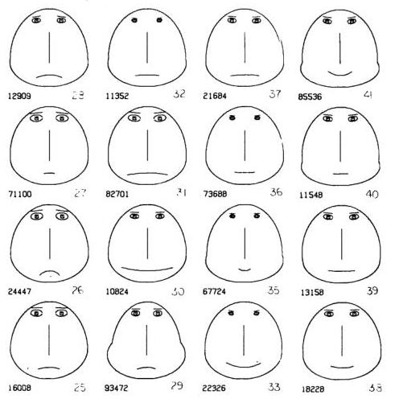
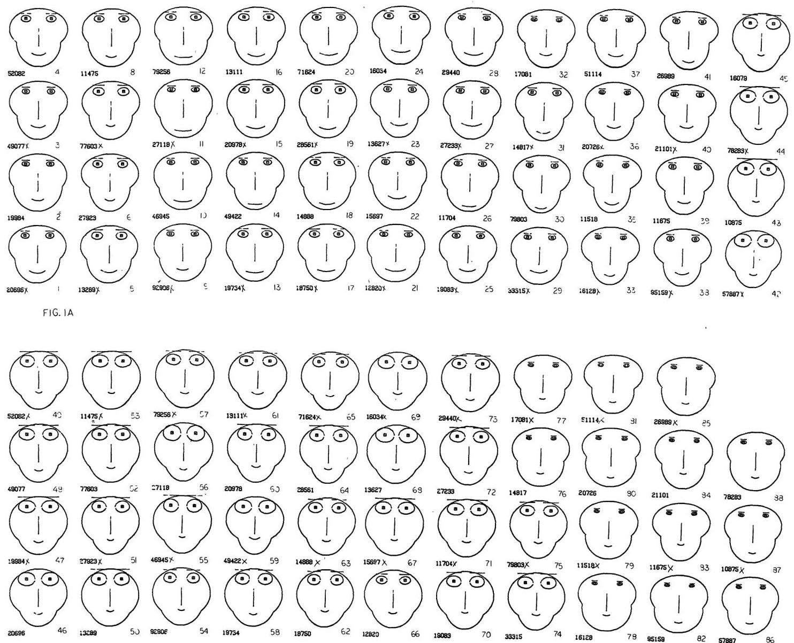
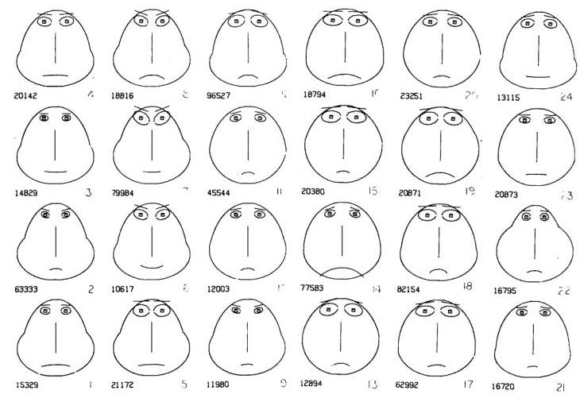
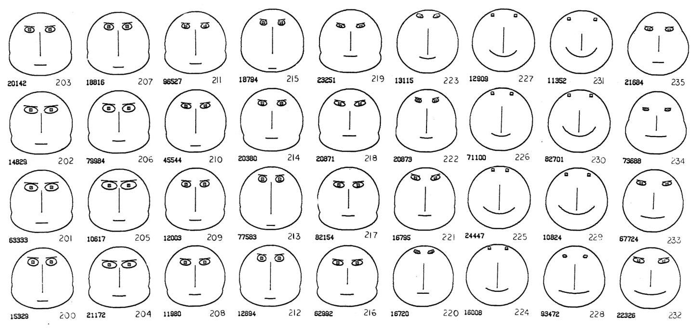
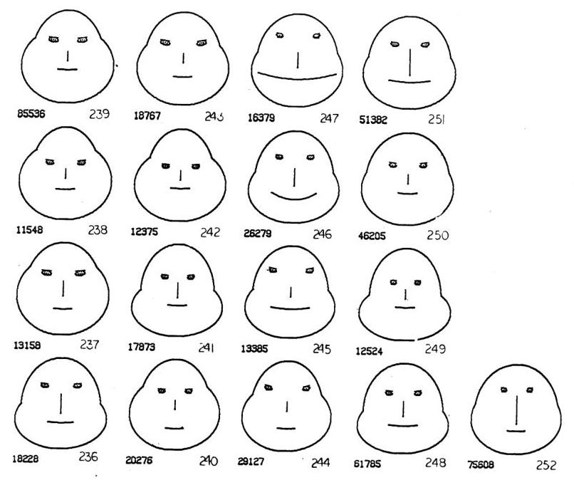

+++
author = "Yuichi Yazaki"
title = "データが「顔」に見える - チャーノフの顔という発想"
slug = "chernoff-face"
date = "2025-09-24"
description = ""
categories = [
    "consume"
]
tags = [
    "",
]
image = "images/画像4_fig2-1.jpeg"
+++

1973年、統計学者ハーマン・チャーノフはちょっと風変わりなアイデアを論文で発表しました。タイトルは[「The Use of Faces to Represent Points in K-Dimensional Space Graphically」](http://wexler.free.fr/library/files/chernoff%20%281973%29%20the%20use%20of%20faces%20to%20represent%20points%20in%20k-dimensional%20space%20graphically.pdf)。
直訳すれば「K次元空間の点を顔で表現する方法」です。

<!--more-->

## 多次元データをどう見せるか

データ分析をしていると、変数が5個、10個と増えていくことはよくあります。けれど、縦横2軸しかないグラフでは表しきれない。数字の表を眺めていても頭に入ってこない。
そんなとき、チャーノフは「顔にしてしまえばいいのでは？」と考えました。

## 仕組みはシンプル
- データの各変数を、顔のパーツに割り当てます。
- 1つのデータ＝1枚の「顔」として描かれます。
- 似たデータは似た顔に、極端に違うデータは異様な顔に。

つまり、数字の塊が「表情」として私たちの目に飛び込んでくるのです。

## なぜ「顔」なのか

人間は顔の違いにとても敏感です。ほんの少し口角が下がっているだけで「怒っている？」と感じたり、眉が上がっているだけで「驚いている？」と思ったりします。
チャーノフはこの能力をデータ分析に応用しました。数字を数字のまま読むより、顔の違いとして認識したほうが直感的に理解できる、という狙いです。

さらに興味深いのは、その発想の逆転です。当時の人工知能研究は「人間の顔を数値に変換し、機械に識別させる」ことに力を注いでいました。ところがチャーノフはその逆で、「数値を顔に変換し、機械には顔を描かせ、人間に識別させる」方法を選びました。彼の言葉を借りれば **「顔を描くという重労働は機械に任せ、知能は人間に委ねる」** という発想です。

## 顔の部位とデータの対応ルール

チャーノフの顔では、顔を構成する部位を「変数の受け皿」として定義します。各変数の値によって形が変化し、それが表情として現れます。以下は代表的な対応例です。

| 顔の部位 | 割り当て可能な変数 | 見た目の変化 |
|----------|------------------|--------------|
| **顔の輪郭** | 縦横比、サイズ | 丸顔〜細顔に変化 |
| **目** | 大きさ、間隔、瞳孔サイズ | 目が大きい／小さい、寄り目／離れ目 |
| **眉** | 角度、長さ | 怒り顔／驚き顔などの感情的印象 |
| **鼻** | 長さ、幅 | 高い鼻／低い鼻、細い鼻／太い鼻 |
| **口** | 曲率、位置、幅 | 笑顔／無表情／しかめっ面 |

## 論文の図版と解説

実際の論文には、チャーノフが生成した「顔の配列」が数多く掲載されています。どの変数をどのパーツに割り当てるかで、同じデータでもまったく違った印象の顔が並びます。

承知しました！それでは、先ほどの記事の 「論文の図版と解説」 セクションに、アップロードいただいたファイル名を明記して追記したバージョンを提示します。

## 論文の図版と解説

実際の論文には、チャーノフが生成した「顔の配列」が数多く掲載されています。

### 画像1

「数値データを顔に変換した最初の例。目や口の形が微妙に変わり、似たデータが似た表情に集まっているのが分かります。」

### 画像2

「大量の観測データを一斉に『顔』として並べた例。同じ系列の顔がグループ化され、外れ値がユニークな表情として浮かび上がります。」

### 画像3

「同じ変数を異なる部位に割り当てると、全体の印象が大きく変わります。ここでは多くの顔
が『しかめっ面』のように見え、データの特徴を直感的に伝えています。」

### 画像4

「口角や眉の角度といった部位が強調されると、表情は一気に感情的なニュアンスを帯びます。怒った顔や笑顔が、データの差異を分かりやすく可視化しています。」

### 画像5

「一見コミカルに見える一連の顔も、すべて数値データの違いから生成されています。『笑顔』『無表情』『困り顔』がデータの分布を映し出しているのです。」

## 図版をどう読み解くか（観察のポイント）

チャーノフの顔を眺めるときには、いくつかの視点を持っておくと理解しやすくなります。
- 全体の雰囲気を見る
まず「画像2」のような大量の顔の並びでは、細部よりも全体的な印象を重視します。似た表情が集まっている場所は、データ上でも類似性が高いグループと考えられます。
- 外れ値に注目する
「画像3」のように多くが似たような表情をしている中で、一部だけ極端に違う顔があれば、それは外れ値や特徴的なデータです。
- 部位ごとの差異を探す
「画像4」に示されるように、眉や口といった部位が強調されると、顔全体の印象が大きく変わります。どの変数をどの部位に割り当てたかを意識して観察することで、表情の違いを数値の違いに結びつけられます。
- 感情的な読み取りに注意する
「画像5」のように笑顔や困り顔に見える場合、それはデータそのものというより、人間の感情連想による解釈です。可視化として使うときには「意図せぬバイアスを招く可能性がある」点を忘れてはいけません。

このように、群化・外れ値・部位の強調・感情連想という4つの観点で観察すると、チャーノフの顔の図版をより深く味わえます。

## 面白さと落とし穴

この方法にはユニークさと同時に、いくつかの弱点もあります。
- 主観的：どの変数をどのパーツに割り当てるかで顔の印象は大きく変わる。
- 正確さに欠ける：目の大きさや口の曲線を定量的に比較するのは難しい。棒グラフほどの厳密さはない。
- 感情を帯びやすい：口が下がっている顔は「悲しい」と感じるなど、データに関係ない印象が入り込む。

## 今も生きているアイデア

チャーノフの顔は、のちに「非対称顔」や「魚」などさまざまに発展しました。現在では、RやPythonのライブラリで簡単に描けますし、D3.jsを使えばWeb上でも再現できます。
また、SF小説の中で未来的なデータ表現として登場することもあり、この発想のユーモラスさと哲学性は今も人々を魅了しています。

## まとめ

チャーノフの論文は、

- 「数字を顔にする」という大胆な発想
- 人間の認知特性をうまく利用した工夫
- 今なお語られるユニークなビジュアライゼーション

ということを提示しました。
万能な方法ではありませんが、「データをどう“顔”として読むか」という問いは、50年以上経った今もデータ可視化の世界に示唆を与え続けています。

