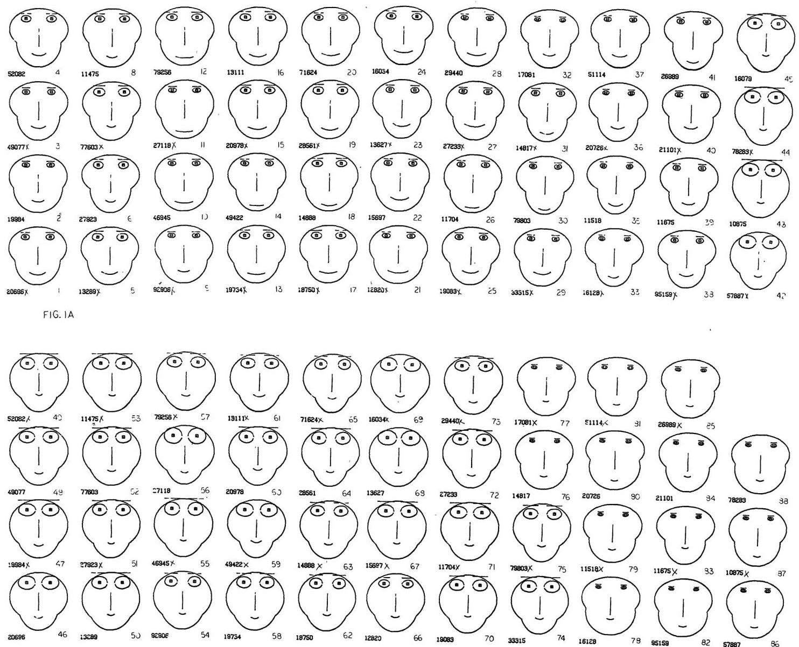

+++
author = "Yuichi Yazaki"
title = "データが「顔」に見える - チャーノフの顔という発想"
slug = "chernoff-face"
date = "2025-09-24"
description = ""
categories = [
    "consume"
]
tags = [
    "",
]
image = "images/画像4_fig2-1.jpeg"
+++

1973年、統計学者ハーマン・チャーノフはちょっと風変わりなアイデアを論文で発表しました。タイトルは[「The Use of Faces to Represent Points in K-Dimensional Space Graphically」](http://wexler.free.fr/library/files/chernoff%20%281973%29%20the%20use%20of%20faces%20to%20represent%20points%20in%20k-dimensional%20space%20graphically.pdf)。
直訳すれば「K次元空間の点を顔で表現する方法」です。

<!--more-->

## 多次元データをどう見せるか

データ分析をしていると、変数が5個、10個と増えていくことはよくあります。けれど、縦横2軸しかないグラフでは表しきれない。数字の表を眺めていても頭に入ってこない。
そんなとき、チャーノフは「顔にしてしまえばいいのでは？」と考えました。

## 仕組みはシンプル
- データの各変数を、顔のパーツに割り当てます。
- 1つのデータ＝1枚の「顔」として描かれます。
- 似たデータは似た顔に、極端に違うデータは異様な顔に。

つまり、数字の塊が「表情」として私たちの目に飛び込んでくるのです。

## なぜ「顔」なのか

人間は顔の違いにとても敏感です。ほんの少し口角が下がっているだけで「怒っている？」と感じたり、眉が上がっているだけで「驚いている？」と思ったりします。
チャーノフはこの能力をデータ分析に応用しました。数字を数字のまま読むより、顔の違いとして認識したほうが直感的に理解できる、という狙いです。

さらに興味深いのは、その発想の逆転です。当時の人工知能研究は「人間の顔を数値に変換し、機械に識別させる」ことに力を注いでいました。ところがチャーノフはその逆で、「数値を顔に変換し、機械には顔を描かせ、人間に識別させる」方法を選びました。彼の言葉を借りれば **「顔を描くという重労働は機械に任せ、知能は人間に委ねる」** という発想です。

## 顔の部位とデータの対応ルール

チャーノフの顔では、顔を構成する部位を「変数の受け皿」として定義します。各変数の値によって形が変化し、それが表情として現れます。以下は代表的な対応例です。

| 顔の部位 | 割り当て可能な変数 | 見た目の変化 |
|----------|------------------|--------------|
| **顔の輪郭** | 縦横比、サイズ | 丸顔〜細顔に変化 |
| **目** | 大きさ、間隔、瞳孔サイズ | 目が大きい／小さい、寄り目／離れ目 |
| **眉** | 角度、長さ | 怒り顔／驚き顔などの感情的印象 |
| **鼻** | 長さ、幅 | 高い鼻／低い鼻、細い鼻／太い鼻 |
| **口** | 曲率、位置、幅 | 笑顔／無表情／しかめっ面 |

## 論文の図版と解説

実際の論文には、チャーノフが生成した「顔の配列」が数多く掲載されています。どの変数をどのパーツに割り当てるかで、同じデータでもまったく違った印象の顔が並びます。

### 図1A

図1Aは、87個の化石標本（有孔虫）の多変量データを、その類似性に基づいて解析的に順序付けられた顔の表現として視覚化したものです。

-  **データの内容：** この図の元になっているのは、「化石データ」（Fossil Data）の事例です。
- **標本の種類：** ジャマイカ北西部で採取された**87個の有孔虫（Nummulited）の化石標本**の測定値が使われています。
- **データの対応関係：** 各化石標本には6つの異なる測定値（変数 $Z_1$から$Z_6$）が割り当てられており、これらの数値が顔のさまざまな特徴 — たとえば **鼻の長さや口の湾曲** —に対応付けられています。これにより **すべての多変量観測値** が、一つの顔の形として捉えられます。

## 可視化の目的と結果

多変量データは、数値の羅列ではその中に存在する複雑な関係性やパターンを理解するのが困難です。この「顔」の表現方法は、人間の心が持つ **顔を識別し、感情的に反応する能力** を利用することを目的としています。

- **クラスター分析（集団の識別）：** この事例では、調査者はデータの中に **類似した集団（クラスター）** が存在するかどうかに関心を持っていました。
- **提示の工夫：** 図1Aに示されている87個の顔は、事前に解析技術によってデータが **3つのグループ** に分類された後、その分類が明確になるように **順序立てて提示されています** 。
- **明らかな結果：** この配列のおかげで、顔の集合が**3つの明確に異なる集団に分かれている**ことが「 **一目で明らかである** (It is immediately obvious)」とされています。
- **人間の認識能力の裏付け：** 実際にID番号を取り除いて一般の人々にこれらの顔の集まりを提示し、視覚的に分類させたところ **ほとんどの人が分析結果と同じ集団を選択した** ことが確認されています。

この図は **顔の形という直感的な情報** を通して、統計分析なしには見つけにくいデータの潜在的なパターン（集団の存在）を、人間が容易に検出できることを証明するための事例です。

## 面白さと落とし穴

この方法にはユニークさと同時に、いくつかの弱点もあります。
- 主観的：どの変数をどのパーツに割り当てるかで顔の印象は大きく変わる。
- 正確さに欠ける：目の大きさや口の曲線を定量的に比較するのは難しい。棒グラフほどの厳密さはない。
- 感情を帯びやすい：口が下がっている顔は「悲しい」と感じるなど、データに関係ない印象が入り込む。

## まとめ

チャーノフの顔は、

- 「数字を顔にする」という大胆な発想
- 人間の認知特性をうまく利用した工夫
- 今なお語られるユニークなビジュアライゼーション

ということを提示しました。

