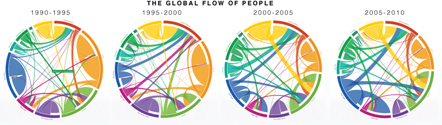
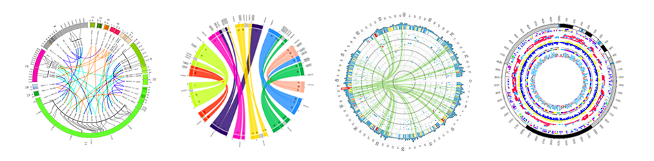

+++
author = "Yuichi Yazaki"
title = "Chord Diagram"
slug = "chord-diagram"
date = "2025-10-11"
categories = [
    "chart"
]
tags = [
    "",
]
image = "images/cover.png"
+++

A chord diagram visualizes relationships or flows among categories arranged around a circle. Curved bands, or chords, connect categories, and their thickness or color represents strength or direction.

<!--more-->

## Use Cases

- Migration flows
- Trade between countries
- Network relationships among categories
- Genomic and biological relationships

## Design Notes

- Limit the number of categories.
- Use ordering to reduce crossings.
- Make direction clear if flows are directional.
- Provide interaction for dense diagrams.

## Summary

Chord diagrams are visually striking and useful for showing many-to-many relationships. They can become difficult to read when too many categories or chords are included.
