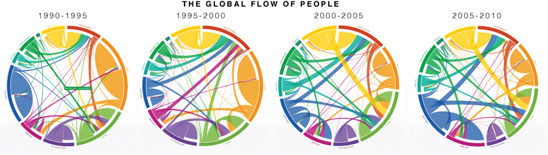
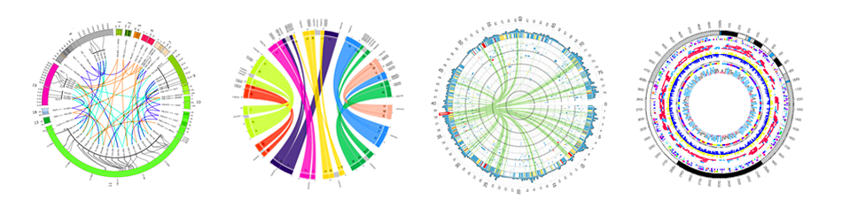
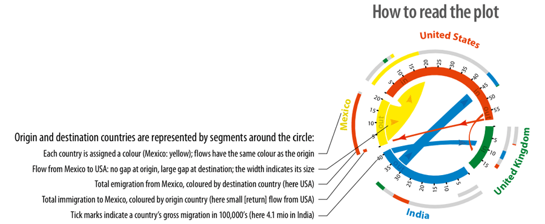

+++
author = "Yuichi Yazaki"
title = "コード・ダイアグラム (Chord Diagram)"
slug = "chord-diagram"
date = "2025-10-11"
categories = [
    "chart"
]
tags = [
    "",
]
image = "images/cover.png"
+++

**コード・ダイアグラム（Chord Diagram）** は、円周上に配置した複数の要素（ノード）間の関係性や流れを、弧（コード）によって視覚化する図です。主に **相互関係・双方向の関係・フロー量** などを表現するために使われ、データの対称性やバランスを直感的に把握できます。

<!--more-->

最初に広く知られるようになったのは、2000年代に登場した**Circos**（Martin Krzywinski開発）という可視化ツールによります。その後、D3.jsなどの可視化ライブラリでも実装が普及し、遺伝子間関係・国際貿易・人口移動・産業間連関などの多様な分野で応用されています。

## 図解の見方（Chord Diagram の場合）

| 要素 | 表しているもの | 解釈のポイント |
|------|----------------|----------------|
| 円周上のセグメント（Arc） | 各カテゴリ・ノード | 対象（国、産業、個体など）を円形に並べる。長さが値の大きさを示す場合もある。 |
| 弧（Chord） | ノード間の関係またはフロー | 2つのノード間の関係や流入・流出の量を表す。弧の太さが数量を示す。 |
| 色（Color） | グループや方向性 | 同系色でグループを示したり、グラデーションで方向（A→B）を表す。 |
| 弧の向き | 関係の方向性 | 有向データの場合、片側が起点、もう片側が終点となる。 |
| 交差の有無 | 相互関係の複雑さ | 弧が多く交差するほど関係構造が複雑であることを示す。 |

## 背景と応用例

- **バイオインフォマティクス** では、遺伝子間の共発現や染色体間の関連を示すために使用される（例：ヒトゲノム間の相同性）。
- **経済学・貿易統計** では、国ごとの輸出入や産業間の資金・資源フローの可視化に用いられる。
- **ソーシャルネットワーク分析** では、人や組織間の関係性を円環的に整理でき、力学的レイアウトよりも対称性が強調される。
- **視覚的特徴** として、放射状・有機的な構造が美しく、アート的可読性とデータの網羅性を兼ね備えている。

## 代表的な作例・ツール

| 名称 | 開発者・機関 | 特徴 |
|------|----------------|------|
| Circos | Martin Krzywinski | ゲノムデータ可視化のために開発。円環構造による高密度な比較表現が可能。高解像度画像出力にも対応。 |
| D3.js Chord Layout | Mike Bostock | Webブラウザ上で動的に描画できるオープンソースの実装。データ駆動型で双方向のフローを表現可能。 |
| RAWGraphs Chord Diagram | DensityDesign Lab（Politecnico di Milano） | CSVをアップロードしてノーコードで生成できる可視化ツール。教育・研究向けに最適化。 |
| Flourish Chord | Flourish | インタラクティブなチャート共有に対応。ストーリーテリングやプレゼンテーション向けに適する。 |
| Plotly Chord Diagram | Plotly Technologies | Python/R/JavaScriptで作成可能な分析可視化ツール。数値解析との連携が容易。 |

## まとめ

コード・ダイアグラムは **「多方向の関係を一目で理解させるための円環的マッピング」** であり、単なるネットワーク図よりも **全体構造の対称性とバランス感覚** を強調する表現です。ただし、ノード数やリンクが多いと可読性が低下するため **グルーピング・色分け・フィルタリング** の工夫が重要です。

## 参考・出典
- [Circos - Circular Genome Data Visualization Tool](http://circos.ca/)
- [D3.js Official Chord Layout Documentation](https://github.com/d3/d3-chord)
- [Chord diagram | the R Graph Gallery](https://r-graph-gallery.com/chord-diagram.html)
- [Chord diagram](https://python-graph-gallery.com/chord-diagram/)
- [How to Create a Chord Diagram in Exploratory](https://ja.exploratory.io/note/exploratory/How-to-Create-a-Chord-Diagram-in-Exploratory-sEM9CMh1)