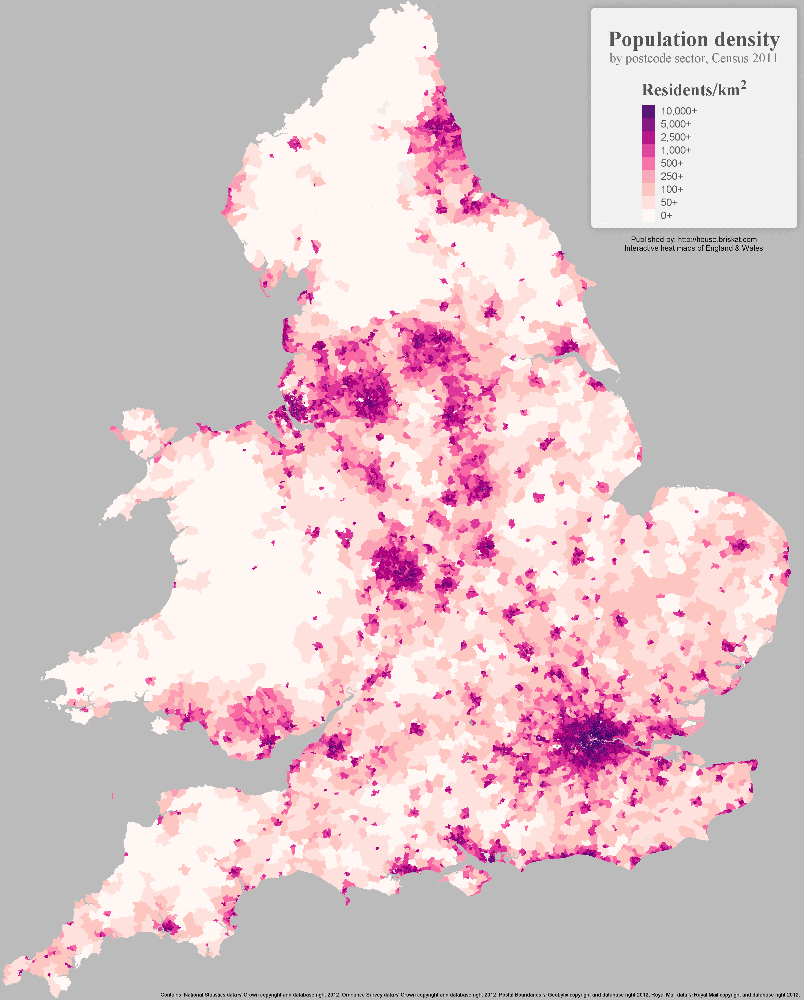
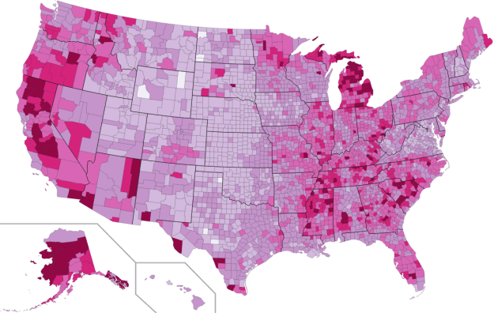

+++
author = "Yuichi Yazaki"
title = "コロプレス・マップ（Choropleth Map）の事例"
slug = "choropleth-map-example"
date = "2020-08-06"
description = ""
categories = [
    "chart"
]
tags = [
    "地図"
]
image = "images/1_vCq7XE-jQGK_OxfmIUiA7w.png"
+++

コロプレス・マップ（Choropleth Map）の事例を紹介します。

<!--more-->

## 過去7日間のアメリカにおける郡（county）別COVID-19人死亡者数

[Covid-19 fatalities per capita by US County for the previous seven days](https://towardsdatascience.com/accessing-and-examining-covid-19-data-on-your-own-e9d9b4fbc09b)

## イングランドとウェールズにおける人口密度

[England and Wales population density](https://medium.com/@briskat/england-wales-population-density-heat-map-26a28a2b6091)

## イングランド・ウェールズにおける人口分散

おそらくイギリスの最も初期の人口密度マップです。

Dispersion of the Population in England & Wales

## 人に対する犯罪地図

Andre-Michel Guerryによって1833年に作成されました。1825年から1830年までのフランスの犯罪を描いています。犯罪のレベルを表す7つの陰影があります。濃い色がより多くの犯罪がある県で、より白に近い薄い色が犯罪の少なさを示します。

犯罪の多い順に県がランキングされ、地図上に番号で示されます。地図の下にランキング順に実際の犯罪数が示されています。

Crimes contre les personnes

## アメリカにおける非雇用者 2009年

[U.S. unemployment in 2009](https://flowingdata.com/2009/11/12/how-to-make-a-us-county-thematic-map-using-free-tools/)

## ミレニアム開発目標マップ

[The Millennium Development Goals Map](http://scimaps.org/mapdetail/the_millennium_devel_90/)

