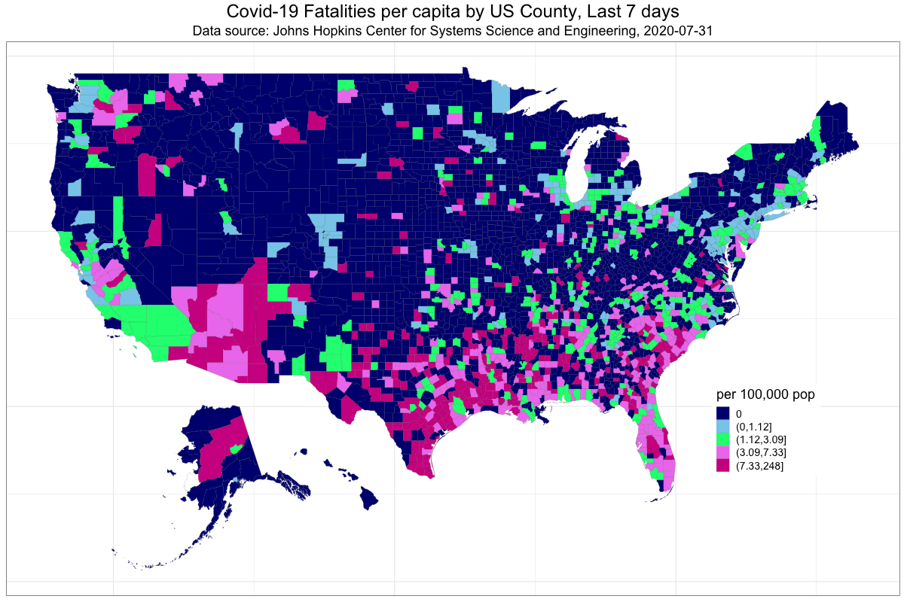
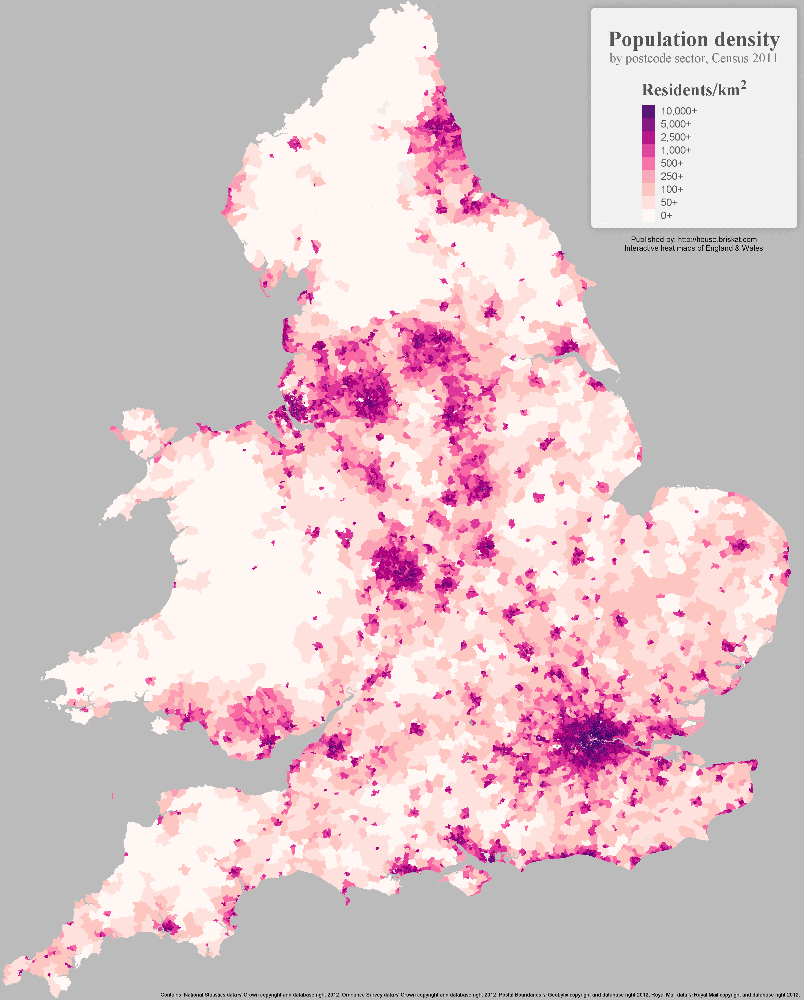
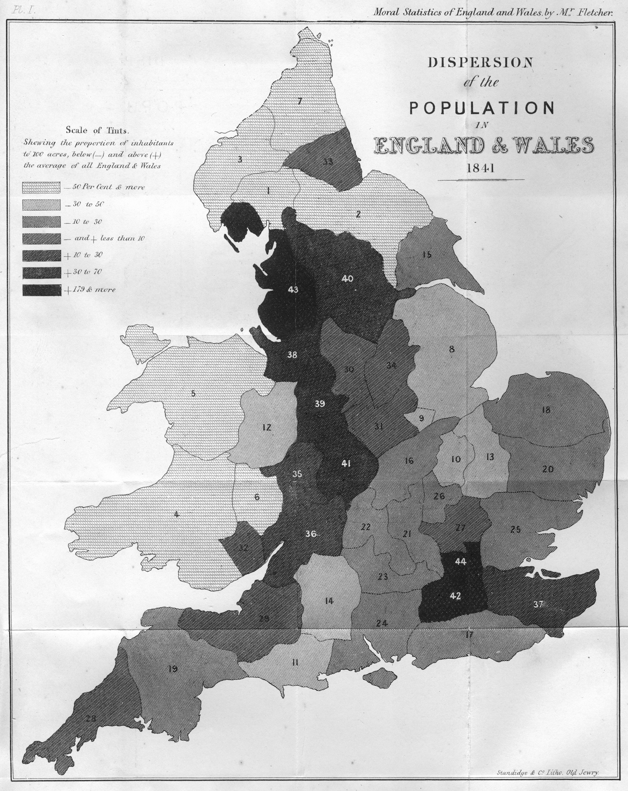
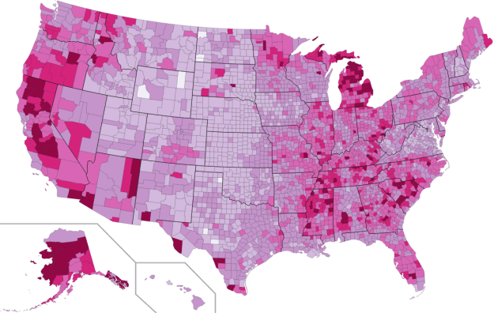
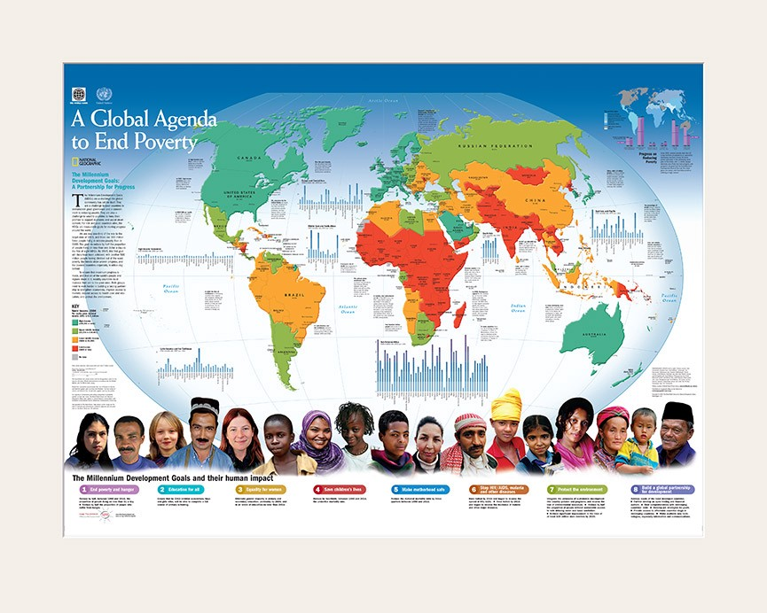

+++
author = "Yuichi Yazaki"
title = "コロプレス・マップ（Choropleth Map）"
date = "2020-08-06"
description = ""
categories = [
    "chart"
]
tags = [
    "map",
]
image = "1_vCq7XE-jQGK_OxfmIUiA7w.png"
+++

通常、行政区画単位によって集計されたデータを、色やテクスチャで表現する地図です。

<!--more-->

こういったコロプレス・マップの問題の一つとして、データをエンコーディングのための領域（行政区画）のサイズが、表現されるデータ量の認識に影響を与えることがあげられます。

データ値と地理的領域を混同するのを避けるために、データは絶対値ではなく正規化（例えば、密度、比率、平均）を使用することが推奨されます。

色やテクスチャでデータ値を表現する際に、データをいくつかにグルーピングする手法が取られることがあります。これを階級分類といい、ヒストグラムにおけるビンとはまた別の概念です。階級分類の数と手法が、見た目に大きく影響を与えるため、その選択には作り手による細心の注意が求められますし、作り手が「嘘をつく」ことも可能ではあります。ですので階級分類の数と手法を凡例に掲載しておくことが望ましいです。

階級分類数は、データの分類数として意味がある最適な数が求められる一方、大量の色を用いすぎても人はそもそも区別して認識できないため最大でも、マジックナンバー7に則れば5～9、5に則れば3〜7つほどに分類することが現実的でしょう。

離散データを面（領域）として表現するため、行政区画という領域の分割方法が、テーマとなるデータとしてふさわしいかどうかも検討する必要があるでしょう。たとえば日本の首都圏における人の行き来を含めた経済活動であれば、島しょ部を含めた東京都のみだけでなく、首都圏や東京圏とよばれる周辺都道府県も含めて評価する必要があるでしょう。

連続的な現象（例えば自然現象でいえば年間降雨量、気温など）は、その分布が政治的または行政的な境界ではないため、この方法ではマッピングすることはふさわしくありません。 その場合は、連続データを活用するための手法である、Dasymetric MapかIsarithmic Mapなどを利用してください。

## 作例

### 過去7日間のアメリカにおける郡（county）別COVID-19人死亡者数

[Covid-19 fatalities per capita by US County for the previous seven days](https://towardsdatascience.com/accessing-and-examining-covid-19-data-on-your-own-e9d9b4fbc09b)

### イングランドとウェールズにおける人口密度

[England and Wales population density](https://medium.com/@briskat/england-wales-population-density-heat-map-26a28a2b6091)

### イングランド・ウェールズにおける人口分散

おそらくイギリスの最も初期の人口密度マップです。

Dispersion of the Population in England & Wales

### 人に対する犯罪地図

Andre-Michel Guerryによって1833年に作成されました。1825年から1830年までのフランスの犯罪を描いています。犯罪のレベルを表す7つの陰影があります。濃い色がより多くの犯罪がある県で、より白に近い薄い色が犯罪の少なさを示します。

犯罪の多い順に県がランキングされ、地図上に番号で示されます。地図の下にランキング順に実際の犯罪数が示されています。

Crimes contre les personnes

### アメリカにおける非雇用者 2009年

[U.S. unemployment in 2009](https://flowingdata.com/2009/11/12/how-to-make-a-us-county-thematic-map-using-free-tools/)

### ミレニアム開発目標マップ

[The Millennium Development Goals Map](http://scimaps.org/mapdetail/the_millennium_devel_90/)

## 参考文献
- Katy Börner — Atlas of Knowledge
- Isabel Meirelles — Design For Information